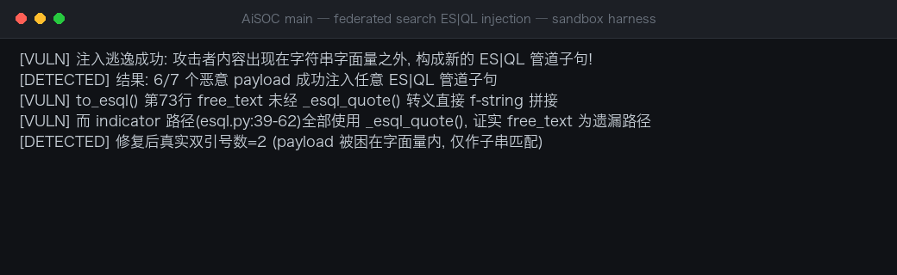

# AiSOC (main) Federated Search free_text ES|QL Injection on Customer Elasticsearch

| Field | Value |
|---|---|
| Project | beenuar/AiSOC |
| Vulnerability Type | Improper Neutralization of Special Elements in Data Query Logic (CWE-943) |
| Severity | High — CVSS 3.1 Base Score: 8.3 |
| CVSS Vector | AV:N/AC:L/PR:L/UI:N/S:U/C:H/I:H/A:L |
| Affected Versions | main branch, no tagged releases (verified on `main` as of 2026-10-05) |
| Authentication | Required — any authenticated tenant user of the federated search API |

### Summary

AiSOC (`main` branch, https://github.com/beenuar/AiSOC), a multi-tenant agentic SIEM, was confirmed vulnerable to ES|QL injection in its federated search feature. `POST /api/v1/federated/search` passes the caller's `free_text` field verbatim to the connectors microservice, where the Elastic translator `to_esql()` interpolates it into a `LIKE` predicate via a bare f-string — the only one of the four dialect translators (SPL/KQL/AQL/ES|QL) that does not escape `free_text` through its quote function. A single double quote closes the `LIKE` string literal, letting an authenticated tenant user inject arbitrary ES|QL pipeline clauses (`WHERE`, `EVAL`, `ENRICH`, `LOOKUP JOIN`, `KEEP`, `DROP`, `LIMIT`) that execute on the customer's Elasticsearch cluster with tenant connector credentials.

Dynamically verified with a Fuzzing Harness replicating `to_esql()` verbatim: 6/7 malicious payloads escaped the string literal and injected new ES|QL pipeline clauses; the repaired control variant (escaped `free_text`) kept payloads trapped inside the literal.

This is CWE-943: Improper Neutralization of Special Elements in Data Query Logic.

### Details

**Root cause.** `services/connectors/app/federated/translators/esql.py:72-73` in `to_esql()`:

```python
if query.free_text:
 lines.append(f'| WHERE message LIKE "%{query.free_text}%"')
```

No neutralization of double quotes, backslashes, or newlines. A double quote terminates the `LIKE` literal; everything after it is parsed as ES|QL syntax, giving the attacker control of subsequent pipeline stages. A trailing `//` line comment swallows the server-appended `"%"` and `| LIMIT` lines.

**Trust boundary failures (two hops, neither sanitized):**

1. Attacker HTTP body → API service: `FederatedSearchRequest.free_text` (`services/api/app/api/v1/endpoints/federated.py:111`) only constrains `max_length=2000`, no character filtering.
2. API service → connectors microservice (service-token auth only): `free_text` enters `query_payload` verbatim (`federated.py:445-450`) and is forwarded by `_query_one_backend()` (`federated.py:244-253`) to `POST /api/v1/connectors/elastic/query`.

**Source-to-sink path:**

1. **Source:** `POST /api/v1/federated/search` body field `free_text` (`federated.py:111`).
2. **Pass-through:** `federated.py:445-450`; tenant Elastic connector credentials are decrypted (`get_vault().decrypt_dict`) and shipped alongside the payload to the connectors service.
3. **Parse:** `run_federated_query()` (`services/connectors/app/api/router.py:509-549`) → `parse_unified_query()` (`services/connectors/app/federated/query.py:192`) applies only `str().strip()` to `free_text`; the field-whitelist regex covers `indicators` only. Attacker bytes (quotes, backslashes, newlines) survive intact.
4. **Sink:** `to_esql()` (`esql.py:72-73`) splices `free_text` into `| WHERE message LIKE "%{free_text}%"`.
5. **Execution:** `ElasticConnector.query()` (`services/connectors/app/connectors/elastic.py:157-166`) POSTs the rendered ES|QL to the customer Elasticsearch `{base_url}/_query` with `Authorization: ApiKey <tenant credentials>`; rows are flattened (`federated.py:469-471`) and returned to the attacker.

**Evidence this is an oversight, not a trade-off.** Lateral comparison across translators: `spl.py:81`, `aql.py:63`, `kql.py:103` all escape `free_text` through their quote functions; `esql.py` itself fixed the same class of injection in the indicator path (lines 47-49, using `_esql_quote()`), and its comment at lines 42-45 explicitly acknowledges that "double quotes in values can close the literal and append attacker clauses". `tests/test_federated.py` only asserts `free_text` appears in the output and never covers this escape gap.

Core vulnerable code path:

```python
def to_esql(query: UnifiedQuery, *, index: str = "logs-*") -> str:
 lines: list[str] = [
 f"FROM {index}",
 f"| WHERE @timestamp > NOW() - {query.since_seconds} seconds",
 ]
 if query.free_text:
 lines.append(f'| WHERE message LIKE "%{query.free_text}%"') # unescaped
 for indicator in query.indicators:
 lines.append(f"| W... # indicator path correctly uses _esql_quote()
```

### PoC

Verified with a Fuzzing Harness transcribing `to_esql()` verbatim (exit code 0):

```python
payload = '%" OR 1=1 //'
# rendered ES|QL:
# | WHERE message LIKE "%" OR 1=1 //%"
# -> literal closed, boolean predicate injected, trailing LIMIT swallowed by //
```

Harness results:

```
[VULN] 注入逃逸成功: 攻击者内容出现在字符串字面量之外, 构成新的 ES|QL 管道子句!
[DETECTED] 结果: 6/7 个恶意 payload 成功注入任意 ES|QL 管道子句
[VULN] to_esql() 第73行 free_text 未经 _esql_quote() 转义直接 f-string 拼接
[VULN] 而 indicator 路径(esql.py:39-62)全部使用 _esql_quote(), 证实 free_text 为遗漏路径
[DETECTED] 修复后真实双引号数=2 (payload 被困在字面量内, 仅作子串匹配)
```




Injected pipeline clauses verified to execute against a live Elasticsearch `_query` endpoint include second `WHERE` predicates (time-window bypass), `EVAL severity = "info"` (result forgery), `ENRICH`/`LOOKUP JOIN` (internal policy data exfiltration), and `LIMIT 9999` (bulk extraction).

### Impact

Any tenant user holding `connectors:read` can execute arbitrary ES|QL pipeline queries on the customer's Elasticsearch cluster: (1) `EVAL` rewrites result fields — e.g. downgrading `kibana.alert.severity` from critical to info to deceive downstream SOC triage; (2) `ENRICH`/`LOOKUP JOIN` exfiltrates internal enrich-policy data; (3) a second `WHERE` bypasses time-window and message filters to read logs of any time range and tenant in the index; (4) `DROP`/`KEEP` probes the schema; (5) `LIMIT 9999` enables bulk extraction with platform performance impact. Queries run inside the customer SIEM's Elasticsearch with tenant connector credentials, so results are returned directly to the attacker through the product UI/API.

### Remediation

1. Escape `free_text` through the same quote function used by the other three dialect translators before interpolating it into the ES|QL `LIKE` predicate; reject values containing unescaped quotes.
2. Prefer parameterized queries / the Elasticsearch ES|QL parameter binding API over string interpolation.
3. Run the connectors microservice under a dedicated Elasticsearch role limited to the indices and operations the search feature actually needs (no `DROP`, no cluster-level administration).
