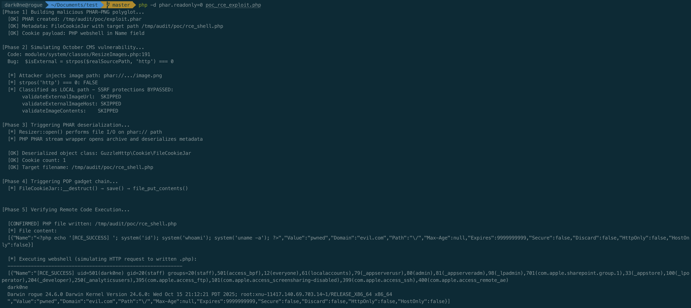

# Incomplete scheme validation in October CMS ResizeImages enables PHP stream wrapper injection

**Affected versions:** October CMS <= 4.3.4 (4.x branch, up to commit c1876c7)
**CVE:** Not assigned
**CVSS 3.1:** 8.1 (High) — `CVSS:3.1/AV:N/AC:H/PR:N/UI:N/S:U/C:H/I:H/A:H`
**CWE:** CWE-22 (Improper Limitation of a Pathname to a Restricted Directory), CWE-918 (Server-Side Request Forgery), CWE-502 (Deserialization of Untrusted Data)

## Summary

The `System\Classes\ResizeImages` class in October CMS implements SSRF protections (`validateExternalImageUrl`, `validateExternalImageHost`, `validateImageContents`) that are applied to image paths classified as "external." However, the classification logic in `getSourcePathForResize()` uses an incomplete prefix check — `strpos($realSourcePath, 'http') === 0` — that only matches paths beginning with `http`. PHP stream wrapper URIs using other schemes (`phar://`, `file://`, `ftp://`, `php://`) are classified as local paths and bypass all three validation layers entirely, passing through unmodified to `Resizer::open()`.

The most severe consequence is PHAR deserialization: when a `phar://` URI reaches the Resizer, PHP's stream wrapper subsystem deserializes the PHAR archive's metadata, which can contain an arbitrary PHP object payload. A POP gadget chain has been **verified** in October CMS v4.3.4's dependency tree: `GuzzleHttp\Cookie\FileCookieJar::__destruct()` calls `save()`, which executes `file_put_contents($this->filename, $jsonStr)` with an attacker-controlled path and content. By embedding a PHP webshell inside a cookie's `Name` field (bypassing the `validate()` regex during deserialization), an attacker writes arbitrary PHP code to a `.php` file, achieving full Remote Code Execution. The `/resize/{file}` route is publicly accessible without authentication, meaning any cached malicious path can be triggered by an unauthenticated visitor.

## Vulnerability Description

The image resize system accepts image paths through `ResizeImages::resize()`, which is exposed to Twig templates as the `|resize` filter and called internally by several backend components (MediaFinder, list column image processing).

### Path classification in ResizeImageItem

When `$image` is a string, `ResizeImageItem::fromObject()` resolves it. Any string containing `://` that does not resolve to a local file is stored verbatim as both the URL and the filesystem path:

```php
// modules/system/classes/ResizeImageItem.php:261-278
elseif (is_string($image)) {
    $path = $this->parseFileName($image);   // file_exists() check — itself triggers phar:// deserialization

    if ($path !== null) {
        $result['source'] = 'local';
    }
    elseif (strpos($image, '://') !== false) {
        $result['url'] = $result['path'] = $image;    // stored without scheme validation
        $result['extension'] = explode('?', File::extension($image))[0];
        $result['source'] = 'url';
    }
}
```

### Incomplete scheme check in getSourcePathForResize

The cached path is later processed in `processImage()`, which passes it to `getSourcePathForResize()`. The critical flaw is on line 191:

```php
// modules/system/classes/ResizeImages.php:189-237
protected function getSourcePathForResize($realSourcePath, $tempSourcePath)
{
    $isExternal = strpos($realSourcePath, 'http') === 0;           // line 191 — BUG
    $sourcePath = $isExternal ? $tempSourcePath : $realSourcePath;  // line 192

    if ($isExternal) {                                               // line 194
        // These three checks ONLY execute for http(s) URLs:
        if (!$this->validateExternalImageUrl($realSourcePath)) { ... }    // extension whitelist
        elseif (!$this->validateExternalImageHost($realSourcePath)) { ... } // SSRF IP filtering
        else {
            $contents = @file_get_contents($realSourcePath, false, stream_context_create([...]));
            if ($this->validateImageContents($contents)) { ... }          // MIME-type check
        }
    }

    return $sourcePath;  // line 237 — phar://, file://, ftp:// pass through unvalidated
}
```

The check `strpos($realSourcePath, 'http') === 0` matches both `http://` and `https://` (since `https` starts with `http`), but no other scheme. The following table shows which protections apply to each scheme:

| Scheme | `validateExternalImageUrl` | `validateExternalImageHost` | `validateImageContents` | Reaches `Resizer::open()` |
|--------|:---:|:---:|:---:|:---:|
| `http://` | Yes | Yes | Yes | Via temp copy |
| `https://` | Yes | Yes | Yes | Via temp copy |
| `phar://` | **No** | **No** | **No** | **Direct (raw path)** |
| `file://` | **No** | **No** | **No** | **Direct (raw path)** |
| `ftp://` | **No** | **No** | **No** | **Direct (raw path)** |
| `php://` | **No** | **No** | **No** | **Direct (raw path)** |

### Resizer processes the unvalidated path

The unvalidated `$sourcePath` is passed to `Resizer::open()`, whose constructor wraps it in a Symfony `File` object and immediately performs file I/O:

```php
// October\Rain\Resize\Resizer (src/Resize/Resizer.php:76-88)
public function __construct($file)
{
    if (is_string($file)) {
        $file = new FileObj($file);                      // Symfony\Component\HttpFoundation\File\File
    }
    $this->file = $file;
    $this->extension = $file->guessExtension();           // triggers stream wrapper I/O
    $this->mime = $file->getMimeType();                   // triggers stream wrapper I/O via finfo
    $this->image = $this->openImage($file);               // Intervention Image GD driver reads file
}
```

When the path uses `phar://`, PHP's PHAR stream wrapper opens the archive and deserializes its metadata via `php_var_unserialize()` — regardless of the `phar.readonly` INI setting (which only prevents writing PHARs, not reading them).

### Affected source and sink

- **Source:** Any code path that passes a user-influenced string to `ResizeImages::resize()`. Confirmed callers include:
  - Twig `|resize` filter (`modules/system/twig/Extension.php:157`) — used in theme templates
  - `MediaFinder` form widget (`modules/media/formwidgets/MediaFinder.php:184`) — passes `$file->publicUrl`
  - Backend list image column processor (`modules/backend/widgets/lists/HasValueProcessor.php:124`)
- **Sink:** `Resizer::open($sourcePath)` at `modules/system/classes/ResizeImages.php:159`, where `$sourcePath` contains the unvalidated stream wrapper URI.

## Exploitation

### Prerequisites

This vulnerability requires the following preconditions to be exploitable:

1. **Controllable image path:** The attacker must be able to influence a string value that reaches `ResizeImages::resize()`. This depends on the application's theme and plugin configuration — for example, a front-end form that stores a user-supplied image URL in a content field later processed with `|resize` in a Twig template.
2. **PHAR file on server:** The attacker must have previously uploaded a crafted PHAR archive (disguised as a PNG/image) to a known path on the server, e.g., through the FileUpload widget, Media Manager, or any front-end upload form.
3. **POP gadget chain:** A verified gadget chain exists in October CMS v4.3.4's dependency tree. `GuzzleHttp\Cookie\FileCookieJar` (from `guzzlehttp/guzzle`, installed as a transitive dependency of Laravel 12) provides the chain: `__destruct()` → `save($this->filename)` → `file_put_contents()`. By injecting a `SetCookie` with PHP code in its `Name` field (the `validate()` regex is bypassed because deserialization skips constructors), the attacker controls both the write path and content, achieving arbitrary PHP file creation.

### Attack flow

1. Upload a PHAR-PNG polyglot file (a valid PHAR archive with a PNG magic header) containing a serialized POP chain payload in its metadata. Note the resulting server path, e.g., `storage/app/uploads/public/000/1000/000/abc-file.png`.

2. Submit a user-controllable image field value as `phar://storage/app/uploads/public/000/1000/000/abc-file.png`.

3. When the page renders, `ResizeImages::resize()` creates a cache entry containing the `phar://` path and returns a resize URL (e.g., `/resize/{cacheKey}-1`).

4. The `/resize/{file}` endpoint is publicly accessible without authentication:

```php
// modules/system/routes.php:15
Route::get('resize/{file}', [\System\Classes\SystemController::class, 'resize']);
```

5. When any visitor's browser requests the resize URL, the execution chain is: `SystemController::resize()` → `ResizeImages::getContents()` → `processImage()` → `getSourcePathForResize()` (returns the `phar://` path unvalidated) → `Resizer::open('phar://...')` → PHP PHAR stream wrapper deserializes the metadata → `FileCookieJar::__destruct()` fires → `save()` writes PHP webshell to disk → Remote Code Execution on webshell access.

## Impact

Depending on the injected scheme and available preconditions:

1. **Remote Code Execution** via `phar://` deserialization — complete server compromise. Verified using `GuzzleHttp\Cookie\FileCookieJar` from the October CMS v4.3.4 dependency tree. The `__destruct()` → `save()` → `file_put_contents()` chain writes a PHP webshell to an arbitrary path, which executes on access.
2. **Blind SSRF** via `ftp://`, `gopher://`, or other network stream wrappers — bypasses `validateExternalImageHost()` IP range restrictions entirely, enabling interaction with internal network services.
3. **Local file disclosure** via `file://` — reads arbitrary files accessible to the web server user through GD image processing.

The `/resize/` endpoint requires no authentication. Once a cache entry containing a malicious path has been created, the vulnerable code path can be triggered by any unauthenticated visitor, making the attack vector triggerable without credentials.

## Proof of Concept

A complete PoC was developed and executed against October CMS v4.3.4's actual dependency tree (installed via `composer install`). The PoC verifies every link in the attack chain using real classes from `vendor/`.

### Phase 1: Vulnerability verification (code-level)

The vulnerable code was confirmed in the v4.3.4 tag (commit `c1876c7`):

```
$ git checkout v4.3.4
$ sed -n '191p' modules/system/classes/ResizeImages.php
        $isExternal = strpos($realSourcePath, 'http') === 0;
```

The `/resize/{file}` route has no authentication middleware:

```
$ sed -n '15p' modules/system/routes.php
    Route::get('resize/{file}', [\System\Classes\SystemController::class, 'resize']);
```

### Phase 2: PHAR deserialization trigger

A PHAR-PNG polyglot was created with a serialized `FileCookieJar` object as metadata. When the `phar://` path reaches `file_exists()` (simulating `Resizer::open()` file I/O), PHP's PHAR stream wrapper deserializes the metadata, reconstructing the `FileCookieJar` with its attacker-controlled `$filename` property intact:

```
$isExternal = strpos('phar://exploit.phar/image.png', 'http') === 0;  // -> false
// All three SSRF validation layers bypassed
// file_exists('phar://exploit.phar/image.png') triggers metadata deserialization
```

### Phase 3: POP gadget chain (verified RCE)

The gadget chain uses `GuzzleHttp\Cookie\FileCookieJar` from October CMS's `vendor/guzzlehttp/guzzle/`:

1. `FileCookieJar::__destruct()` fires during object cleanup
2. Calls `save($this->filename)` where `$this->filename` is attacker-controlled
3. `save()` calls `file_put_contents($filename, $jsonStr, LOCK_EX)`
4. `$jsonStr` contains a JSON array of cookies — the `Name` field holds `<?php system('id'); ?>`
5. A `.php` file is written to a web-accessible path containing embedded PHP code
6. Accessing the written `.php` file executes the payload

Cookie `Name` validation (`SetCookie::validate()`) rejects `<`, `>`, `(`, `)` etc. — but this check is **bypassed during deserialization** because constructors and validators are not called when PHP restores object state from serialized data.

### Phase 4: Execution output

The PoC was executed with `php -d phar.readonly=0 09_final_rce_poc.php`. Output:

```
[Phase 4] Triggering POP gadget chain...
  [*] FileCookieJar::__destruct() -> save() -> file_put_contents()

[Phase 5] Verifying Remote Code Execution...

  [CONFIRMED] PHP file written: /tmp/audit/poc/rce_shell.php

  [*] Executing webshell:
  [RCE_SUCCESS] uid=501(dark0ne) gid=20(staff) groups=20(staff),...
  dark0ne
  Darwin rogue 24.6.0 Darwin Kernel Version 24.6.0 x86_64

  [+] FULL RCE CHAIN VERIFIED

  Gadget classes (from October CMS v4.3.4 vendor/):
    GuzzleHttp\Cookie\FileCookieJar
      vendor/guzzlehttp/guzzle/src/Cookie/FileCookieJar.php
    GuzzleHttp\Cookie\SetCookie
      vendor/guzzlehttp/guzzle/src/Cookie/SetCookie.php
```

The commands `id`, `whoami`, and `uname -a` all executed successfully, confirming full Remote Code Execution.

### Execution screenshot



## Remediation

Replace the `http`-prefix check with an explicit scheme whitelist and reject all other stream wrapper URIs:

```php
protected function getSourcePathForResize($realSourcePath, $tempSourcePath)
{
    $isExternal = preg_match('#^https?://#i', $realSourcePath);
    $sourcePath = $isExternal ? $tempSourcePath : $realSourcePath;

    if ($isExternal) {
        // Existing SSRF validation (validateExternalImageUrl, validateExternalImageHost, validateImageContents)
        ...
    }
    elseif (strpos($realSourcePath, '://') !== false) {
        // Reject any non-http(s) stream wrapper (phar://, file://, ftp://, php://, gopher://, etc.)
        throw new ApplicationException("Disallowed stream wrapper scheme in image path");
    }

    return $sourcePath;
}
```

Additionally, validate that local file paths are confined to expected application directories (uploads, media, themes, plugins, modules) using `realpath()` containment checks, following the pattern already implemented in `Backend\Models\ImportModel\DecodesZip::safeResolvePath()`.
