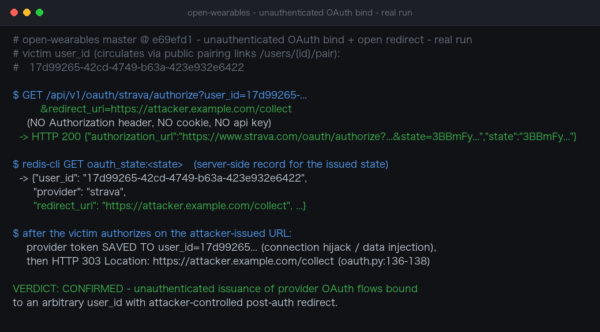

# Unauthenticated Provider OAuth Authorization Enables Arbitrary User Binding and Attacker-Controlled Redirect in open-wearables

| Field | Value |
|---|---|
| Project | [the-momentum/open-wearables](https://github.com/the-momentum/open-wearables) |
| Vulnerability Type | Missing Authorization on OAuth Initiation / Open Redirect (CWE-862, CWE-601) |
| Severity | High — CVSS 3.1 Base Score: 8.2 |
| CVSS Vector | `AV:N/AC:L/PR:N/UI:N/S:U/C:L/I:H/A:N` |
| Affected Versions | <= 0.9.0 (latest release) and current master @ `e69efd1` (verified) |
| Authentication | None (`GET /api/v1/oauth/{provider}/authorize` takes no `DeveloperDep`/`ApiKeyDep` dependency) |

---

## Summary

The OAuth initiation endpoint `GET /api/v1/oauth/{provider}/authorize` requires no authentication and accepts two caller-controlled parameters: the `user_id` of the platform account the resulting connection will be bound to, and an optional `redirect_uri` that is stored verbatim in the server-side OAuth state and, after authorization completes, used as the target of a `303` redirect with no allowlist. An unauthenticated attacker can therefore generate a genuine, platform-issued Strava/Oura/etc. authorization URL bound to any known user, with the victim's post-authorization token written into that user's account and the browser landing on an attacker-chosen URL. Because the product's pairing feature (`/users/{user_id}/pair`, public shareable links circulated via WhatsApp/email) makes victim user UUIDs widely available, the precondition is trivially met.

## Details

`backend/app/api/routes/v1/oauth.py:48-68`:

```python
@router.get("/{provider}/authorize", ...)
def authorize_provider(
    provider: str,
    user_id: Annotated[UUID, Query(description="User ID to connect")],
    redirect_uri: Annotated[str | None, Query(...)] = None,
):
    strategy = get_oauth_strategy(resolve_provider(provider))
    auth_url, state = strategy.oauth.get_authorization_url(user_id, redirect_uri)
    return AuthorizationURLResponse(authorization_url=auth_url, state=state)
```

No dependency in the signature authenticates the caller. `get_authorization_url` (`backend/app/services/providers/templates/base_oauth.py:70`) stores `user_id`, `provider`, and the raw `redirect_uri` in Redis under `oauth_state:{state}`. After the provider redirects back, `oauth_callback` (`oauth.py:88-138`) validates the state, exchanges the code, and saves the resulting provider tokens to `oauth_state.user_id` (`base_oauth.py:103-134`, `_save_connection`); it then redirects:

```python
# oauth.py:136-138
if oauth_state.redirect_uri:
    return RedirectResponse(url=oauth_state.redirect_uri, status_code=303)
```

There is no validation of `redirect_uri` against platform origins anywhere in the flow (by contrast, the first-party frontend passes an internal `pairingSuccessUrl`, but the backend accepts anything). Three consequences follow from the same missing check:

1. **Arbitrary binding / data injection** — the attacker picks the victim `user_id` and can steer the attacker's own wearable account (or a victim's, via phishing) into being saved onto any platform account; the `provider_user_id` unique constraint means a later binding overwrites the earlier connection's tokens (connection takeover).
2. **Open redirect with platform provenance** — the victim completes a real, legitimate-looking platform OAuth flow and lands on `https://attacker.example.com/...` with a `303` from the platform's own API origin, ideal for credential-harvesting phishing.
3. **Token fixation against attacker accounts** — a malicious platform user can trick a victim into completing an authorization URL that writes the victim's provider token into the attacker's user record.

## PoC

**Real-environment reproduction** (open-wearables master @ `e69efd1` deployed locally for this test; `17d99265-...` is a regular platform user):

```bash
# No Authorization header, no cookie, no API key:
curl 'http://TARGET:8000/api/v1/oauth/strava/authorize?user_id=17d99265-42cd-4749-b63a-423e932e6422&redirect_uri=https://attacker.example.com/collect'
```

Response — a genuine, platform-issued authorization URL plus its state:

```json
HTTP 200
{"authorization_url":"https://www.strava.com/oauth/authorize?response_type=code&client_id=...&state=3BBmFybUbKvur4MfqWj0zADpuyMCHIfjgdlAe09noxk&scope=activity:read_all,profile:read_all",
 "state":"3BBmFybUbKvur4MfqWj0zADpuyMCHIfjgdlAe09noxk"}
```

Server-side state record created by that single unauthenticated request (read from the instance's Redis to show what the server persisted):

```
GET oauth_state:3BBmFybUbKvur4MfqWj0zADpuyMCHIfjgdlAe09noxk
{"user_id": "17d99265-42cd-4749-b63a-423e932e6422",
 "provider": "strava",
 "redirect_uri": "https://attacker.example.com/collect", ...}
```

When any victim completes authorization on that URL, `handle_callback` writes the provider token into user `17d99265-...` and the flow ends with `303 Location: https://attacker.example.com/collect` (`oauth.py:136-138`).



---

## Impact

- **Health-data injection and connection hijacking** against any user whose UUID is known — and the pairing-link design distributes exactly these UUIDs to third parties (trainers, clinics, group-chat members). An attacker can bind their own device as the victim's data source (poisoning the medical/fitness record) or overwrite an existing connection's tokens via the unique constraint.
- **High-confidence phishing** — victims complete a genuine Strava/Oura consent screen opened from a platform-issued URL and are then silently redirected to an attacker-controlled site by the platform's own API.
- **Cross-tenant token confusion** — the endpoint lets any caller mint flows between arbitrary user records and arbitrary redirect targets, which also breaks the CSRF assumptions of the platform's own frontend pairing flow.

### Remediation

1. Require authentication on `POST/GET /oauth/{provider}/authorize` — either a developer API key or a short-lived, single-use pairing token issued to the pairing link — and refuse requests whose caller is not authorized to modify the given `user_id`.
2. Allowlist `redirect_uri` against registered platform origins; reject absolute external URLs and store only a signed, expiry-bound reference rather than the raw caller-supplied string.
3. Bind the OAuth `state` to the authenticated initiator's session so a state minted by one party cannot be completed by another, and make connection overwrites on an existing `provider_user_id` require explicit user confirmation.
